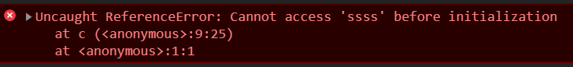

**关于版本**

没说明的都是es5或更低版本

es6+会用下面这种标签来标记

- <span style='background:#eef5f4;padding:0 10px'>es6</span>
- <span style='background:#eef5f4;padding:0 10px'>es7</span>


# 未分类

- 异步执行的代码里的变量取的值都是执行时的值，而不是异步代码生成时的值

- 使用未定义的变量会导致阻塞报错，报错内容如下：  
  `Uncaught ReferenceError: 变量名 is not defined`
  
- js的奇异表现  
  
  - [知乎视频](https://www.zhihu.com/zvideo/1322284588354412544)第4分钟
  
  - `3.0000000000000002 === 3`结果为`true`
  
  - 字符串可以比大小  
  
    > 如果两个值都是字符串，则根据它们包含的Unicode代码点的值将它们作为字符串进行比较 —— [MDN 比较运算符](https://developer.mozilla.org/en-US/docs/Web/JavaScript/Reference/Operators/Less_than#description)  
  
- 闭包  
  
  > 闭包就是能够读取其他函数内部变量的函数。例如在javascript中，只有函数内部的子函数才能读取[局部变量](https://baike.baidu.com/item/局部变量/9844788)，所以闭包可以理解成“定义在一个[函数](https://baike.baidu.com/item/函数/301912)内部的函数“ —— [百度百科](https://baike.baidu.com/item/%E9%97%AD%E5%8C%85)
  
  > 一个函数和对其周围状态（**lexical environment，词法环境**）的引用捆绑在一起（或者说函数被引用包围），这样的组合就是**闭包**（**closure**）。也就是说，闭包让你可以在一个内层函数中访问到其外层函数的作用域。在 JavaScript 中，每当创建一个函数，闭包就会在函数创建的同时被创建出来。 —— [MDN](https://developer.mozilla.org/zh-CN/docs/Web/JavaScript/Closures)

- 0/0得到NaN

- nullish  

  > 也就是null或undefined —— [MDN](https://developer.mozilla.org/en-US/docs/Glossary/Nullish) 
  
  本笔记的`??`部分也有一些说明  
  
- 必须要加分号的情况

  - 包括立即执行函数前，有时候不加不会报立即执行函数的错，但是加和不加的执行结果会不同


# 数据类型

数据类型可以分为下面两类

1. 原始类型值：undefined、null、boolean、number、string、symbol（<span style='background:#eef5f4;padding:0 10px'>es6</span>）、BigInt（<span style='background:#eef5f4;padding:0 10px'>es2020</span>）  
2. 引用类型值，也就是对象类型(Object type)，除了原始值外一切皆对象，比如Object、Array、Function、Date、RegExp、Error。

声明变量时不同的内存分配：  

1. 原始类型值：  
   存储在栈(stack)中的不可变数据，每个原始值在栈中都有独立的空间来存储。  
   除了字符串外，不可能有两个全等的原始值；就算两次用相同的字符串字面量给变量赋值，js也会在栈中开辟两个位子存放这两个字符串（个人猜想）  
2. 引用类型值：  
   存储在堆(heap)中，引用的结果是栈中的值或另一个引用  
   引用分两种：  
     1. 映射的引用：比如数组和狭义上的对象。数组的子项通过序号映射到一个原始值，而狭义对象通过字符串映射到原始值  
     2. 非映射的引用，比如`=`。  
        `let a=1`后a获得的就是一个非映射引用，引用的指向是原始值——1。  
        之后把a赋值给任何变量，这些变量的引用都是相同的。  
        如果赋值给a的是广义对象，那就有可能发生下文说的引用传递  

这么设计的原因

引用值的大小会改变，所以不能把它放在栈中，否则会降低变量查寻的速度。相反，放在变量的栈空间中的值是该对象存储在堆中的地址。地址的大小是固定的，所以把它存储在栈中对变量性能无任何负面影响。

关于命名  

- 犀牛书中称为原始类型（primitive type）和对象类型（object type）
- [MDN](https://developer.mozilla.org/zh-CN/docs/Glossary/Primitive)中中文译名为：基本类型（基本数值、基本数据类型）  
  英文名为：primitive (primitive value, primitive data type) 

### 字面量

对象字面量：｛a:1,b:'aa'｝  
数组字面量：[1,4,3,2]  
函数字面量：function(){.. }  
以上这些方式直接出现的都叫字面量  


# 字符串

- `'abc'[1]`的结果是`'b'`  
- 字符串实例的说明见[A](https://developer.mozilla.org/zh-CN/docs/Web/JavaScript/Reference/Global_Objects/String#String_instances)或[B](https://developer.mozilla.org/zh-CN/docs/Web/JavaScript/Reference/Global_Objects/String/prototype)（AB区别应该就是兼容性表不一样）
- 16进制字符串  
  例子："\x74\x61\x69"  
  可以直接使用，在控制台输入就会转成具有可读性的字符串  
  该博文有说编码方法：https://blog.csdn.net/haige025/article/details/89531355

**字符串的类型**

有基本字符串和字符串对象2种，基本都用基本字符串  
（字符串对象就属于对象了）   
2者的描述见[MDN](https://developer.mozilla.org/zh-CN/docs/Web/JavaScript/Reference/Global_Objects/String)


# 数字

### 表达

- `1e-2`等于0.01
- `1e2`等于100


### 操作

四舍五入 Math.round(7.25)
取出大的值 Math.max(2,4)


### BigInt

> [ES2020](https://github.com/tc39/proposal-bigint) 引入了一种新的数据类型 BigInt —— [阮一峰](https://es6.ruanyifeng.com/#docs/number#BigInt-%E6%95%B0%E6%8D%AE%E7%B1%BB%E5%9E%8B)

**可参考资料如下**

- [MDN](https://developer.mozilla.org/zh-CN/docs/Web/JavaScript/Reference/Global_Objects/BigInt)
- [阮一峰](https://es6.ruanyifeng.com/#docs/number#BigInt-%E6%95%B0%E6%8D%AE%E7%B1%BB%E5%9E%8B)
- [ES2021](https://tc39.es/ecma262/#sec-bigint-objects)
- [tc39提议（github版本）](https://github.com/tc39/proposal-bigint)
- [tc39提议（网页版本）](https://tc39.es/proposal-bigint/)

**特性**

- 可以表示任意大的整数

- 与Number的关系

  - 即使是同一数字Number和BigInt也不全等  
    不过用`==`的判断结果是`true`

  - > 不能和Number混合运算 —— [MDN](https://developer.mozilla.org/zh-CN/docs/Web/JavaScript/Reference/Global_Objects/BigInt#%E6%8F%8F%E8%BF%B0)

- 兼容性  
  IE不行，其他浏览器在18年左右就支持了

- > 可以使用负号，但不能使用正号 —— [阮一峰](https://es6.ruanyifeng.com/#docs/number#%E7%AE%80%E4%BB%8B)


# 数组
```javascript
let a=[11,22]
a[6]='ss'
console.log('a',a) // [11, 22, empty × 4, "ss"]
console.log('a.length',a.length) // 7
console.log('a[3]',a[3]) // undefined
```
数组可以拥有属性（但是属性只能存在在原型链上）（只有数组和对象类型的数据可以拥有属性）

- 数组隐式转字符串  
  是不符合直觉的  
  转换结果为：  

  - 一维数组：每一项转为字符串，用`,`连接（结果不包含左右的中括号）
  - 多维数组：`[[1,2,3],[4,5]]`的转换结果为`"1,2,3,4,5"`

  测试案例为：

  - `数组+''`
  - `数组.toString()`

# 函数

- 形参与实参的关系相当于`形参=实参`，所以是会发生引用传递的
- 函数都有一个`name`属性，值为函数名（es5中如果把函数表达式赋值给变量，这个函数的name属性将是空字符串）
- `arguments`对象是所有（非箭头）函数中都可用的局部变量  
  特性近似于包含所有实参的数组  
  详见[mdn](https://developer.mozilla.org/zh-CN/docs/Web/JavaScript/Reference/Functions/arguments)


### 函数的编写方法
函数有三种编写方法：
1. 函数声明：`function fnName () {…}`
   唯一一个会函数提升的编写方法
   相当于给window的原型加一个叫fnName的方法
2. 函数表达式
   通过在函数（命名或匿名皆可）前加运算符来让函数变成函数表达式，
   可加运算符有：`！`、`+`、`-`、`=`、`(`
   其中加`(`的话，后半个括号要补上，如第三点的写法。加`(`的写法在括号之中会形成独立作用域
   运算符的计算效果同样会生效
   函数表达式可以通过在后面加`()`来立即执行而函数声明不行
3. 立即执行函数
   立即执行函数不会给window的原型增加方法
    1. `(function(){... }())`
    2. `(function(){... })()`
		
### 高阶函数

- **定义**  
  接收或返回函数的函数

- **回调函数**  
  作为函数实参的函数即为回调函数

- **作用域**  
  如果一个函数return了另一个函数，return的函数会处于return它的函数的作用域中（就算return它的函数已经执行结束也是如此，作用域的关系会延续下去）  
  如果函数接收另一个函数作为参数，则这两个函数的作用域将是同级的

- **应用场景**  

  1. 用一份代码制造多个函数，并且制造出来的函数都有独立的父级作用域  
     类似功能如果不用高阶函数就只能用面向对象的写法实现，比如：返回含方法的对象的函数、构造函数、类  
     但用高阶函数写则更为简洁  
     代码如下：  

     ```javascript
     function 高阶函数(){
         let 父级作用域变量=0
         function 要造出的函数(){
             父级作用域变量++
             console.log('父级作用域变量：',父级作用域变量)
         }
         return 要造出的函数
     }
     
     const 第1个造出的函数=高阶函数()
     第1个造出的函数() // 父级作用域变量： 1
     第1个造出的函数() // 父级作用域变量： 2
     第1个造出的函数() // 父级作用域变量： 3
     const 第2个造出的函数=高阶函数()
     第2个造出的函数() // 父级作用域变量： 1
     第1个造出的函数() // 父级作用域变量： 4
     ```

  2. 柯里化


### `this`
##### 特性

1. 对`this`赋值将会导致阻塞报错
1. 普通方法中的`this`  
   谁调用就是谁  
   比如`a.b()`调用者就是`a`  
   `c=a.b;c()`如果在最外层的话调用者就是`window`  
<span style='color:red'>要注意有些js方法是挂在`window`下面的，如：`setTimeout`、`setInterval`  </span>  
   <span style='opacity:.5'>在对象字面量的方法里，setTimeout处写箭头函数，那this就会指向这个对象 </span>  
1. 使用`new`的构造函数中  
   `this`代表这个构造函数创建的对象，初始值是`{} ` 
1. 【】对象的方法居然可以用变量名调用自身，甚至用`const`声明的也一样。  
   未详细测试（比如在另一个有同名变量的作用域内调用）

##### 相关方法

1. **`apply`**  
   `函数.apply(thisArg,数组)`  
   让`thisArg`以`...数组`作为实参去调用函数
   
1. **`call`**  
   `函数.call(thisArg[, arg1[, arg2[, ...]]])`  
   让`thisArg`使用『第一个参数以外的参数』作为实参去调用函数

1. **`bind`**  
   `函数.bind(thisArg[, arg1[, arg2[, ...]]])`  
   创建并返回一个绑定函数  
   
   - 几种传参情况
     - `bind`没有实参的话  
       不建议不传实参  
       试了几个例子，绑定函数的`this`都是`window`，这和MDN上说的不一样  
       <span style='opacity:.5'>MDN上写“执行作用域的 `this` 将被视为新函数的 `thisArg`”  </span>
     - `bind`有实参的话  
       第一个参数会作为绑定函数的`this`  
       <span style='opacity:.5'>补充：绑定的是引用值（被绑定对象改变后，函数也是按改变后的值执行的）</span>
     - `bind`有多个实参的话  
       除了第一个参数以外的参数，都会作为新创建函数的初始参数  
       <span style='opacity:.5'>初始参数：给函数传的参数都会排在初始参数的后面  </span>
     
   - 绑定函数  
     > 绑定函数不管怎么调用，都有同样的 **this** 值  —— [MDN](https://developer.mozilla.org/zh-CN/docs/Web/JavaScript/Reference/Global_Objects/Function/bind#%E5%88%9B%E5%BB%BA%E7%BB%91%E5%AE%9A%E5%87%BD%E6%95%B0)  
     
     
     一些内部属性如下：
     
     - `[[TargetFunction]]`  
       原函数
     - `[[BoundThis]]`  
       `bind`的第一个实参
     - `[[BoundArguments]]`  
       初始参数组成的数组
     
     其他内容：
     
     - 绑定函数的`name`属性是：`'bound '+原函数name属性`  
     - 依据控制台结果来看，箭头函数不是绑定函数，打印结果跟普通函数比较相似


# `undefined`

用`undefined`赋值可以把原有内容覆盖掉  
但是对对象的某个属性赋值`undefined`并不会将这个属性删除


# 对象

（下文的对象都指广义对象）

- 在`let a={a:1}`中发生的几件事：
  1. 栈中开辟空间存放原始值——1
  2. 堆中创建一个引用（犀牛中称为基对象），这个引用是映射引用的集合，这个集合里包含一个映射引用——通过字符串`a`引用到原始值1
  3. 变量a通过非映射引用引用基对象
- ==或===对比变量都是对比变量背后的引用，只两个变量指向同一个引用时才会返回true，因为每一个引用在js的判断下都是不同的（就算用一样的字面量给不同变量赋值，最终的比较结果还是false）  
- 方法：对象的属性值是函数时这个属性被称为方法 

  

### 键

- es5键值只能是字符串  
  es6中可以用 symbol做键名
- 使用`对象[表达式]`这种语法的时候表达式结果也会转为字符串  
  下面是一个例子
  - 给对象设置数字键是会转为字符串键的  
    `pureObj[.222]=.222`  
    <span style='opacity:.5'>注意：`.222`这种写法转成字符串后是`0.222`</span>


### [评价属性的2个维度](https://developer.mozilla.org/zh-CN/docs/Web/JavaScript/Enumerability_and_ownership_of_properties)

[各方法于这2个维度的统计表](https://developer.mozilla.org/zh-CN/docs/Web/JavaScript/Enumerability_and_ownership_of_properties#%E7%BB%9F%E8%AE%A1%E8%A1%A8)


2个维度

- 是否可枚举  
  （可枚举的称为可枚举属性）  
  
  - 可枚举  
    - 通过直接的赋值和属性初始化的属性  
    - 使用[Object.defineProperty](https://developer.mozilla.org/zh-CN/docs/Web/JavaScript/Reference/Global_Objects/Object/defineProperty)定义时设为可枚举的属性
    - 判断对象自身的属性是否可枚举  
      `obj.propertyIsEnumerable(键)`  
      面对在对象自身上找不到的属性，总是返回false  
      （可以用symbol做键）  
    
  - 不可枚举  
    
    - 对于通过 [Object.defineProperty](https://developer.mozilla.org/zh-CN/docs/Web/JavaScript/Reference/Global_Objects/Object/defineProperty) 等定义的属性，默认不可枚举
    
    - > js中基本包装类型的原型属性是不可枚举的  
      > 如Object, Array, Number等  
      > —— [知乎文章](https://zhuanlan.zhihu.com/p/47291013)  
    
      （注意这里说的是原型**属性**，当然原型也是不可枚举的）
    
  - chrome控制台中对于可枚举属性与不可枚举属性标有不同颜色  
      
  深色为可枚举、浅色为不可枚举
    
  - js设置不可枚举的意义  
    有的东西希望在字典里存在又不希望在列表里存在，那这些东西就可以设为不可枚举  
    <span style='opacity:.5'>比如做下拉列表时，如果和字典复用同一个数据来源（狭义对象），又希望加强字典的健壮性（不合法键也不阻塞报错），就可以加一些不可枚举键</span>
  
- 是否属于对象自身  
  也就是说是否不在原型链上  
  <span style="opacity:.5">MDN英文版称属于对象自身的属性是ownership的，但中文版翻译为所有权，这明显是错误的（2021.5.5）</span>


# 依据模板制造对象

- 最原始的方法  
  （基本不会用这种方法，这种方法创建的对象`.constructor`不会显示函数中的代码，只会显示`ƒ Object() { [native code] }`）

    ```javascript
    function createObj(){
      let obj = {}
      obj.name = 11111
      return obj
    }
    let obj1 = createObj()
    ```

- 使用new关键字可以简化一些代码

  ```javascript
  function createObj(){
    this.name = 11111
  }
  let obj1 = new createObj()
  ```

  其中用来创建对象的函数被称为 构造函数

  - 继承  

    ```js
    function A() {
      this.property = 'is not enumerable';
    }
    
    A.prototype.methodA = function() {};
    
    function B() {
      this.propB='bbb'
      this.methodB = function method() { return 'is enumerable'; };
    }
    
    // 让B继承A
    B.prototype = new A;
    B.prototype.constructor = B;
    
    var o = new B()
    ```

    用这种方法继承的属性会存在在原型链上（class写法的话都是存在于对象自身上）

- `new`关键字后的构造函数似乎可以不加括号

- 用`class`关键字制造模板  
  （下文有详细描述）


### 在原型上增加属性

方法：在构造函数外给`构造函数.prototype.属性名`赋值 

- 这种方法会给这条语句后所有由该构造函数创建的对象的`__proto__`属性增加属性（`__proto__`属性应该就是原型）
- 这条语句后的对象可以用访问普通属性的方法访问这些属性（前提是普通属性中没有和这些属性同名的）
- 上面两条的限定条件为：
  - 在这个语句后生效
  - 这个语句前新建的对象在这语句后也能生效
- 对Array、Object、Date等原生构造函数也能进行这样的操作（就算在某个作用域内也会对所有目标生效，要注意`{}`字面量无法使用`.`运算符）
- 这种方法增加的方法在不同对象之间是全等的，比在构造函数里增加更节省资源（构造函数里增加的方法在不同对象间是不同的）


# 原型链

原型也可以拥有原型，这样一直往后追溯的原型的链条就称为原型链  

- 原型链上的属性或方法对象都可以直接调用

- 原型链上的成员可以与对象本身上的成员重名  

  但是直接按这些成员名进行调用会调到对象本身上的成员

constructor（译文：构造函数）
prototype（译文：原型）
打印 构造函数名.prototype.constructor 则会显示函数内容（与直接打印一致）
打印 对象名.constructor 则会显示其构造函数

### 获取对象的原型

[`Object.getPrototypeOf(对象)`](https://developer.mozilla.org/zh-CN/docs/Web/JavaScript/Reference/Global_Objects/Object/GetPrototypeOf)

> 返回对象的原型（内部`[[Prototype]]`属性的值）

- > 如果没有继承属性，则返回`null`

- > Object.getPrototypeOf(Object)不等于Object.prototype

- >在 ES5 中，如果参数不是一个原始对象类型，将抛出一个 [`TypeError`](https://developer.mozilla.org/zh-CN/docs/Web/JavaScript/Reference/Global_Objects/TypeError) 异常  
  >在 ES6 中，非对象参数被强制转换为对象 

### 测试对象是否存在于另一个对象的原型链上

[Object.prototype.isPrototypeOf()](https://developer.mozilla.org/zh-CN/docs/Web/JavaScript/Reference/Global_Objects/Object/isPrototypeOf)


# 类

<span style='background:#eef5f4;padding:0 10px'>es6</span>

``` javascript
class 类名 {
  constructor(x, y) { // 构造函数可以不写，js会自动生成
    // 这里写原来写在es5构造函数中的内容 
    // 构造函数的形参指向new类时传入的实参，这点和es5构造函数一样
    // 这里如果return的话，制造的对象就和普通函数没多大区别了（比如方法不会加上去）
  }
  方法名() {
    // 这个方法会加在（类及其产生的对象的）原型链上（与给`es5构造函数名.prototype.方法名`赋值函数效果一致）
  }
}
```

- this  
  - 非静态内容的this都是指向实例，而静态内容的this指向类  
  - 属性会直接作为this的属性显示（两种方法赋值的属性都一样）  
  - 方法则会加在this的原型链上  
- 类中非静态的内容都是给实例调用的，而静态的内容都是给类调用的  
- 类构造函数也可以`return`一个对象，这样的话实例就会是这个对象  
- 类的方法名可以用表达式，属性名不确定可不可以
- 类主体中的内容都在严格模式下执行——mdn
- 类可以匿名可以赋值给变量可以被返回，这三个特性结合着函数使用可以拥有更灵活的操作
- 找到实例的类：`实例.__proto__.constructor`  
  找到实例的类的父类：`实例.__proto__.__proto__.constructor`  
  以此类推

- 类的变量提升  
  有和var一样的变量提升  
  （注意：var的提升和function是不同的）


### 类的静态方法

```javascript
class Foo {
  static bar() {
    this.baz();
  }
  static baz() {
    console.log('hello');
  }
  baz() {
    console.log('world');
  }
}

Foo.bar() // hello
```

- 静态方法可以与非静态方法重名
- 类中可以调用自己的静态方法


### 类的属性

- **实例属性**  
  实例属性除了在构造函数里给`this`添加外，也可以定义在类的最顶层，如：

  ```javascript
  class A {
    a=1
  }
  ```

- **静态属性**  
  静态属性除了用`类.静态属性=属性值`这种方法添加外，也可以定义在类的最顶层，如：

  ```javascript
  class A {
    static a=1
  }
  ```

  类中可以调用自己的静态属性

- **待整理**  
  类的外部无法对私有字段进行读写（js中），原生js在控制台里可以读取私有字段
  私有字段必须声明后使用
  babel的私有字段在控制台里无法查看
  实例属性、公有字段、私有字段
  https://developer.mozilla.org/zh-CN/docs/Web/JavaScript/Reference/Classes#%E5%AD%97%E6%AE%B5%E5%A3%B0%E6%98%8E

  - 井号（#）不能加在方法前面  
    会导致方法完全不能访问


### 类的继承

子类会继承父类所有方法和属性  
（包括静态内容）  

- 不写构造函数时会默认执行父类的构造函数
- 继承的属性的所有权是实例的（这个属性包括取值函数）  
  方法是在原型链上的（类的方法本来就是在原型链上，这里指的是继承来的方法会存在对应级别的原型链上，而不是和子类同级）

- `super`的功能  
  - 执行`super`意味着给父类构造函数传参后执行，并添加父类属性、方法，最终创建this  
  - `super`在构造函数、普通方法中调不到父类属性（静态、实例、属性、公有字段都不行）和父类静态方法
  - `super`调用父类方法。可以在构造函数、普通方法中使用。静态方法中不允许使用`super`
- `super`的使用条件  
  - 子类要写构造函数的话，里面一定要有且只能有一个`super(传参或不传参)`，不然会阻塞<span style='color:red'>报错</span>（比如`TypeError: Cannot set property 'xxx' of undefined`）  
    而且要在这之后才能用`this`和`super`，不然阻塞<span style='color:red'>报错</span>  
  - 不能用`super`这种形式直接存在，不然阻塞<span style='color:red'>报错</span>  
- 子类new出来的对象，同时是父类与子类的实例，instanceof 父类或子类都是true  
- 可以继承js原生的构造函数  
  （记得继承过Event）


### 类的存值函数和取值函数

```javascript
class HasSetGet {
    set prop(value) {
        console.log('setter: ' + value);
    }
    get prop() {
        return 123
    }
}
```

用存值函数和取值函数可以创建一些特殊的属性  
在chrome控制台这些属性是半透明显示，而且是点击“(...)”后获取其值，对这些属性用hasOwnProperty结果也为false  
一般使用中需要再开一个属性或者字段来存值

- **存值函数**  
  在给属性赋值时会运行的函数，形参是赋给属性的值，这个函数的return没有意义  
  不设存值函数的话除了没这个函数的功能外似乎没有其他影响  
- **取值函数**  
  在读取属性值时运行的函数，这个读取行为包括在chrome控制台点开“(...)”  
  return的值是最终读取到的值  
  如果不写取值函数，实例就不会拥有这个属性，不过还是可以给这个属性赋值  


# 引用传递

（有时也被称为“引用传值”）

- 定义：  
  将一个变量赋值给另一个变量后，使其中一个变量的一部分发生改变， 这个变化会同步到另一个变量上，那就说发生了引用传递

- 触发条件：  
  赋值变量的值是广义对象，操作变量的子项就会发生引用传递  
  （操作包含`delete`）

- 规避方法：

  1. 浅拷贝：规避操作第一层子项时的引用传递
  2. 深拷贝：规避操作所有层子项时的引用传递

  

### 浅拷贝方法

对所有对象都可以用的方案

- `...`（最优方案）
- 被赋值变量=Object.assign(x,赋值变量) 
  x处根据赋值变量的值是数组还是对象来选择是输入空数组还是空对象
- objectA = { a: objectB.a, b: objectB.b, c: objectB.c }
- `b=[].concat(a)`
- `Object.create()`  
  这是一个虚假的浅拷贝方案
- 用`map`方法

仅Map对象（<span style='background:#eef5f4;padding:0 10px'>es6</span>）可用的方案

- `new Map(原map.entries())`

### 深拷贝方法

- `$.extend(objectA, objectB )//【】等待重新测试`  
  （使用这种方法的前提是：`objectA`是空对象，对象类型是对象。这是一个jq方法）
- A=JSON.parse(JSON.stringify(B))
- 自己写函数一层一层赋值


# 事件

（这里介绍的内容都来自[EventTarget](https://developer.mozilla.org/zh-CN/docs/Web/API/EventTarget)）

这里写的是最正规的方法
以下事件名不加on

- 增加事件
  `元素.addEventListener(字符串事件名, 函数名)`
- 移除事件
  `元素.removeEventListener(字符串事件名, 函数名)`

元素可以是`window`、dom和[XMLHttpRequest](https://developer.mozilla.org/zh-cn/DOM/XMLHttpRequest)  
`window`的话可以省略`window.`

后面还有几个选项

**增加自定义事件**

<span style='opacity:.5'>这里用代码来说明</span>

```javascript
元素.addEventListener("自定义事件名", (事件对象)=>{}); // 增加事件。具体用法看上面
var event = new CustomEvent("自定义事件名", 事件对象); // 第二个参数可不传
元素.dispatchEvent(event); // 触发事件
```

如果重复给一个事件绑定一个函数，那触发事件的时候这个函数也只会执行一次。  
（这个特点在leaflet实现的事件里也是一样的）

**焦点相关**

div上似乎没有聚焦、失焦事件  
不过window有

做『判断按键按下状态』时，可以增加对window焦点的监听，这样状态判断就万无一失了


# 打印

**普通打印**

只有内容主体和右侧的触发地址，且都是白色

- `console.log()`
- `console.dir()`  
  专注于输出信息  
  打印信息比`console.log()`更为丰富  
  但是交互性就不强  
  比如打印dom，是无法通过点击跳转到dom的  
  打印错误对象，里边的连接也是无法点击的

**其他非错误打印**

- `console.warn()`  
  除了版本低于8的IE，其他浏览器都支持  
  和`console.error()`一样可以看到调用栈

- `console.table(arr)`  
  输出表格，未看兼容性  
  子项是对象

**报错**

都是红色，且左侧会多一个展开按钮，可以查看打印代码的调用链

- `console.error`和`throw`  
  外观一致，但`throw`会阻断

**打印错误对象**  

- 各种方法打印出来内容都差不多（都有调用链）

# 错误


### 错误对象（Error对象）

未深入了解

除了`Error`外还有8种错误对象，详见[MDN](https://developer.mozilla.org/zh-CN/docs/Web/JavaScript/Reference/Global_Objects#%E9%94%99%E8%AF%AF%E5%AF%B9%E8%B1%A1)

- [TypeError](https://developer.mozilla.org/en-US/docs/Web/JavaScript/Reference/Global_Objects/TypeError)  
  类型错误  
  继承自`Error`

API

- 生成错误对象

  - `Error(描述信息)`
  - `new Error(描述信息)`

  两种方法效果都是一致的  
  `描述信息`是1个参数，展示时会被转为字符串展示

- 打印的话都是： 描述信息+几个错误的代码地址

  - `console.dir`的表现形式：
    和上一条差不多，但是地址是字符串的形式，并且点击后可以看见错误对象的属性

- 用任何方法把错误对象转为字符串，都只会留下字符串形式的错误描述信息（这些方法包括`JSON.stringify()`）

- ECMA定义的六种默认错误类型应该就是js自动报错的全部情况（[这个页面](https://developer.mozilla.org/zh-cn/docs/web/javascript/reference/global_objects/error#Error_types)有7种）

- if语句块内似乎如果红色报错，则会进入下一个语句块

其他内容

- 可以给错误对象增加属性，但是`...错误对象`将得不到任何属性
- 有一种报错似乎无法从控制台上抹除掉  
  就是资源未找到的错误`404 (Not Found)`


### `throw exception`

抛出一个自定义错误

- exception为错误内容，可以是对象、数组、字符串、错误对象等
- 会阻断程序

### try catch finally

```javascript
try{
    // 一些代码
}catch (e) {
    // try语句块阻塞报错则执行
    // 这里return和再外一层return表现是一致的
}finally{
    // 上面两块都走完就执行（没有错误也会执行）
}
```

- 加了catch的话  
  try语句块中阻塞报错的话整体代码不会阻塞  
  <span style='color:red'>所以记得要在catch里把错误对象抛出来</span>
- 这个方法可以跳出`forEach`
- 等于then处理承诺被拒绝的功能

# Date对象

**api**

- **获得时间戳**  
  `valueOf`与`getTime`都可以  
  这2个方法具有完全一致的功能  
  
- 2个额外知识：
  
    - `valueOf`是所有对象都具有的方法
    
    - date对象隐式转换后结果是字符串  
      （以下内容测试于chrome92）  
    
      ```js
      a=new Date()
      b=new Date()
      b-a // 输出数字： 6288
      a+b // 输出： "Wed Aug 18 2021 10:43:08 GMT+0800 (中国标准时间)Wed Aug 18 2021 10:43:14 GMT+0800 (中国标准时间)"
      ```
    
      
  
- **获得年份**  
  用`getFullYear()`  

  - getUTCFullYear于getFullYear的区别  

    > - **`getFullYear()`** 方法根据本地时间返回指定日期的年份
    > - **`getUTCFullYear()`** 以世界时为标准，返回一个指定的日期对象的年份
    >
    > —— [MDN](https://developer.mozilla.org/zh-CN/docs/Web/JavaScript/Reference/Global_Objects/Date)

    > 比如在中国大陆、香港、澳门、蒙古国、台湾、新加坡、马来西亚、菲律宾等地区的本地时间比UTC快8小时，记作UTC+8，意思就是比UTC时间快8小时。减的类似理解，比如UTC-10等。 —— [博客](https://www.cnblogs.com/poorpan/archive/2011/11/29/2267030.html)

- 获得星期几  
  getDay方法  
  0代表星期天、1代表星期一

**延展内容**

- 跳到一个月的最后一天的方法  
  `new Date(year,month,0)`  
  注意这里的month不是monthIdx
  原理：setMonth的dayValue传入0是设为上个月的最后一天
- `setMonth`、`setFullYear`有时候并不是那么符合常识的。  
  因为他们在没有指定day参数时会默认去getDate方法里取，而如果取了过大的day，就会走到下个月


# 声明与作用域

let/const属于es6

- var  
  若在块内声明，则与块外同名变量为两个不同变量  
  若块内没有声明，不管块外声明与否，块内外同名变量都为同一个变量  
- 函数嵌套  
  规则如上，块为声明函数处的闭包  
  详细说就是：若A函数中使用了B函数，则这两个函数中变量的作用域都遵从以下准则：有声明的在函数内自成作用域，没声明的与声明该函数处外部作用域一致。 

**let/const与var的区别**

1. let/const在声明语句前使用会直接报错“is not defined”，而var会返回undefined，因为var的声明会提升至作用域顶部，而赋值不会提升
2. var可以重复声明，而let/const会报错“has already been declared”
3. var不会在在花括号形成独立作用域，而let/const会（这个花括号包括条件语句、循环语句中的花括号以及直接写的花括号）
4. 在最外层用var声明变量会给window的原型加属性，而let、const不会  

   - 一个用var不会加到window上的例子  

     ```js
     function getPromise(pass=true){
       var b=pass
       return new Promise((resolve,reject)=>{
         setTimeout(()=>{
           if(pass){
             resolve(new Date())
           }else{
             reject(new Date())
           }
         },1000)
       })
     }
     var a=getPromise(true)
     ```

     

let与var仅有以上区别

const除了以上区别外，const在声明时必须赋值，而且其声明的变量不能在其他地方赋值。  

但是有两种情况可以让声明后的const看起来像被改变：  
（其实对常量赋值的引用并没有被改变，被改变的是引用另一头的内容）  

1. 常量依赖的变量改变
2. 常量是个数组或对象，其子项可以被改变或增删

**未归类**

- `const`声明变量所在最后一个作用域前这个变量将是未定义的  
  就算在外层作用域声明了同名变量也是一样的  
  【】
  - 是不是只是“最后一个作用域”是这样未测试
  - let是不是这样未测试
  - “未定义的”是什么情况未测试


**待探究原理的例子【】**

- 例子A

  ```javascript
  function a(){
      var q=1
      b()
  }
  function b(){
      console.log(q)
  }
  a() // b函数中获取不到q
  ```


# 运算符

### 与、或

- `&&`与前为true 时解析与后
- `||`或前为false时解析或后
- 与或后是表达式或者语句的话可以执行
  - 打印语句直接写就能执行
  - 赋值语句的话外面要加括号
  - 括号中可以写多个语句，语句用逗号分开，语句间也可以换行

### <<、>>、<<<、>>>

按位移动运算符。  
在二进制位移，返回十进制。  
向左的即为左移，在右侧加上位移数个数的0，反之同理  
a<<b在数学中相当于a=a*2^b，反之类似  

### `~`

按位取反  

输入`-1返回0

### `++`

`a++`返回自增前的  
`++a`返回自增后的  

- 对非数字使用会返回NaN

### 取余

`%`

- a、b都是正数时  
  a%b=c 意味着 a=b*某个整数+c 且 0<=c<=(b-1)
  【】把c放到等式左边可能更易于计算和理解
- a是负数b是正数时  
  a%b=c 意味着 a=b*某个整数+(-c) 且 0>=c>=-(b-1) 也就是 c为用a绝对值取余b的结果的相反数


### 可选链接运算符

<span style='background:#eef5f4;padding:0 10px'>es2020</span>

作用：用来代替`.`。在用`.`会报错时`?.`不会报错，而是会返回一个`undefined`

代码：`?.`


写法

- 面对属性的写法  
  `对象?.属性`
- 面对数组的写法  
  `数组?.[序号]`
- 面对方法  
  `对象.属性?.()`  
  解读：  
  如果属性存在则将属性作为函数执行  
  不存在则不执行，并返回`undefined`


提醒

- 如果不知道a对象是否有b属性其实没必要用`?.`  
  因为就算用`.`返回的也是`undefined`


### `||`与`??`

`||`是判断`==false`，`??`是判断是否为`null`或`undefined`

> 佐证材料：[博客A](https://blog.csdn.net/qq_28387069/article/details/78526037)、[博客B](https://blog.csdn.net/weixin_41650390/article/details/113739845?utm_medium=distribute.pc_relevant.none-task-blog-2%7Edefault%7EBlogCommendFromMachineLearnPai2%7Edefault-1.control&depth_1-utm_source=distribute.pc_relevant.none-task-blog-2%7Edefault%7EBlogCommendFromMachineLearnPai2%7Edefault-1.control)


- 这个`??`在ts 3.7以上也可以用  

  > 佐证材料：[博客C](https://blog.csdn.net/qq_37164975/article/details/106132687)及其给出的[TS文档](https://www.typescriptlang.org/docs/handbook/release-notes/typescript-3-7.html#nullish-coalescing)


# 关键字


### `instanceof`

`对象 instanceof 构造函数`  
（注意：对原始类型值使用`instanceof`永远都返回`false`）

mdn的说明是判断构造函数的prototype属性是否出现在对象的原型链中，不过粗略测试后感觉是构造函数或类是否出现在对象的原型链中

`instanceof Object`的话数组、日期也会判断为true，但是`String instanceof String`这种情况都是返回false


### `typeof`

`typeof a`返回a的数据类型，返回值是字符串，优先级第二级，测试表如下：
https://developer.mozilla.org/zh-CN/docs/Web/JavaScript/Reference/Operators/typeof
注意：对于数组返回的是和对象一样的'object'


### `delete`

`delete`做的应该是去除引用关系

**删除对象的属性**

`delete obj.键值`或`delete obj['键值']`  
要注意这是会发生引用传递的

**删除变量**

`delete variable`  
以下两种对象可以用delete删除

  1. `window.obj='attr'`用这种方法声明的对象
  2. 不声明直接赋值的对象

**删除数组的子项**

可以把数组的某一项变成empty，数组长度不变


### `in`

> `prop in object`  
> 如果指定的属性在指定的对象或其原型链中，则in 运算符返回true。  

- `prop`  
  接受类型为字符串和symbol  
  遇到这两种类型以外的数据会转为字符串
- `object`  
  指的是广义对象
- `idx in arr`这种用法是可以的


# 语句


### 普通for循环

- `for(let i=任意值;任意语句;任意语句)`  
  第一次循环就会判断是否符合条件，不符合条件就不会走循环体里的代码


### `switch`

**用例**

```js
switch(表达式){
  case 0:
    console.log(0)
    break
  case 1:
  case 2:
    console.log('1或2')
  case 3:
    console.log(3)
  case 4:
    console.log(4)
    break
  case 5:
    console.log(5)
    break
  default:
    console.log('default')
}
```

**程序执行流程**

1. 计算表达式结果
2. 从上到下用`===`判断`case`后面的值（`case`后面好像也可以用表达式？）
3. 判断结果为`true`的话开始执行后续“case语句块”的语句  
   直到碰到`break`  
   <span style='opacity:.5'>所有执行的“case语句块”为：</span>  
   <span style='opacity:.5'>[判断结果为`true`的那个,结果为`true`的`case`所在行后面第一个`break`所在的“case语句块”]</span>  
   <span style='opacity:.5'>（这里的 [a,b] 是区间的意思，不是数组的意思）</span>

**块级作用域**

面对var时无所谓，反正重复声明也没影响。这里主要是针对`let`和`const`的使用场景  
这个块级作用域具体是怎么样的没搞清楚  
不过有以下2个例子：

- ```js
  function c(表达式){
    const ssss=1
    switch(表达式){
      case 0: 
        const ssss=2
        console.log(ssss)
        break  
      case 4:
        console.log(ssss)
        break 
    }
  }
  ```

  `case 0`时正常走  
  `case 4`时有如下报错  
  

- 每个“case语句块”都用大括号包裹的话，就可以在每个大括号内生成块级作用域  
  MDN的示例代码如下：  

  ```js
  const action = 'say_hello';
  switch (action) {
    case 'say_hello': { // added brackets
      let message = 'hello';
      console.log(message);
      break;
    } // added brackets
    case 'say_hi': { // added brackets
      let message = 'hi';
      console.log(message);
      break;
    } // added brackets
    default: { // added brackets
      console.log('Empty action received.');
      break;
    } // added brackets
  }
  ```

  

“块级作用域”这个名称引用自[MDN](https://developer.mozilla.org/zh-CN/docs/Web/JavaScript/Reference/Statements/switch#switch_%E8%AF%AD%E5%8F%A5%E5%86%85%E7%9A%84%E5%9D%97%E7%BA%A7%E4%BD%9C%E7%94%A8%E5%9F%9F)

**提醒**

`switch`语句内第一个`case`前不能加入任何语句


### for in 


**对对象使用**

`for(const 属性名 in 对象) `  
遍历一个对象除symbol外的可枚举属性（本笔记有记录什么叫可枚举属性）

- 只会遍历执行该语句前的属性  
  （该语句中新增的属性不会被遍历）  
  证明代码如下  

  ```js
  let list=['a','b','c','d','e','f',]
  let a= {aaa:1,bbb:1},i=0
  for(const key in a){
    a[list[i]]=i
    i++
  }
  console.log(a) // 输出：{aaa: 1, bbb: 1, a: 0, b: 1}
  ```

  


**对数组使用**

`for(const 序号 in 数组)`  

- 所有被赋值的子项都会进入循环
- 如果遇到数组元素为空时，不会执行本次循环
- 循环体内获得的序号是字符串
- 对数组并不会一定按顺序遍历


# 结束循环、跳出函数
`break`、`return`可以结束for循环、`switch`  
无法结束`map`、`forEach`  

`continue`可以在for循环中跳过本次迭代的后续语句  
（比如说循环3次，在第二次时执行`continue`，那么就会直接进入第三次的语句执行）

`return` 可以跳出函数，`break`只能存在于指定位子


目前观察`break`只能跳出1层for循环，而return可以无数层

# 对象相关的api


### [Object.create](https://developer.mozilla.org/zh-CN/docs/Web/JavaScript/Reference/Global_Objects/Object/create) 

`Object.create(proto,[propertiesObject])`  
返回一个空对象

- `proto`会作为对象的`__proto__`  
- 第二个参数参照[`Object.defineProperties()`](https://developer.mozilla.org/zh-CN/docs/Web/JavaScript/Reference/Global_Objects/Object/defineProperties)的第二个参数


### 字面量中的set、get

```javascript
{
    get a(){
        return this._a;
    },
    set a(a){
        this._a=a;
    }
}
```


### [Object.defineProperty](https://developer.mozilla.org/zh-CN/docs/Web/JavaScript/Reference/Global_Objects/Object/defineProperty)  

```javascript
Object.defineProperty(对象,属性的键名, {
  get() {
    console.log('get')
  },
  set(x) {
    console.log('set')
  }
})
```

- 单纯设个值  
  例子如下  

  ```js
  Object.defineProperties(STATUS_DICT, {
    null: {
      value:值,
    },
    undefined: {
      value:值,
    }
  })
  ```

  


**Object.defineProperties()**  

详细内容参照Object.defineProperty，下面是个例子

```javascript
Object.defineProperties(对象, {
  '属性1的键名': {
    get(){},
    set(){}
  },
  '属性2的键名': {
    get(){},
    set(){}
  }
  // etc. etc.
})
```


### 冻结对象  

`Object.freeze(对象)`  
冻结后对象不能被修改，不过对象的属性可以  

- `对象.属性=1`这种写法不生效  
  不过`对象.属性.属性=1`可以生效

似乎原型链也会被冻结，详见[MDN](https://developer.mozilla.org/zh-CN/docs/Web/JavaScript/Reference/Global_Objects/Object/freeze)


### hasOwnProperty  

`对象或数组.hasOwnProperty(attr)`判断对象或者数组自身(不包括原型链)是否具有指定名称的属性或序号  

- 面对取值函数的结果  
  要看取值函数是否在原型链上  
  （比如字面量写法、defineProperty写法就是在对象自身上，类写法就是在原型链上）  
  （chrome90在对象自身上也会显示原型链上的取值函数对应的属性，这个结论是通过观察class写法得出的）  
- （返回布尔值）
- （该方法属于Object对象，由于所有的对象都"继承"了Object的对象实例，因此几乎所有的实例对象都可以使用该方法）  
- （这个方法与属性是否可枚举无关，mdn的描述容易看出有关系的） 


### 返回对象自身的键

返回形式是数组


- 所有非symbol键

  [`Object.getOwnPropertyNames(对象)`](https://developer.mozilla.org/zh-CN/docs/Web/JavaScript/Reference/Global_Objects/Object/getOwnPropertyNames)
  
    > 数组中枚举属性的顺序与通过 [`for...in`](https://developer.mozilla.org/zh-CN/docs/Web/JavaScript/Reference/Statements/for...in) 循环（或 [`Object.keys`](https://developer.mozilla.org/zh-CN/docs/Web/JavaScript/Reference/Global_Objects/Object/keys)）迭代该对象属性时一致。数组中不可枚举属性的顺序未定义
  
  > 在 ES5 中，如果参数不是一个原始对象类型，将抛出一个 [`TypeError`](https://developer.mozilla.org/zh-CN/docs/Web/JavaScript/Reference/Global_Objects/TypeError) 异常  
    > 在 ES6 中，非对象参数被强制转换为对象 


- 所有可枚举非symbol键  
  [Object.keys(obj)](https://developer.mozilla.org/zh-CN/docs/Web/JavaScript/Reference/Global_Objects/Object/keys)  
  返回数组包含了对象自身的（不含继承的）所有可枚举属性（不含 Symbol 属性）的键名

  - 数组的子项都是字符串

  - 排序  

    > 数组中属性名的排列顺序和正常循环遍历该对象时返回的顺序一致

    （下面2条不记得是否校验过）

    - 如果属性名中不含数字的话，则这个数组会按赋值先后排序
    - 是数字（字符串型数字）则按数字大小排序

  - 对非对象使用  

    > es5中对非对象使用会报错，而es6会返回内容  

    （如：对字符串使用则会返回一个从0开始的数组，数组长度与字符串长度一致）


- 所有symbol键   
  `Object.getOwnPropertySymbols(对象)`  
  - 兼容性：  
    IE不支持、edge12开始支持，其他支持


# 数组的方法


数组内容建议查阅[MDN](https://developer.mozilla.org/zh-CN/docs/Web/JavaScript/Reference/Global_Objects/Array#%E6%96%B9%E6%B3%95_2)


### forEach遍历数组

```javascript
array.forEach(function(currentValue, index, arr) {
},this)
```

花括号间可使用变量如下：（需先在函数参数中或者forEach第二个参数中写下，否则花括号内无法使用）

【】this似乎会被改变

- currentValue代表当前循环的值，对这个值进行赋值不会改变原数组，不过对其子项赋值会  

  除了这个参数外其他参数都是可选的

- index代表当前循环索引值

- arr代表整个数组

- this处可以传入一个值，最好用对象或数组，数字或字符串不好处理


### map

`arr.map(fun)`  
将arr的每一项经过fun处理（return）后形成这一项新的内容，这些新的项集合成一个新的数组，最终返回这个新的数组 （注意是每一项，不管是否return，每一项的处理都会返回一个子项，就是说处理后的数组长度一定与调用map的数组长度一致）【】测试一下在回调中删掉this末尾项会如何  
map面对空子项时不会执行回调，但是还是会返回一个空子项（这里指的是真正的“空”，没有任何内容，控制台打印也是empty，null、undefined这种不算空子项）  
四个参数与forEach一致，但是this经过多次测试都没成功  
this不会指向返回的数组  
map似乎全面领先forEach。map可以return，而forEach不行，而且forEach似乎有兼容性问题


### fill

<span style='color:red'>`fill`广义对象时是会引用传递的，这个要非常小心</span>


### reduce

```js
arr.reduce((之前计算的结果,currentVal)=>{
  return 结果 // 给下一项调用的结果
})
```

从第二项开始给每个元素执行一次回调函数，最终返回最后一次回调函数的返回值。

- 回调的第一个参数  
  - 第二项的回调中  
    第一个参数是第一项
  - 第三项及以后的回调中  
    第一个参数是前一个回调的返回值
- 回调的第二个参数  
  第二个参数就是当前项

回调基本都是命名为`reducer`

更多内容看[MDN](https://developer.mozilla.org/zh-CN/docs/Web/JavaScript/Reference/Global_Objects/Array/reduce)  
还有一个类似但是是反着遍历的方法叫`reduceRight`


### filter
`var XX = arr.filter(callback)`
callback中返回的是布尔值，为真的子项会进入新数组
单参数代表前面的arr


`arr.push(xx)`
没输入xx则不执行这个方法
只要有输入xx，不管值是什么都会向arr末尾增加一个值为xx的子项
可以输入多个子项，用逗号隔开
不可用于对象


### join
`arr.join(分隔符)`

返回一个字符串，这个字符串包含arr数组所有子项，子项间用分隔符分隔  
如果不填分隔符，则用`,`分隔。可以用空串做分隔符  
子项在各种类型下的情况：

- `null`、`undefined`、`empty`：都会转为空串
- 数组：会按顺序打印，并用逗号分隔（不管分隔符是什么，这里都是逗号），层级再深都能打印  
- 对象：会转为字符串'[object Object]'  
（数组与对象的情况和直接输入到html的规则相同）  


### unshift

在数组头部添加元素，并返回添加后的数组长度

```js
let a=[1,2,3]
a.unshift('a','b','c')
```

上面这段代码执行后a等于`["a", "b", "c", 1, 2, 3]`


### splice
`arr.splice(index,howmany,item1,item2,不定数量的item,itemN)`
从数组中添加/删除项目，然后返回被删除的项目，会改变原数组

1. `index`  
   添加/删除项目的位置（包含），使用负数可从数组结尾处规定位置
1. `howmany`  
   要删除的项目数量。如果设置为 0，则不会删除项目  

   > 如果被省略了，或者它的值大于等于`array.length - start`(也就是说，如果它大于或者等于`start`之后的所有元素的数量)，那么`start`之后数组的所有元素都会被删除。
   >
   > —— [MDN](https://developer.mozilla.org/zh-CN/docs/Web/JavaScript/Reference/Global_Objects/Array/splice#%E5%8F%82%E6%95%B0)
1. `item1,item2,不定数量的item,itemN`	  
   向数组添加的新项目  
   （可以省略）


### 数组排序

[`arr.sort`](https://developer.mozilla.org/zh-CN/docs/Web/JavaScript/Reference/Global_Objects/Array/sort)

对输入数组进行排序并返回

- [回调](https://developer.mozilla.org/zh-CN/docs/Web/JavaScript/Reference/Global_Objects/Array/sort#%E5%8F%82%E6%95%B0)  
  可选  
  要求返回数字  
  - 详解  
    有2个形参，代表数组中的2个子项  
    - 返回值<0 则 第一个形参代表的子项排在第二个前面
    - 返回值>0 则 第一个形参代表的子项排在第二个后面
    - 返回值=0 <span style='color:red'>最好不要返回0</span>


### 在数组中查找单个元素

- 返回数组中符合条件的第一个元素  
  `arr.find(fn)`  
  `fn`结果为`true`时代表符合条件  
  没符合条件的就返回`undefind`
- 查找元素在数组中的序号  
  - 返回第一个符号条件的元素的序号  
    `arr.findIndex(fn)`  
    `fn`结果为`true`时代表符合条件  
    如果没有元素符合条件，则返回`-1`
  - 查找与输入值全等的元素  
    下面这2个方法在没查找到元素时都是返回`-1`
    - 查找第一个全等的元素的序号  
      `arr.indexOf(值)`  
      
      > 如果不存在，则返回-1 —— [MDN](https://developer.mozilla.org/zh-CN/docs/Web/JavaScript/Reference/Global_Objects/Array/indexOf)
    - 查找最后一个全等的元素的序号  
      `arr.lastIndexOf(值)`

### 测试数组

 『测试函数』返回`true`的话表示符合条件  

- 测试是否有元素符合条件  
  `arr.some(测试函数)`  
  调用这个方法会对数组的每一项执行测试函数，直到有一项测试函数的结果是`true` 
- 测试是否每个元素都符合条件  
  `arr.every(测试函数)`


# 数组与字符串共有的方法


### concat

只有字符串或数组能调用这个方法

- 数组调用的话  
  `数组1.concat(数组2,数组3,任意数量的数组,数组n)`
  该方法返回一个数组  
  新数组的元素是调用该方法的数组及参数中所有数组的元素  
  元素的顺序与调用该方法中各数组的顺序一致  
  【】？如果传进去的不是数组则会作为元素连接
- [字符串调用](https://developer.mozilla.org/zh-CN/docs/Web/JavaScript/Reference/Global_Objects/String/concat)的话  
  不会改变调用`concat`的变量


### slice

 `arr或str.slice(begin,end)`  

- 数组  
  返回一个数组，其元素从arr[begin]开始到arr[end]结尾（不包含arr[end]）  
  序号从0开始  
  可以不输入end。不输入的话就从第一个参数开始，一直到结束  
  end小于或等于begin时返回空数组  
  输入负数则代表从末尾开始数（-n代表倒数第n个）  
  返回数组子项顺序与原数组一致  
  （原数组不会被改变）
  - 如果end过大，那就截到数组最后一位
    
    - 复制数组  
    不输入参数
  
- 字符串  
  规则与数组的类似  
  就是返回的是字符串，且在end不大于begin时返回空串  
  不会改变原字符串


# 分割字符串

返回一个数组，这个数组是输入字符串按`separator`分割后组成的
格式：`字符串.split(separator,howmany)`
      `separator`是用来分割的字符串（结果不会包含`separator`）
      `howmany`指定分割出来的数组长度的最大值
若 用来分割的字符 在头或者在尾，则头或者尾一侧的子项为空字符串


# [`JSON.stringify()`](https://developer.mozilla.org/zh-CN/docs/Web/JavaScript/Reference/Global_Objects/JSON/stringify)
返回 转为JSON格式字符串 的 传入js对象或数组


- 不可枚举属性将被忽略  
  mdn中一句话看起来像是普通对象的不会被忽略，但实际上也会被忽略  
  下面贴出了这句话：  

  > 其他类型的对象，包括 Map/Set/WeakMap/WeakSet，仅会序列化可枚举的属性


第三个参数可输入数字或者字符串，这个参数生效的话就会对结果进行格式整理

1. 输入数字代表缩进（缩进个数为0到10）
2. 输入字符串则代表缩进用字符串进行填充（也是0到10个字符，可输入转义字符）
这个方法不能直接对有循环引用的内容使用，否则阻塞报错“Converting circular structure to JSON”
遇到这情况在第二个参数传入如下函数后即可正常返回  
3. 不要第二个参数可以传`null`
```javascript
//（这个例子不行）
function(key, value) {
  if (typeof value === 'object' && value !== null) {
	if (cache.indexOf(value) !== -1) {
	  // Duplicate reference found
	  try {
		// If this value does not reference a parent it can be deduped
		return JSON.parse(JSON.stringify(value));
	  } catch (error) {
		// discard key if value cannot be deduped
		return;
	  }
	}
	// Store value in our collection
	cache.push(value);
  }
  return value;
}
```
面对特殊值时的处理情况：
- 数组元素为`undefined`、`NaN`、`empty`的会转为`null`
- 对象属性值为`undefined`的属性不会打印
- 对象属性值为`NaN`的会转为`null`

# `toString`

多种数据类型都可以执行这个方法来返回字符串

- **用于数字类型时**  
  可以传一个参数来进行进制转换，可以把十进制转为指定进制的字符串  


# [js中的正则](https://developer.mozilla.org/zh-CN/docs/Web/JavaScript/Guide/Regular_Expressions)

### js的正则api


##### 表达正则

js中的正则表达式就是`RegExp`对象  
有2种方法创建`RegExp`对象

- 正则表达式字面量  
  `/ab+c/i`  
  由包含在斜杠之间的模式组成
- 构造函数  
  `new RegExp('ab+c', 'i')`或`new RegExp(/ab+c/, 'i')`  
  使用这种方法时要注意js的字符串也是有转义的


##### 方法

`test`方法与其他方法的区别

| 其他方法               | test                         |
| ---------------------- | ---------------------------- |
| 只能对字符串使用       | 可以对字符串、数字和数组使用 |
| 可以用纯字符串当表达式 | 不能用纯字符串当表达式       |

`test`方法：

- 判断字符串中是否有内容被匹配到  
  `表达式.test(入参)`返回布尔值  
  - 入参是数组时  
    会检测逗号但是不会检测中括号

其他方法：

- 返回被匹配内容的序号
  `字符串.search(表达式)`
  第一个字符就匹配到的话就是0，都没匹配到就是-1  
  `.search('|')`的话一直都是返回0，甚至空串也是
  
- 返回匹配内容
  `字符串.match(正则)`
  
  - `/表达式/`与`/表达式/g`的对比
    - 不加g只会匹配一次，匹配不到返回null，匹配到则返回一个有一个子项的数组，以及一些相关数据。
    - 加g的话会匹配多次，匹配不到返回null，匹配到则返回数组，没有相关数据
      （这里记录的方法中只有replace和match可以用）
  
- 将字符串部分替换  
  `原字符串.replace(正则,替换的字符串)`  
  
  *不会改变原字符串*  
  
  - 正则后不加g则将 **第一个** 匹配到的内容替换为第二个参数
  - 正则后加g的话则将 **所有** 匹配到的内容替换为第二个参数
  
  
# 正则核心
- 匹配在正则中有功能的符号  
   `[]`几乎可以把中间所有原来有功能的符号转为无功能的（包括空格，中间加`]`是不行的，`]`直接写就能匹配。webstorm中`[[]`都是不行的，webstorm里要写成`\[`）  
   （[微信公众号](https://mp.weixin.qq.com/s/nTXcPdrqW4H-g8baKlWXrw)上说是反义的说法不对）  
   - 该目的下只能包裹一个字符  
     包裹多个字符的时候判断结果是错的  
     比如`/[$]initData[$]/`就能正确发挥作用而`/[$initData$]/`不能
- 匹配区间  
   （比如说匹配数字1到3之间的任意数字）  
   语法示例如下
   - `/[a-z]/`  
     所有小写字母
   - `/[a-zA-Z]]/`  
     所有字母
- **不包含**  
   `(?!不想包含的内容).`  
   `.`应该可以换成其他代表数量的符号？？`.`不代表数量吧
- 匹配中文  
  php和js的匹配方法不一致，php不能用js的方法的原因是：PHP正则表达式中不支持下列 Perl 转义序列：\L, \l, \N, \P, \p, \U, \u, or \X  
  js不能用php的方法的原因未知  
  js方法：`\u4e00-\u9fa5`（代码示例：`/[\u4e00-\u9fa5]/.test('dsac上次ds')`）  
  php方法：`\x80-\xff`  
- `+`和`* `  
   `*`匹配重复任意次(可能是0次)，而 `+`则匹配重复1次或更多次。 ——https://mp.weixin.qq.com/s/nTXcPdrqW4H-g8baKlWXrw
- 或  
  `|`  
  [微信公众号](https://mp.weixin.qq.com/s/nTXcPdrqW4H-g8baKlWXrw)里搜索“分枝条件”查看更多内容

例子

- 两个单词中可以有任意内容  
  `单词A.*单词B`


# 定时器
setInterval和setTimeout  
- 定时器执行的回调是定时器生成时的回调，而不是执行时的回调

- 清除定时器循环的例子：  
  ```javascript
  let sss=1
  const aa=setInterval(function () {
  sss++
  console.log(sss)
  if(sss>11){
      clearInterval(aa)
    }
  },111)
  ```

- `setTimeout(fn,0)`  

  可以达到异步的效果，不过注意这样做的操作在画面里会有卡顿感


# URI编解码

有2个选择

- encodeURI与decodeURI的组合
- encodeURIComponent与decodeURIComponent的组合

2个选择的结果会稍有差异（有一次同事用decodeURI解不全的字符串用decodeURIComponent就可以解全）

# π

`Math.PI`长度没占满，所以将`Math.PI`除一些数两边也能全等


# 三角函数算不出0却算得出1


# 迭代

阮一峰ES6中对相关名词的使用是不严格的


### 可迭代对象

iterable object  
必须有一个键值为`Symbol.iterator`的@@iterator方法

- 转数组的方法  
  - `Array.from(可迭代对象)`
  - `[...可迭代对象]`  
    这种方法会把可迭代对象中的内容清空（把每一项都移除）

### @@iterator方法

[阮一峰ES6](https://es6.ruanyifeng.com/#docs/iterator#%E9%BB%98%E8%AE%A4-Iterator-%E6%8E%A5%E5%8F%A3)中称为Iterator接口  
该方法会返回一个迭代器


### 生成器

generator

生成迭代器的函数（暂时的理解，实际上应该不是）

【】把备忘录里的记录先过一遍


### 迭代器

iterator

> 迭代器是一个对象 —— [MDN](https://developer.mozilla.org/zh-CN/docs/Web/JavaScript/Guide/Iterators_and_generators#%E8%BF%AD%E4%BB%A3%E5%99%A8)

[阮一峰ES6](https://es6.ruanyifeng.com/#docs/iterator#Iterator%EF%BC%88%E9%81%8D%E5%8E%86%E5%99%A8%EF%BC%89%E7%9A%84%E6%A6%82%E5%BF%B5)中称为：Iterator、遍历器、遍历器对象

描述

- 迭代器有一个`next`方法，调用这个方法表示进行一次迭代

- 外部可以判断迭代器是否迭代完成

诞生来由

- 有时候需要使用复杂的迭代方案（比如按指定顺序遍历深度对象）  
  这个时候就需要用for循环、while等api编写迭代方案  
  把迭代部分代码封装成对象，那这个对象就被称为迭代器
- 可以一次一次迭代，es5-迭代api都是遍历的

虽然有时候有这个需求，但是写一些代码就能实现了，没必要在js里加api吧↑↑↑↑↑↑


# 属性名简写

<span style='background:#eef5f4;padding:0 10px'>es6</span>

- 属性名与属性值变量名相同时可以只写一个  

- 属性名与属性值的函数名相同时可以直接写 “函数名(xxx){.. }”  

- 如果属性值是匿名函数也可以直接写“属性名(){.. }”  

- 前面两条简写的函数不能作为构造函数，也就是不能`new`这个函数

- **允许用表达式作为字面量属性名**  
  如：  

  ```javascript
  let propKey = 'foo';
  
  let obj = {
    [propKey]: true,
    ['a' + 'bc']: 123
  };
  ```


# `:function(a)`可缩写为`(a)`

<span style='background:#eef5f4;padding:0 10px'>es6</span>

# Symbol

<span style='background:#eef5f4;padding:0 10px'>es6</span>

【】学到[这](https://es6.ruanyifeng.com/#docs/symbol#%E5%AE%9E%E4%BE%8B%EF%BC%9A%E6%B6%88%E9%99%A4%E9%AD%94%E6%9C%AF%E5%AD%97%E7%AC%A6%E4%B8%B2)之前

Symbol是第七种数据类型  
任何Symbol值都不会与其他值相等（包括其他Symbol值）  
可以用来当对象的属性名  
无法添加属性

- **生成Symbol值的方法**  
  - `let 变量=Symbol(描述字符串)`  
    描述字符串是可选的  
  这种方法创建的symbol不会放入全局的symbol注册表
    
  - `Symbol.for(字符串的键)`  
  - 功能
    
      1. 该方法会首先去全局的symbol注册表里找是否有该键的symbol
        2. 如果有则返回
        3. 如果没有则创建一个新的symbol，并加入全局的symbol注册
    - 兼容性  
        IE不支持、edge12开始支持，其他支持
  
- **类型转换**  
  Symbol值不会隐式转换，在其他值会隐式转换的场景下会报错  
  Symbol值只能显式转换为字符串或布尔值
  - 字符串转换结果：`"Symbol(描述)"`
  - 布尔值转换结果：`true`
  
- **读取描述**  
  除了转字符串读取外还可以通过调用`description`属性来读取  
  *`description`是ES2019提出来的*
  

# 模块

- UMD  
  糅合了CommonJS和AMD  
  如果2者都不可用，则将模块公开到全局

- CommonJS  

  - 同步的

  - > 模块可以多次加载，但是只会在第一次加载时运行一次，然后运行结果就被缓存了，以后再加载，就直接读取缓存结果。要想让模块再次运行，必须清除缓存。 —— [知乎文章](https://zhuanlan.zhihu.com/p/79695530)

  - > 模块加载的顺序，按照其在代码中出现的顺序 —— [知乎文章](https://zhuanlan.zhihu.com/p/79695530)

- [AMD](https://github.com/amdjs/amdjs-api/wiki/AMD)  
  异步的  

  - 实现库：requirejs、almondjs

- [CMD](https://github.com/seajs/seajs/issues/242)  
  异步的  

  - 实现库：seajs

- AMD、CMD区别

  - AMD推崇在定义模块的最前面就要声明好依赖  
    CMD推崇在任意位置引用依赖  
    - AMD虽然也可以在任意位置引用依赖  
      不过执行结果不符合直觉，详见[这篇文章](https://www.douban.com/note/283566440/)

- es module  
  未来

- YUI

# [es module](https://developer.mozilla.org/zh-CN/docs/Web/JavaScript/Guide/Modules)

<span style='background:#eef5f4;padding:0 10px'>es6</span>

一般在打包工具中使用，部分浏览器也支持了es6模块  
以下提到的**变量**包括**函数**（函数名后不应加括号），不包括**属性**  

- **让html支持es6模块**  
  *已在chrome进行过验证*  
  script标签加入“ type="module"”就能使用es6的模块了  
  不过这种方法不能省略.js，而且地址要以./或../开头（../未验证）  
  这种标签里的函数，html里的事件（比如onclik属性）访问不到
- 变量导来导去都是同一份东西  
  不过感觉导出后就都是“模块”了，和原有的东西有一些细微差异  
  导出[『原始数据类型值』](##数据类型)并在另一个文件导入后，这个东西似乎只有getter没有setter（目前没想到好的验证这一条的方法）
- webpack4的模块可能和es6的有些出入  
  详见[印记中文webpack文档](https://webpack.docschina.org/api/module-methods#import)
- es6还有一些其他的模块语法  
  详见[MDN](https://developer.mozilla.org/zh-CN/docs/Web/JavaScript/Reference/Statements/import)
- `export`和`import`可以位于模块顶层任何位置（即不能放在块级作用域内）

可以在[《阮一峰ES6》](https://es6.ruanyifeng.com/#docs/module)上查看更多关于模块的内容


### 模块的地址表示

- `../xx`代表上一级目录中的文件
- 若地址中只写到文件夹而没有写到具体文件，则代表该文件夹中的index.js文件（各处文档均未提及，不过确实可用）


### 导出

- 一个文件里可以同时拥有`export`和`export default`  
  下面是一个例子：  

  ```js
  export function getStatusDict() {
    return 1
  }
  export default getStatusDict()
  ```

  

##### `export`

作用：负责导出

两种格式：  
1. `export{a,b}`  
   就算只export一个变量也要用括号，之后import也要带括号
2. `export var a='xx'`  
   这种格式不能用as在输出时重命名变量  

两种格式 变量在`export`前或`export`时都必须定义，且不可重复定义  

- `import`后`export`的简写方式：  

  - `export {Vec2,getLen,LineFn,} from './math'`
  - `export * from './math'`

  上面这2中简写的测试环境：`math.js`里都是用`export`导出的


##### `export default`

与node的`module.exports`类似，不过不同的是`export default`可以与`export`共同使用，在引入时还有简写`import a, {b,c as d} from 'only_name'`  
`export default`本质是输出一个叫default的变量，所以不能使用`export default var a = 1`这种写法，而可以使用`export default 1`这种写法


### `as`

作用：负责重命名

不管在`export`还是`import`中，`as`前的都是原变量名，`as`后的都是重命名后变量名  

- `as`可以将一个变量重命名为多个变量  

- 重命名`export default`导出的内容  
  用下面的代码可能可以（turf源码中出现，自己并未研究过）  
  `export {default as booleanContains} from '@turf/boolean-contains'`


### `import`

作用：负责导入

语法：  
- `import {a} from './s2'`  
  这种语法针对export的输出，可以引入多个变量  
  
- `import b from './s3'`  
  这种语法针对`export default`的输出，意思为 导入./s3模块并命名为b  
  
  （同样支持用`module.exports=`输出的文件）
  
- `import {a} from 'util'`  
  这种语法需配置，配置方法与nodeJS自定义模块一致  
  
- `import * as a from './b'`  
  针对`export`输出，将./b中的变量都重命名为a.x1、a.x2等  
  a的属性都是getter（测试过vue-cli4.5.11）
  
- `import _, { each, forEach } from 'lodash'`  

  > 如果想在一条`import`语句中，同时输入默认方法和其他接口则可以这样写 —— [《ES6 入门教程》](https://es6.ruanyifeng.com/#docs/module#export-default-%E5%91%BD%E4%BB%A4)

import from的地址可以省略.js，（慕课react实战里说是脚手架的功能）  
import在静态解析阶段执行，所以它是一个模块之中最早执行的。  
由于import是静态执行，所以不能使用 表达式、变量 这种只有在运行时才能得到结果的语法结构。  
而export可以用export var i = k这种语句  


### 动态绑定
例子：
```javascript
export var foo = 'bar';
setTimeout(() => foo = 'baz', 500);
```
用webpack【测试失败】，原因可能是其遵循的是来自nodeJS的CommonJS规范  
可能加babel或者vue-cli后可以成功  


### 动态加载
- 面对`export default`的话用`require(路径.default)`


### export 与 import 的复合写法
- ```javascript
  import { foo, bar } from 字符串路径
  export { foo, bar }
  ```

  可以简写为`export { foo, bar } from 'my_module'`  

- `export * as Browser from './Browser'`这种语法是不支持的（在webpack4做了验证）

可以用`as`，甚至可以用`as`让具体接口和默认接口互相转换  
和`*`【】？？  
默认接口的写法为：`export { default } from 'foo'`  


### 模块的错误用法

- **2个文件相互依赖**  
  - 正常来说这时候构建工具应该拒绝打包并且报错“循环引用”  
  - 有一次允许了打包并且报错“有模块名只有大小写不同”  
    但是引用的东西并不会实时更新（给`Map`实例`set`了一个键，但是`import`的那个实例并没有多一个键）  
    环境：webpack4、A文件导入了B文件`export default`的内容而B文件导入了A文件`export`的内容
  
  解决方式：
  
  - 新建一个文件，里边存一个对象（起名为`bus`）  
    然后需要互相引用的文件都导入`bus`，并且把需要给对方使用的内容做完键值添加到`bus`下  
    这样2个文件内就都可以通过`bus`来获得对方的内容了
  - 使用状态管理


# 箭头函数

<span style='background:#eef5f4;padding:0 10px'>es6</span>

箭头函数的`this`在声明时就确定了，并且不会被改变  

> 箭头函数没有自己的this —— [MDN](https://developer.mozilla.org/zh-CN/docs/Web/JavaScript/Reference/Functions/Arrow_functions)

自己没有`this`就意味着：

1. 其内部写的`this`其实是外部的`this`
2. `call`、`apply`、`bind`的第一个参数将失效

语法：

- 无参数：  ()=>函数内容  相当于  function(){return(函数内容)}
- 单参数：  x=>函数内容  相当于  function(x){return(函数内容)}
- 多参数：  (x,y)=>函数内容  相当于  function(x,y){return(函数内容)}
- 多行值：()=>(值)  相当于  function(){return(值)}
- 多行语句：()=>{函数内容}  相当于  function(){函数内容}
- bug写法：`()=>对象字面量`  估计是因为这里的花括号会被解析成语句块的花括号


# 解构赋值

<span style='background:#eef5f4;padding:0 10px'>es6</span>

结构赋值可以多级嵌套使用
- ```javascript
  var a, b, rest;
  [a, b] = [10, 20];
  console.log(a); // 10
  console.log(b); // 20
  ```
  
- ```javascript
  [a, b, ...rest] = [10, 20, 30, 40, 50];
  console.log(a); // 10
  console.log(b); // 20
  console.log(rest); // [30, 40, 50]
  ```
  
- ```javascript
  ({ a, b } = { b: 10, c:111,a: 20 }); //这个语法等号前不能用数组形式
  console.log(a); // 20
  console.log(b); // 10
  ```
  
- ```javascript
  ({a, b, ...rest} = {a: 10, d: 30,  b: 20,c: 40});
  console.log(a); // 10
  console.log(b); // 20
  console.log(rest); //{d: 40 , c: 30}
  ```
  以上测试数组都可以用变量代理【数组中的变量名要不要用字符串格式？】
  
- 默认值【】待和周边内容整理  

  ```javascript
  const {
    code = 5,
    color = -1,
    opacity = 1,
  } = this.params
  ```

  对象中若有属性值为undefined，就会使用默认值

- 函数（对象式、有默认值）传参
  ```javascript
  function move({x = 1, y = 1} = {}) {
      console.log('x:',x);
      console.log('y:',y);
  }//用这个语法就可以跳出按顺序传参的限制，可以只传想要的参数
  ```
  使用时函数参数应为对象形式，如下：  
  - `move({ y: 8})`  
  
  若无传参，或传参格式不正确，都会使用默认值，会使用默认值的情况如下：  
  - `move({})`  
  - `move()`  
  - `move(11,22)`  
  - `move(11)`  
  - `move([11,22])`  
  - `move([11])`  
  
- 解构实参（以下是自己测试的结果，在《ECMAScript6入门-阮一峰》里没找到相关内容）
  `function Fn({x}){函数内容}`
  函数内x就直接代表实参（对象）的x属性  
  甚至可以多级解构，如：  
  
  ```javascript
  function Fn({x:{
    属性名a,
    属性名b,
    属性名c,
  }}){
    函数内容
  }
  ```
  
  
  
- **用新的变量名来接收值**  
  `const{对象中属性名:想要的变量名}=对象`  
  


# [Promise](https://developer.mozilla.org/zh-cn/docs/web/javascript/reference/global_objects/promise)

<span style='background:#eef5f4;padding:0 10px'>es6</span>

- 还有一个可以查阅的页面是[使用Promise](https://developer.mozilla.org/zh-CN/docs/Web/JavaScript/Guide/Using_promises)

`Promise`对象是一个构造函数

- 回调如果是普通函数的话，this指向将和外层的不同  
  【】哪个回调？

- 如果`promise`执行完毕的话，`promise.then`里的`return`值就是`promise.then`的值   
  【】？？？

- 似乎无法用js获得`promise`的状态，只能在控制台获得  

回调

- 实例化`Promise`时传入的回调  
  这个回调是同步执行的    
  包括其中的『异步代码』以及『reslove之后的代码』，都和在promise外的表现是一致的

  - `resolve`和`reject`都只能有一个实参，多了在`then`里也不会体现出来  
  - `reject`  
    - 调用`reject`会导致控制台红色报错  
      如果reject的实参不是错误对象的话报错如下：  
      `Uncaught (in promise) reject的实参`
    - `reject`触发的catch中的回调或者then里的onRejected里会获得传给`reject`的参数

- then  

  - > 即使是一个已经变成 resolve 状态的 Promise，传递给 `then()` 的函数也总是会被异步调用 —— [MDN](https://developer.mozilla.org/zh-CN/docs/Web/JavaScript/Guide/Using_promises#%E6%97%B6%E5%BA%8F)

  - `promise.then(fn)`会返回一个新的promise  
    （这点要注意，`.then`之后就不是原来的对象了）  
    [这个MDN页面](https://developer.mozilla.org/zh-CN/docs/Web/JavaScript/Guide/Using_promises#%E9%93%BE%E5%BC%8F%E8%B0%83%E7%94%A8)有相关描述  
    
    - 如果fn里return了一个值  
      那被返回的promise的then的参数就是return值
    - 新的promise也是能catch的
    
  - `promise.catch(fn)`也会返回一个promise  

    - 如果进了catch的话要让返回promise失败只能使用throw（throw什么都可以）
      - 返回promise成功的话  
        返回promise的then的参数也是catch回调的return值
      - 返回promise失败的话  
        返回promise的catch的参数是throw的内容
    - 没进catch的话那结果和没有catch是一样的

  - 【】测测多个then之间是否是同步执行的

  

  （以下都是个人猜测，未经验证）  
  then解决了两个问题

  - 如果要一个函数运行后获取其计算出的值，再对这个值进行操作。
    - 无then的情况：就要多一层嵌套，而且代码也要多一行以上
    - 可以让**计算出这个值后的语句**对**再之后的语句**行成异步，可以缩短部分运算时间
  - 语法  
    `promise对象.then(onCompleted, onRejected)`
    - onCompleted
      必需。`resolve`就是执行这个函数
    - onRejected
      可选。`reject`就是执行这个函数
    【】测试加载图片的异步功能能不能用高阶函数代替promise实现

- catch  

  > `catch(failureCallback)` 是 `then(null, failureCallback)` 的缩略形式 —— [MDN](https://developer.mozilla.org/zh-CN/docs/Web/JavaScript/Guide/Using_promises)

  - 多个`then`后跟一个`catch`  
    [这个MDN页面](https://developer.mozilla.org/zh-CN/docs/Web/JavaScript/Guide/Using_promises#%E9%94%99%E8%AF%AF%E4%BC%A0%E9%80%92)似乎说『多个`then`后跟一个`catch`』就相当于如下代码  

    ```js
    async function foo() {
      try {
        const result = await doSomething();
        const newResult = await doSomethingElse(result);
        const finalResult = await doThirdThing(newResult);
        console.log(`Got the final result: ${finalResult}`);
      } catch(error) {
        failureCallback(error);
      }
    }
    ```

  - catch返回的是一个promise

- [finally](https://developer.mozilla.org/zh-CN/docs/Web/JavaScript/Reference/Global_Objects/Promise/finally)  
  正常写法是在then或catch后执行，不正常写法没试过


关于错误

- 传入Promise构造函数的回调的代码如果报错的话，是会触发onRejected和finally的，onRejected的话返回一个错误对象  
  catch与then的onRejected得到的错误对象是全等的
  - 一种嵌套promise时会导致catch无法捕获的情况  
    传入Promise构造函数的回调里新建了一个promise  
    并且调用了新建promise的then方法，但是传入then方法的回调的代码报错  
    这时候最外层的promise是捕获不到这个错误的
- 传入then的回调里的代码如果报错的话  
  - 后面没有catch的话控制台直接报错
  - 后面有catch的话控制台不会报错  
    传入catch的回调会被触发


其他

- MDN似乎说promise不要嵌套使用，不过这部分并没有看得很理解  
  MDN的相关说明见[这里](https://developer.mozilla.org/zh-CN/docs/Web/JavaScript/Guide/Using_promises#%E5%B5%8C%E5%A5%97)以及它之后的[这里](https://developer.mozilla.org/zh-CN/docs/Web/JavaScript/Guide/Using_promises#%E5%B8%B8%E8%A7%81%E9%94%99%E8%AF%AF)


### Promise相关可行的例子（大多和await/async有关）

【】这部分笔记待整理

1. ```javascript
   const go= new Promise((resolve, reject) => {
   setTimeout(resolve, 555, 'done') // setTimeout改成await也可以
    })
    go.then((value) => {
   alert(value)
    })
   ```
2. ```javascript
   async function drawBuilding() { // 要用await，其所在函数体外一定要加async
      const result = await (new Promise((resolve) => { // 在函数前加await可以让函数在完成前让语句保持阻塞
        setTimeout(resolve, 1111, 'done')
      })).then((value) => {
        return value
      })
      console.log(result); // done
      return result;
    }

    const aa = drawBuilding() // 倒二行
    console.log(aa); // 倒一行
   ```
  - 这样写的话  
    从倒二倒一行都不会阻塞  
    `aa`的结果为一个promise  
    - promise的`[[PromiseStatus]]`属性  
      为`"pending"`代表promise还未结束运行  
      为`"resolved"`代表`resolve`已经运行完毕  
    - promise的`[[PromiseValue]]`的值为promise返回的值  
  - 如果在倒二行的`=`后加上`await`  
    倒二行就会阻塞，aa的值也会变为promise的resolve的返回值  
  - 如果要包含`await`的代码异步，只要套一层`Promise`就行（`then`和`resolve`都不需要加）  
    如果要在这些代码全部执行完毕后执行其他代码，只需要对这些`promise`进行`Promise.all`就行（`promise`里有要`resolve`）
3. ```javascript
        async function getBorderCanvas({width,height,lineWidth,color}) {
            // 其他代码
            const afterLoading= new Promise((resolve) => {
                let img = new Image()
                img.src ='resource/border-img.png'
                img.onload = function(){
                    ctx.drawImage(img,0,0,canvasWidth,canvasHeight)
                    resolve()
                }
        })
    
            return await afterLoading.then(() => {
                return canvas
            })
	    }
    ```
    加了`async`的函数会返回一个promise，并且会异步执行  
    如果要获取加了`async`的函数return值，需要用`await`或`then`
    
    对于map用了await后每个子项会变成promise，要写for循环才行，例子如下
    
    ```javascript
    const a=new Promise(resolve=>{
              setTimeout(()=>resolve(9),1111)
            })
            
            
            async function ss(){
              let arr=[1,2,3,4]
              let b=await arr.map(async ()=>{
                return await a.then(aaaa=>aaaa)
              })
              /*let b=[]
              for (let i=0;i<arr.length;i++){
                b.push(await a.then(aaaa=>aaaa))
              }*/
              console.log(b)
            }
    
            ss()
    ```
    
    

### [`Promise.resolve`](https://developer.mozilla.org/zh-CN/docs/Web/JavaScript/Reference/Global_Objects/Promise/resolve)

兼容性：除了ie，都可以

- Promise.resolve().then与setTimeout 0的区别  
  Promise.resolve().then比setTimeout 0早执行  
  下面是一个例子  

  ```js
  Promise.resolve().then(x=>{
    console.log(x,1)
  })
  setTimeout(()=>{
    console.log('setTimeout 0（1）')
  },0)
  setTimeout(()=>{
    console.log('setTimeout 0（2）')
  },0)
  Promise.resolve().then(x=>{
    console.log(x,2)
  })
  console.log('外层打印内容')
  ```

  打印结果为  

  

  

### [Promise的组合方法](https://developer.mozilla.org/zh-CN/docs/Web/JavaScript/Reference/Global_Objects/Promise#%E9%9D%99%E6%80%81%E6%96%B9%E6%B3%95)

##### Promise.all

- **语法** 

  `Promise.all(多个promise组成的数组)`  
  数组元素不是promise的话会被转为立即执行的promise

- **功能**  

  相当于一个新的promise对象  

  这个新的promise对象的`then`的执行时间：在输入的所有promise对象的`then`执行之后执行  

- **`then`的回调的形参**  
  这个形参会返回一个数组  

  数组的子项为各输入promise对象的`resolve`或`reject`的实参  

  子项顺序与输入promise对象顺序一致  
  
  【】不过每个子项彼此间似乎都是异步的，所以执行完毕的时间并不是按顺序来的

（不用Promise.all不进入回调地域似乎无法做出Promise.all的功能）

##### Promise.race

> 其他和Promise.all一样，不同的是只要有一个promise解决或拒绝，合成的promise就会解决或拒绝
>
> —— [SF博客](https://segmentfault.com/a/1190000020034361)


# 请求

<span style='opacity:.5'>（后端也可以发起请求，因此请求是前后端共有内容）</span>

- 目前未找到捕获跨域错误的方法

### fetch

<span style='background:#eef5f4;padding:0 10px'>es6</span>

```javascript
    fetch(这里可以放请求、php文件或其他文件,{ // 加第二个参数可以规避在跨域时的报错，但并没有解决跨域获取不到东西的问题
        method: "GET",
        mode: "no-cors",
        //body:xxx
    }).then((请求返回的内容)=>{
        return 请求返回的内容.对于这个内容的方法()//这里可选的方法详见https://developer.mozilla.org/zh-CN/docs/Web/API/Fetch_API/Using_Fetch#Body
    }).then((上一个then return出来的东西)=>{
        //一些操作
    })
```
- **普通post请求**  
  各参数放进一个对象转为字符串后放进`body`属性  
  【】Content-Type是 text/plain;charset=UTF-8，已学的node方法没办法接收到数据
- **form的post请求**  
  `body`里放`FormData`实例  
  每个参数用实例的`append`方法加
- get方法不能拥有body属性，传参只能写在请求地址里（这点网上资料都没提到）  
- fetch据说可以全面替代xhr（js请求除了xhr就是fetch），完整见[mdn](https://developer.mozilla.org/zh-CN/docs/Web/API/Fetch_API/Using_Fetch)

### new request

（未测试不用new request是否能成功）

```javascript
    let myImage = document.querySelector('img');
    var myRequest = new Request('flowers.gif');
    fetch(myRequest) // 返回一个Promise对象
        .then((res)=>{
            console.log('res:',res);
            return res.blob() // res.text()是一个Promise对象，但是个人测试发现是php echo出来的文本
        })//return的东西会给下一个then用
        .then((res)=>{
            var objectURL = URL.createObjectURL(res);
            myImage.src = objectURL;
        })
```


### 读取json类文件的内容
`请求返回内容.json()`  
`json()`方法只能用于`请求返回内容`，会返回一个promise，它的then会返回文件中的json内容  
详见[mdn](https://developer.mozilla.org/en-US/docs/Web/API/Body/json)


### WebSocket

- 内容不多，见[菜鸟教程](https://www.runoob.com/html/html5-websocket.html)

- 测试网站：http://www.websocket-test.com/

  

特性

- 服务器返回的数据存在`形参.data`里
- 不受到同源策略限制
- 一实例化就会尝试连接  
  连接断开后没法用同一个实例再次连接
- 断网情况下new ws也会触发close事件
- 同路径连接在服务端应该只会保持一个  
  比如2个页面访问了同路径websocket，那先访问的那个在后端就不会处理了  
  （2021.08.16宇翔是这么说的）
- 有可能出现没触发close事件就失去连接的情况（比如中途网络不行了）
  解决方案叫“心跳”，在SandWebSocket里有实现


### 请求的头部【】改成XMLHttpRequest

- 增加自定义字段
  `请求.setRequestHeader(键,值)`
  这个请求是`new XMLHttpRequest()`时可以，其他没测过

  

### 上传

直接在formData里append File实例即可

- 对于要在一个参数里放多个文件的情况  
  只要对这个参数append多次即可


# Object.assign

`Object.assign(object1,object2,object3等等)`

<span style='background:#eef5f4;padding:0 10px'>es6</span>

参数要求是对象或数组
把除第一个参数外的参数的属性添加到第一个参数上,同时返回处理后的第一个参数的值
遇到同名的属性后面的会覆盖前面的
要把数组加到对象里的话，数组就会化为属性名为其序号的对象参与到assign中 
第一个参数写空对象或空数组可以实现浅拷贝

# 参数默认值语法

（default parameter）

<span style='background:#eef5f4;padding:0 10px'>es6</span>

```javascript
function a(p0,p1='p1'){
    // 按顺序给参数赋予默认值（目前js用原生api给真正的函数参数默认值的话也只能按顺序给）
}
```


# Set对象

<span style='background:#eef5f4;padding:0 10px'>es6</span>

> `Set`对象是值的集合，你可以按照插入的顺序迭代它的元素。 Set中的元素只会**出现一次**，即 Set 中的元素是唯一的。—— [MDN](https://developer.mozilla.org/zh-CN/docs/Web/JavaScript/Reference/Global_Objects/Set)

- 构造函数  
  可以传入可迭代对象或者`null`  
  传`null`或者不传入内容时，新的set为空

- set认为`NaN`间是相等的

有一些显而易见的API，具体看[MDN](https://developer.mozilla.org/zh-CN/docs/Web/JavaScript/Reference/Global_Objects/Set)


# Map对象

<span style='background:#eef5f4;padding:0 10px'>es6</span>

比普通对象的优点是可以拿任意值作为键名，引用值也可以。可以迭代到symbol键，数字作为键值时也不会转为字符串  
缺点是创建时、打印时结构没那么直观、也无法输出成字面量  
除了键名外并没有比普通对象多出什么功能 

**api**

- **实例化**  

  ```javascript
  new Map([
      [键名1,键值1],
      [键名2,键值2],
  ])
  ```

  在遇到键名相同时只会保留最后一个键值对

- **常用方法**
  
  | `set(键名，键值)` | `get(键名)` | `has(键名)`  | `delete(键名)` | `clear()`                                                    |
  | ----------------- | ----------- | ------------ | -------------- | ------------------------------------------------------------ |
  | 存与改            | 取          | 判断是否存在 | 删单项         | 删全部。<br />clear后依然是一个Map对象<br />可以使用Map对象的方法 |
  
- **`forEach`**  
  回调第一个参数是值，第二个是键
- **查看键的数量**  
  `Map对象.size`

**特性**

- 与`for of`结合使用  
  `for (var arr of map)`  
  arr的第一项是key，第二项是值


# [类型化数组](https://developer.mozilla.org/zh-CN/docs/Web/JavaScript/Reference/Global_Objects/TypedArray)

### [Uint8Array](https://developer.mozilla.org/zh-CN/docs/Web/JavaScript/Reference/Global_Objects/Uint8Array)

<span style='opacity:.5'>虽然是ES6的，但是chrome、firefox、node在非常早期的版本中就支持了</span>

没发现任何修改器方法

**创建方式**

- `Uint8Array.from(xx)`  
  MDN里关于该方法的介绍导向了[TypedArray.from](https://developer.mozilla.org/zh-CN/docs/Web/JavaScript/Reference/Global_Objects/TypedArray/from)和[Array.from](https://developer.mozilla.org/zh-CN/docs/Web/JavaScript/Reference/Global_Objects/Array/from)  
  xx要是一个类数组对象或可迭代对象  
  如果xx子项不合法的话，uint8Array的子项会是0，且不报错

### [Uint8ClampedArray](https://developer.mozilla.org/zh-CN/docs/Web/JavaScript/Reference/Global_Objects/Uint8ClampedArray)

应用场景：[canvas](canvas及2d 学习笔记 .md###像素操作)里的`ImageData`实例的`data`属性就是Uint8ClampedArray

**创建方式**

和上面的Uint8Array一致

**特点**

子项最大值为255，给子项赋值超过255的话会变成255且不报错


# [对象展开运算符](https://developer.mozilla.org/zh-CN/docs/Web/JavaScript/Reference/Operators/Spread_syntax)

（或称扩展运算符）（Object rest spread）

<span style='background:#eef5f4;padding:0 10px'>es7</span>

`...`后的内容可用变量代理

- 使用条件：
  1. cnpm install --save-dev babel-plugin-transform-object-rest-spread
  2. .babelrc中加"plugins": ["transform-object-rest-spread"]
  
- 运用于对象 
  
  - 仅拷贝可枚举的属性
  
  1. 代码：（序号后不写点东西就变成行内代码了）
     ```javascript
     let { x, y, ...z } = { x: 1, y: 2, a: 3, b: 4 };
     console.log(x); // 1
     console.log(y); // 2
     console.log(z); // { a: 3, b: 4 }
     ```
  2. 代码：
     ```javascript
     let n = { x, y, ...z };
     console.log(n); // { x: 1, y: 2, a: 3, b: 4 }
     ```
  3. vuex的辅助函数
  
- 运用于数组
  ...array可以把数组的各子项变成各参数，console.log、运行函数时传入参数中都可用，array与[...array]相等
    1. 在document.write中，加不加...输出都是用英文逗号隔开
  
    2. 定义函数传入参数前加上...，如function a(...x)
       则函数中x代表所有传入参数组成的数组
       ...x代表所有传入参数，可以再传入其他函数，直接document.write会将参数连着打出，console.log则会在参数间加入空格打出
       
    3. 函数编写时形参中的运用，可在最后一个参数前加上...
       意思是把最后几个实参合成一个数组，例子：
       ```javascript
          function a(first,...aaa){
            console.log('first',first); // 11
            console.log('aaa',aaa); // [22,33]
            console.log('...aaa',...aaa); // 22,33
          }
          a(11,22,33)
       ```
       
       用这种方法可以跳过前面或者中间的参数，函数普通写法的话必须输入前面的参数才能输入后面的参数
       
    4. 可以使用三元运算符，如...(x > 0 ? ['a'] : [])
  
    5. arr1.push(...arr2)意为把arr2每个子项都加到arr1数组后面（前面有push的介绍）
  
- 运用于字符串
    1. 将字符串转为数组
    `[...'hello']` // [ "h", "e", "l", "l", "o" ]
（更多内容见http://es6.ruanyifeng.com/#docs/array#扩展运算符）
    
- 可运用于`undefined`

# 装饰器

<span style='background:#eef5f4;padding:0 10px'>es7</span>

看了一个例子后感觉像语法糖  
可以把  
```
export default connect(函数)(组件)
```
变成  
```
@connect(函数) // 这句要在export default前
export default 组件
```


# 待学习内容

- toLocaleString

  - 有时候可以对数字用有时不行

    - 不行的例子  
      `11111111111111111111111111111111.toLocaleString()`

    - 行的例子  

      ```vue
      {{scope.row.collectionNumber.toLocaleString()}}
      ```

  一个可以加上千分符的方法（未测试功能是否完善）
  var a=1234567894532;
  console.log(a.toLocaleString())
  
  - 对数字好使，不过数字上没有这个方法（vue method里可以直接对数字用），加个括号就行了  
  - 对字符串没用