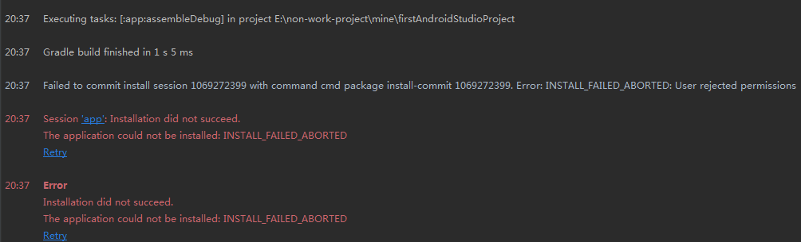
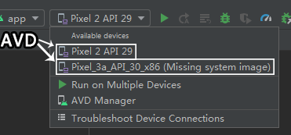

# android studio

- 开启项目后gradle下半天的问题  
  开系统翻墙也不好使  
  - 解决方法：
    1. 翻墙下好gradle的压缩包  
       （比如gradle-6.5-bin.zip就是[这个地址](https://downloads.gradle-dn.com/distributions/gradle-6.5-bin.zip)）
    2. 关掉AS
    3. 找到类似`C:\Users\Administrator\.gradle\wrapper\dists\gradle-6.5-bin\6nifqtx7604sqp1q6g8wikw7p`这样的目录
    4. 把类似`gradle-6.5-bin.zip.lck`和`gradle-6.5-bin.zip`的2个文件删掉
    5. 放入下好的gradle压缩包
    6. 开启AS
    7. 剩下的AS会处理好，也会把压缩文件解压出来

# 命令行

- `android.BAT`  
  以`“android sdk”绝对路径\tools\android.BAT`开头在命令行里可以执行一些命令  
  - 查看可执行命令：  
    执行`“android sdk”绝对路径\tools\android.BAT`来查看  
  - 可执行命令示例：  
    `D:\devtools\android\android_sdk\tools\android.BAT list target`

# 使用真实设备运行

初次安装调试的app时可能要选择“允许文件传输”

**步骤**

1. 准备好AS等各种东西
2. 在AS新建项目  
   要注意设置的`Minimum API level`不能高于手机的
3. usb连接手机与电脑
4. 手机开启USB调试
5. 如果顺利的话几秒内AS就会开始加载  
   加载成功的话这块就会显示出连接的手机  
   
6. 点击上图的绿色三角  
   然后手机上就会提示安装app  
   点允许即可

如果有步骤进行不下去的话看这里

- 第5步未显示出连接的手机的话  
  - 原因：应该就是AS没检测到连接的手机  
    有一个方法可以进一步确定这个猜想  
    那就是：上方工具栏 -> Tools -> Troubleshoot Device Connections
  - 解决办法：  
    华为手机的话需要安装华为手机助手  
    调试的时候不开华为手机助手也可以
- 第6步手机上提示`解析包时出现问题`  
  并且AS上有如下提示  
    
  - 问题原因：  
    app的`Minimum API level`设置得太高了
  - 解决办法：  
    把app的`Minimum API level`设置得不高于手机的

**google给的用真实设备运行的方式都不好使**

- 方式A

  > 1. 在Android Studio中，从工具栏的“运行/调试配置”下拉菜单中选择您的应用。
  > 2. 在工具栏中，从目标设备下拉菜单中选择要在其上运行应用程序的设备。
  >
  > —— [在真实设备上运行app](https://developer.android.google.cn/training/basics/firstapp/running-app#RealDevice)

- 方式B：[安装OEM USB 驱动程序](https://developer.android.google.cn/studio/run/oem-usb)  
  这个页面并没有什么卵用  
  对win7的2个操作并没有什么卵用  
  OEM USB驱动程序也么有什么卵用  

# 模拟真实设备

如果已经配置完毕的话，只要点击Run按钮（）就可以模拟真实设备（要稍等一会才会开启）

- 如果没有模拟成功  
  1. 需要在Tools/AVD Manager里查看是否有可用的配置
  2. 有的话，检查是否在下拉列表里选择了可用的AVD  
     下拉列表如下：  
     

在AS中打开模拟设备的另一个方法：

Run -> Debug -> App -> Run

**Android Emulator和AVD的关系**

> AVD是一种配置，用于定义要在[Android Emulator](https://developer.android.google.cn/studio/run/emulator)中模拟的Android手机，平板电脑，War OS，Android TV或Automotive OS设备的特征 。—— [创建和管理虚拟设备](https://developer.android.google.cn/studio/run/managing-avds)

意思就是说AVD是Android Emulator中的一个概念

**3种配置的优先级**

> - AVD configuration properties override hardware profile properties.
> - Emulator properties that you set while the emulator is running override them both.  
>
> —— [AVD properties](https://developer.android.google.cn/studio/run/managing-avds#avdproperties)

**[Android Emulator](https://developer.android.google.cn/studio/run/emulator)**

安卓模拟器

> 提供了真正的Android设备的几乎所有功能。可以安装app、存储文件，模拟来电和短信，指定设备的位置，模拟不同的网络速度，模拟旋转和其他硬件传感器，访问Google Play商店等等。 —— [《Android Emulator》](https://developer.android.google.cn/studio/run/emulator)

[《Android Emulator》](https://developer.android.google.cn/studio/run/emulator)里还提供了更多详细信息

**AVD**

android virtual devices（安卓虚拟设备）

> - AVD在电脑上有专用存储区域
> - AVD 存储设备用户数据，如已安装的应用和设置以及模拟 SD 卡
> - 可以用AVD Manager 擦除用户数据
>
> —— [google之存储区域](https://developer.android.google.cn/studio/run/managing-avds#storage)

**AVD Manager与avdmanager**

> AVD Manager是一个可以从 Android Studio 启动的界面 —— [创建和管理虚拟设备](https://developer.android.google.cn/studio/run/managing-avds)

> `avdmanager` 是一个命令行工具 —— [avdmanager](https://developer.android.google.cn/studio/command-line/avdmanager)

# [API级别](https://developer.android.google.cn/guide/topics/manifest/uses-sdk-element#ApiLevels)

# 其他

- > `adb` 包含在 Android SDK 平台工具软件包 —— [android调试桥](https://developer.android.google.cn/studio/command-line/adb?hl=zh_cn)