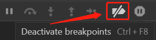

# 开发者工具

- 断点  
  程序运行到断点处就会进行阻断  
  之后可以（在source选项卡）查看各变量的值（有时不准确，比如.vue文件中部分变量值会显示为`undefined`）  
  且在console选项卡的后续上下文环境就会变为断点处的  
  打断点的两种方法：【】？？
  
  - 右侧的“Call Stack”  
    第一个是断点所在的函数，第二个是断点所在的函数所在的函数...以此类推  
    点指定函数，就会跳到指定函数中调用“Call Stack”上一条函数的地方
  
- 使用断点时交互是会有问题的  
  比如拖拽事件中打了断点，断点过了之后会触发点击事件（甚至是多次点击事件）

- 进入断点有时会导致程序运行结果不同  

    比如需要获取当前时间的程序

- 代码里写debugger  
    执行到debugger时就进行阻断  
  - source选项卡中点击某行代码行首数字  
    相当于在行尾加上`;debugger`  
    （似乎只有真正运行的文件才可以这样操作，比如.vue文件就不行）  
  
- 谷歌控制台值显示为`...`的属性似乎都是点击时获取的

- 有时候打印结果是异步的

- 控制台输入函数即使不回车也会让函数执行（未做进一步测试）

- 输入css  

    开头写`%c`，逗号后写css（不用加花括号，不支持`opacity`）
    
- 可以通过下图的按钮把断点全过了（不让断点生效）  
    

- 控制台可以把前端代码改了，保存后会按更改后的代码执行

- 可以在控制台修改变量，后续程序会按照修改后的来（未测试）

### 控制台

console标签

- 搜索范围  
  这里说的搜索包括上方的filter和按ctrl+f调出的搜索框  
  在对象中可以搜到第一级的内容，第二级搜不到（除非已经展开过）  
  （数组的情况未测试）
- 保存当前控制台内容  
  右键后点击`Save as ...`  
  右键在对象或symbol上的话没有这个选项
- 将对象保存为全局变量  
  右键对象后点击`store as global variable`  
  不能保存symbol以外的原始类型值

### Audits

在最新版chrome上可能命名为Lighthouse

可以对网站性能进行评价，谷歌建议所有性能优化工作从这里开始。不过可能会因为在墙内而受到影响（这个影响是自己猜测的）

# 安装扩展

『扩展集合文件夹』：C:\Users\用户名\AppData\Local\Google\Chrome\User Data\Default\Extensions  

- **注意点**  
  - 『扩展集合文件夹』是有可能被全覆盖的  
    一次迅雷强行插入扩展并且用户在chrome的提示中点了“启用”后就导致了这个情况  
    图标上这个标志可能代表扩展是强行插入的
- **从已装有扩展的电脑上移植**  
  用这种方法装的扩展似乎都有这个标志    
  可能用这种方式安装的扩展是无法更新的
  2. 『扩展集合文件夹』里的每个文件夹就是一个扩展  
     这个代表扩展的文件夹在这里称为『扩展文件夹』  
     打开『扩展文件夹』会看到一个以版本号为名的文件夹  
     这里称为『版本号文件夹』
  3. 将『扩展集合文件夹』拷贝到需安装扩展的电脑上  
     将其放在一个合适的位置（*这时可以对其进行重命名*）  
     之后要确保这个文件夹以后不会被删除或移动  
     **不然会导致这文件夹内的扩展不可用**
  4. 在chrome打开chrome://extensions/，并打开开发者模式
  5. 将『版本号文件夹』拖入浏览器完成最终安装
  

# 扩展

- **谷歌访问助手**  
  ID（文件夹名）：gocklaboggjfkolaknpbhddbaopcepfp  
  目前chrome网上应用商店已经找不到这个扩展了  
  有一次出bug导致没有这个扩展也能访问google所有内容，但是在重新添加这个扩展后失效了  
  bug：将文件夹放在『扩展集合文件夹』中的一个文件夹下，开启后在试用期内没有激活，后来『扩展集合文件夹』被重置了，结果还是能访问

# 书签

- **本地的书签信息**  
  本地存有书签的文件有C:\Users\Administrator\AppData\Local\Google\Chrome\User Data\Default文件夹下的『Bookmarks.bak文件』和『Bookmarks文件』  
  两个文件的内容是完全一致的

# 快捷键

- 打开新窗口  
  ctrl+n
- 打开新标签
  - ctrl+t  
    开启一个
  - ctrl+shift+t  
    打开刚才关闭的一个或者多个标签页
- 关闭标签  
  ctrl+f4
- 切换标签页
  - ctrl+tab
  - ctrl+shift+tab
  - ctrl+数字（1到8）  
    跳到窗口中第n个标签
  - ctrl+9  
    跳到窗口中最后一个标签

