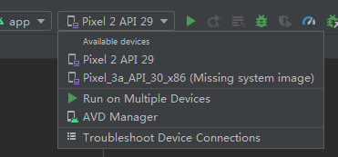

- 平台  

  - 执行`cordova platform list`命令列出的平台可能不全  
    不过依旧可以通过`cordova platform add 平台`命令添加平台

  - 已知平台有：
    - android
    - browser
    - ios
    - electron
    - windows

- 前置条件
  
  - 检查是否满足添加的各平台的前置条件  
    `cordova requirements`
  
  - [android](https://cordova.apache.org/docs/en/latest/guide/platforms/android/index.html#installing-the-requirements)  

# 创建项目

- 不使用模板  
  `cordova create 路径`
- 使用模板  
  `cordova create path [id [name [config]]] [options]`  
  可参考资料有：[教程](https://cordova.apache.org/docs/en/latest/guide/cli/template.html)和[CLI](https://cordova.apache.org/docs/en/latest/reference/cordova-cli/index.html#cordova-create-command)  

跑起项目

- 安卓
  1. 开启模拟的设备  
     （比如通过AS开启）
  2. `cordova run android`  
     这时模拟设备上就已经有项目对应的应用了  
     （自己操作下模拟设备就能开启这个应用）

执行`cordova run 平台名`时可能遇到的问题

- 安卓
  - 可能在下载gradle-6.5-all.zip上出现问题  
    - 问题表现：
      - 等待时间过长
      - 命令执行失败并报错`Could not unzip`
    - 解决方案：  
      翻墙下载[gradle-6.5-all.zip](https://downloads.gradle-dn.com/distributions/gradle-6.5-all.zip)  
      并替换类似如下地址中的`gradle-6.5-all.zip`  
      `C:\Users\Administrator\.gradle\wrapper\dists\gradle-6.5-all\2oz4ud9k3tuxjg84bbf55q0tn`

# 非cordova内容

### android studio

- 开启项目后gradle下半天的问题  
  开系统翻墙也不好使  
  - 解决方法：
    1. 翻墙下好gradle的压缩包  
       （比如gradle-6.5-bin.zip就是[这个地址](https://downloads.gradle-dn.com/distributions/gradle-6.5-bin.zip)）
    2. 关掉AS
    3. 找到类似`C:\Users\Administrator\.gradle\wrapper\dists\gradle-6.5-bin\6nifqtx7604sqp1q6g8wikw7p`这样的目录
    4. 把类似`gradle-6.5-bin.zip.lck`和`gradle-6.5-bin.zip`的2个文件删掉
    5. 放入下好的gradle压缩包
    6. 开启AS
    7. 剩下的AS会处理好，也会把压缩文件解压出来

### 命令行

- `android.BAT`  
  以`“android sdk”绝对路径\tools\android.BAT`开头在命令行里可以执行一些命令  
  - 查看可执行命令：  
    执行`“android sdk”绝对路径\tools\android.BAT`来查看  
  - 可执行命令示例：  
    `D:\devtools\android\android_sdk\tools\android.BAT list target`

### 使用真实设备运行

google有说明，但是如下2点的操作并不如预期

> 1. 在Android Studio中，从工具栏的“运行/调试配置”下拉菜单中选择您的应用。
> 2. 在工具栏中，从目标设备下拉菜单中选择要在其上运行应用程序的设备。
>
> —— [google](https://developer.android.google.cn/training/basics/firstapp/running-app#RealDevice)

### 模拟真实设备

如果已经配置完毕的话，只要点击Run按钮（）就可以模拟真实设备（要稍等一会才会开启）

- 如果没有模拟成功  
  1. 需要在Tools/AVD Manager里查看是否有可用的配置
  2. 有的话，检查是否在下拉列表里选择了可用配置  
     下拉列表如下：  
     

打开模拟设备的另一个方法：

Run -> Debug -> 随便点点

【】搞清楚下面2个东西的区别

猜测：Android Emulator是一个程序，而AVD是一个配置，确定了在这个程序上具体用哪个设备

##### 安卓虚拟设备

AVD（android virtual devices）

##### 安卓模拟器

Android Emulator

# 学习

待做事项

- 更换AS及其他安卓内容的下载地址
- 在手机上调试应用

目录意义

- learnCordova_1  
  以`cordova create learnCordova_1`命令创建的项目  
  目前遇到了安卓开发环境不足的问题
- hello  
  跟着[create your first app](https://cordova.apache.org/docs/en/latest/guide/cli/index.html)走所建立出来的项目

当前Android Studio和安卓的一些东西可能被弄乱了，已经搞不清了