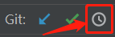

# Git


### 未归类

- 一个远程仓库可以下载到一个电脑的不同路径上
- 各终端可使用git命令的情况
  - powershell：可用
  - git bash：可用
  - cmd：不可用

### Git英文的专有名词

- 版本库 repository

- > 工作区 working tree —— [博客](https://blog.csdn.net/heart_mine/article/details/79424591)

- 暂存区 stage（或index）

- 分支 branch

- 有改动的文件 modified

### `$ git init`
把这个目录变成Git可以管理的仓库（表述可能不正确）
（内含工作区与版本库，.git文件夹以外都是工作区，.git是版本库）
这时候并没有真正创建master分支(`git branch`看不到任何东西)  
要第一次`add`、`commit`之后才有【】表达待整理  
要有master之后才能创建其他分支

### `git clone 地址`

将远程库克隆到本地  
这个`地址`都是以`.git`结尾的  
会在输入命令时所在文件夹里新建一个文件夹  
文件夹名应该就是`.git`前的那级路径  

- 只`clone`一个分支  
  `git clone -b branchA 地址`

### 把文件提交到分支
（使用下面两个命令前先要确保这个文件存在）

先`add`后`commit`

- **`add`**
  `git add readme.txt`
  add就是把文件修改添加到暂存区  
  全部添加的话使用`git add -A`，因为`git add .`在1.x版本上不会提交被删除的文件，2.x版本的话两个命令是一致的
- **`commit`**  
  `git commit -m "wrote a readme file"`
  把暂存区的所有内容提交到当前分支
  commit -m后的内容是对这次提交的说明性文字
  因此可以多次add后一次性commit来提交
  （测试提交未更改的文件，似乎失败了）


### 同时在版本库和工作区（本地）删除的文件
`$ git rm XX`  
要同步到分支的话要加上  
`$ git commit -m "remark information"`  


### `$ git status`
该命令用于查看状态
1. 如工作区有文件未提交到版本库且未被添加到暂存区里，则会打印“Untracked files:”  
   并在后面列出文件名（文件名的中文部分会以8进制形式显示）  
   如果希望中文正确显示的话要先输入一行命令：`git config --global core.quotepath false`
2. 如工作区有文件与分支不一致则会打印“Changes not staged for commit”  
   并在后面列出文件名  
   （文件名前会出现说明型前缀）
3. 如暂存区与分支不一致，则会打印“Changes to be committed:”  
   并在后面列出文件名  
   （文件名前会出现说明型前缀）  
   如暂存区与分支一致，则会在结尾打印“nothing added to commit”
4. 如果一切正常，则会打印“nothing to commit, working tree clean”  
   （一切正常意为工作区所有文件都与分支一致且暂存区无内容）  

### 文件名说明型前缀
“deleted: ”  
工作区没有而版本库有 或 暂存区没有而分支有  
“new file: ”  
暂存区有而分支没有  
“modified: ”  
工作区文件内容与版本库不一致 或 暂存区文件内容与分支不一致  
“renamed: ”  
（出现过一次，不过不知道触发机制。
测试了 工作区与暂存区不同、工作区与分支不同、暂存区与分支不同 都没触发）

### `$ git diff`
若暂存区有内容，则将工作区与暂存区比较  
若暂存区无内容，则将工作区与分支比较  
比较后的打印内容会显示 是否有不同、不同之处在哪  

### `$ git diff --cached`
比较暂存区与分支的不同  
比较后的打印内容会显示 是否有不同、不同之处在哪  

### `$ git log`
查看所有提交的版本


### 在不同commit间切换


### 回退版本

[思否文章](https://segmentfault.com/a/1190000020863861)有详细描述


**用`checkout`**

`checkout 版本号`（版本号就是指commit id）  
会新建一个未命名分支  
可以多次`checkout 版本号`  
要退出这个未命名分支的话只要再`checkout`到普通分支就行了  
`checkout`到普通分支后未命名分支就会消失

**不过在未命名分支里做修改的话似乎会导致严重的问题，暂时不要在未命名分支里做任何commit**

- 一次“修改”后安全离开的经验  
  都是在webstorm的控制台里操作的  
  操作步骤如下：
  1. 在一个分支上退了一个commit
  2. 压缩了文件，又删了新产生的压缩包  
     （没有add与commit）
  3. 切换到落后当前分支很多的主支
  4. 控制台报了错：  
     `Your branch is up to date with 'origin/master'.`
  5. 但是成功切换到主支，而且临时分支消失了


**用`reset --hard`**

- 退到指定commit  
  `git reset --hard commit的id`

· 回退到上个版本
`git reset --hard HEAD^`

【】--hard 似乎很有问题

如果commit后有做修改，那执行这个命令就会回到这个commit
HEAD后面`^`的数量代表回退2的`^`数量次方步（廖雪峰中说多少个`^`代表回退多少步），可以用~199这种简写

· 变成未来某个版本
$ git reset --hard 2b595d5eac
hard后面是未来版本的版本号的头几位，输入后git会自动检索

· $ git reflog
显示记录的每次命令（上次关机前的命令都会保存），每条命令前都会有这条命令所在的版本号


# 下方是做电动车项目后记录的

【】待整理到`# git`标签下


### 初次连接服务端
要生成密钥，并在服务端添加密钥，然后再来一些操作即可连接

### 更改本地仓库连接的远程仓库

`git remote set-url origin 远程仓库地址`  
<span style='opacity:.5'>远程仓库地址是指以`.git`结尾的那个地址</span>


### 新建分支
`git branch 分支名`

### 切换分支
`git checkout 分支名`  
（廖雪峰中说用`switch`更科学，不过[《Pro Git》](https://git-scm.com/book/zh/v2/Git-%E5%88%86%E6%94%AF-%E5%88%86%E6%94%AF%E7%9A%84%E6%96%B0%E5%BB%BA%E4%B8%8E%E5%90%88%E5%B9%B6)中就是用`checkout`）

```git
git branch 分支名
git checkout 分支名
```

可以简写为`git checkout -b 分支名`

### 删除分支

`$ git branch -d [branch-name]`

### 合并

> 不像其他的版本控制系统，Git 并不会尝试过于聪明的合并冲突解决方案。 Git 的哲学是聪明地决定无歧义的合并方案 —— [《Pro Git》](https://git-scm.com/book/zh/v2/Git-%E5%B7%A5%E5%85%B7-%E9%AB%98%E7%BA%A7%E5%90%88%E5%B9%B6)


##### <span style='color:red'>注意</span>

合并过程中不要手动对文件进行多余的修改  
比如说a文件没有冲突而b文件有冲突那你就不要去改a文件  
不然就算你修复了冲突也无法提交  
这时你输入`git status`会提示你冲突都解决了让你`commit`但是你`commit`又会提示你`fatal: cannot do a partial commit during a merge.`

解决方式就是退到合并之前，重新合并


##### 将本地另一个分支的代码合并过来

`git merge 分支名`


##### 冲突时2块的意思

冲突时在文件里有如下字样

```
<<<<<<< HEAD
aaaa
=======
bbbb
>>>>>>> commit号
```

合并这个操作肯定是有一个基础内容，然后把另外一个内容合并到基础内容上  
`<<<<<<< HEAD`和`=======`之间的内容就来自于基础内容  
`=======`和`>>>>>>> commit号`之间的内容就来自于另一个内容


上面的内容是自己猜测的，猜测依据有2个
1. 一次合并的经验  
    `<<<<<<< HEAD`指的是本机上之前commit的内容
    `>>>>>>> commit号`指的是远程服务器上要合并的内容
2. [《Pro Git》](https://git-scm.com/book/zh/v2/Git-%E5%88%86%E6%94%AF-%E5%88%86%E6%94%AF%E7%9A%84%E6%96%B0%E5%BB%BA%E4%B8%8E%E5%90%88%E5%B9%B6)中HEAD指的是合并的基础内容，commit号指的是`merge`命令后的分支


##### 从服务端下载指定分支代码并将其与当前分支进行合并
`git pull origin 远程主机分支名`  （这里origin是远程主机名）

即使当前不在要pull的分支也能执行完毕


**当本地库的代码跟远程库有冲突时**

- <b style='color:gray'>如果pull时已经自动合并冲突的话</b>  
会出现一些提示，包括以下字样
  
```
  Please enter a commit message to explain why this merge is necessary.
  especially if it merges an updated upstream into a topic branch.
```

这时候有2个选择：

- 输入commit信息  
  
  1. 按键盘字母 i 进入insert模式
  
  2. 输入commit信息（可以输入多行）
  
  3. 按键盘左上角"Esc"按钮
  
  4. 输入":wq"，然后按回车键
  - 不自定义commit信息  
    那就只做上文的第三、第四点即可  
    不自定义commit信息的话git也会自动补充上commit信息
  
- <b style='color:gray'>如果pull后还有为合并冲突的话</b>  
那需要手动合并，操作步骤如下
  
1. 有冲突的部分会有如下字样  
  
     ```
     <<<<<<< HEAD
     Creating a new branch is quick & simple.
     =======
     Creating a new branch is quick AND simple.
     >>>>>>> feature1
     ```
  
     把这些内容调整好
  
  2. `git add`有冲突的文件
  
  3. `git commit`


### 还原某个文件到上一次commit
`git checkout -- 文件名`  
`--`可以省略  
可以输入多个文件，文件间用空格隔开  
文件名中有空格的话文件要用单引号包起来  
文件名处可以改成`.`来选择所有文件  
**文件在已追踪未add状态下可以**  
未追踪或已add都不行

### 还原某个文件夹到上一次commit

用上一段的方法不行，但是用webstorm的撤销方法可以（叫什么忘记了）


### 提交分支代码到服务端
- `git push`  
  应该是整体提交
- **提交单个分支**  
  `git push origin 本地分支名`  
  如果服务端没有该分支的话则会自动在服务端新增该分支  


### 将本地另一个分支的文件覆盖到本分支

`git checkout 另一个分支名 文件路径`

### 忽略文件

增加`.gitignore`文件，在里面写上希望忽略的文件或文件夹  

- **按名称忽略内容内容**  
  直接写文件夹名或者文件名（含后缀名）  
  - 不论内容层级多深，只要名称被匹配到就会被忽略  
  - 被忽略的文件夹里边的内容也都会被忽略
- **编码**  
  `.gitignore`文件支持多种编码  
  如果编码不是`utf-8`的话，在`.gitignore`文件里的中文操作将会失效

##### 忽略文件已track文件

> .gitignore文件只能忽略那些原来没有被track的文件，如果某些文件已经被纳入了版本管理中，则修改.gitignore是无效的。
那么解决方法就是先把本地缓存删除（改变成未track状态），然后再提交。 —— [引用自《福信富通GIT使用帮助》](https://git.fxft.net/fxft/help/src/master/README.md#gitignore%E6%96%87%E4%BB%B6%E7%9A%84%E4%BD%BF%E7%94%A8)
```cmd
git rm -r --cached . // `git rm -r --cached 文件或文件夹`
git add -A
git commit -m 'xxx'
```


### tag标签

- 查看所有标签  
  `git tag`
- 切换到指定标签  
  `git checkout 标签名`

[点这看更多内容](https://git-scm.com/book/zh/v2/Git-%E5%9F%BA%E7%A1%80-%E6%89%93%E6%A0%87%E7%AD%BE)


# git相关的内容

- 不要使用windows自带记事本编辑文件  
  （可能是因为会把编码改为GBK）
- 码云上多行commit信息的显示不好  
  一开始只会显示一行，要鼠标移上去一会才会显示全部内容


### WebStorm的git相关功能

【】这些东西有空整到webstorm的笔记里

- WebStorm的git相关功能挺好用的    
  WebStorm命令行和『Git Bash』相比也各有千秋

- 可以完成git的各种操作

  - commit  
    提交前会进行代码检查（比如会检测出无用代码、像没有`alt`属性的`img`标签这样不那么符合规范的代码）（可以选择点review来拒绝提交而进行检查）  
    似乎无法提交忽略文件  
    commit描述可以输入多行的
  - add  
    似乎无法add忽略文件
  - 合并其他分支  
    操作步骤：
    1. 用git命令切换到需要合并其他分支的分支
    2. 切换到“Log”选项卡
    3. 在要合并的分支上右击
    4. 移到“Branch 分支名”菜单上
    5. 点击“Merge into Current”
    6. 完成

- 忽略文件  
  上面2条说的忽略文件都会显示在“Ignored Files”里  
  关于忽略文件的检测似乎有点问题，和git的表现不一致（版本2018.3）

- 查看自上次commit后做了哪些修改  
  看“Local Changes”选项卡

- 似乎能在`Console`面板看到git命令记录？

- 可以回退代码到上一次commit

- 更改某次commit的信息（msg）  
  操作步骤如下：

  1. 在commit上右键
  2. 点击“Reword...”
  3. 在弹框里输入新的信息

  如果已经提交到远程仓库的话，“Reword...”按钮将是不可点击的

- 可以查看单个文件在git中的历史  
  打开文件后点右上角的时钟按钮就行，下面是这个按钮的截图：  
  


# 学习

cd d:nospace/learngit

### 学习进度

学完https://www.liaoxuefeng.com/wiki/0013739516305929606dd18361248578c67b8067c8c017b000/0013745374151782eb658c5a5ca454eaa451661275886c6000


### 码云上简易的命令行入门教程:

##### Git 全局设置:

```cmd
git config --global user.name "王佳星"
git config --global user.email "417783514@qq.com"
```

##### 创建 git 仓库:

```cmd
mkdir front-dev-framework
cd front-dev-framework
git init
touch README.md
git add README.md
git commit -m "first commit"
git remote add origin https://gitee.com/IDontDrive/front-dev-framework.git
git push -u origin master
```

##### 已有仓库的话做如下操作

已经测试过，可用

测试环境如下：

- 文件夹名与参考名是否相同：不同
- 是否执行过`git init`命令：是
- 是否执行过`git commit`命令：是

```cmd
git remote add origin https://gitee.com/IDontDrive/front-dev-framework.git
git push -u origin 你要推送的分支名 // 推送一个分支就要执行一次这个命令
```

