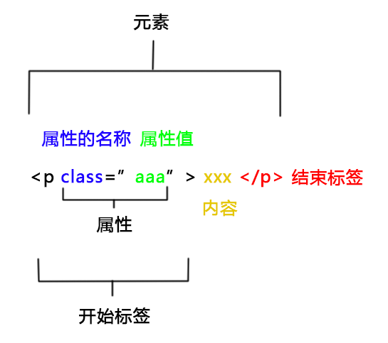

# 综合

> 网页可以视为可以包含任意数量分支的文档树（A web page could be considered as a document tree that can contain any number of branches） —— [《网页的基本架构》（MDN提供的链接）](https://www.sitepoint.com/basic-structure-of-a-web-page/)

> 一个web页面是一个文档。这个文档可以在浏览器窗口或作为HTML源码显示出来。DOM提供了对同一份文档的另一种表现，存储和操作的方式。 DOM是web页面的完全的面向对象表述，它能够使用如 JavaScript等脚本语言进行修改。 —— [MDN](https://developer.mozilla.org/zh-CN/docs/Web/API/Document_Object_Model/Introduction#%E4%BB%80%E4%B9%88%E6%98%AF_DOM)

> 在文档中的每个元素都是文档所属于的文档对象模型（DOM）的一部分 —— [MDN](https://developer.mozilla.org/zh-CN/docs/Web/API/Document_Object_Model/Introduction#DOM_and_JavaScript)

> DOM可以用js外的语言来编写，比如python —— [MDN](https://developer.mozilla.org/zh-CN/docs/Web/API/Document_Object_Model/Introduction#DOM_and_JavaScript)

- 元素是节点的子集
- **标签的id**  
  所有标签的id值都会作为键增加到`window`变量下  
  这个增加的属性的属性值就是标签对应的dom  
  <span style='opacity:.5'>可以通过window调用到这个增加的属性，不过当前未在打印出的window对象上找到这些属性</span>
- firefox滚动条bug  
  （并不明确触发条件，约十分钟内进行的尝试有这个bug，结果之后不知道为什么没有了）  
  有元素大于视口，但是父元素已经`overflow: hidden;`了，结果还是会出现滚动条。  
  解决方案：body上加`overflow: hidden;`




- > 内容可以是文本但不一定是文本 —— [MDN](https://developer.mozilla.org/zh-CN/docs/Learn/Getting_started_with_the_web/HTML_basics)


# DOM

> 文档对象模型 （DOM：Document Object Model）是HTML和XML文档的编程接口 —— [MDN](https://developer.mozilla.org/zh-CN/docs/Web/API/Document_Object_Model/Introduction)

### 获得dom

- 获得dom子代  

  > - `dom.children`  
  >   获取元素节点，浏览器表现相同
  > - `dom.childNodes`  
  >   IE：只获取元素节点  
  >   非IE：获取元素节点与文本节点
  >
  > —— [博客](https://www.cnblogs.com/ilovexiaoming/p/6853176.html)

### dom的属性操作

- 获得dom的属性值  
  `dom.getAttribute(字符串属性名)`
- 设置dom的id  
  `dom.id=id值`

### 在文档上增减dom

增加dom：

- `document.body.appendChild(dom)`  
  多次对一个dom执行这个方法只会生效一次  
  这个方法会同步生效，`appendChild`后马上就能从文档上获取到这个dom

移除dom：

- `dom.remove()`
- `dom的父元素.removeChild(dom)`


### 样式相关

更改dom的类名

- [`classList`](https://developer.mozilla.org/zh-CN/docs/Web/API/Element/classList)  
  兼容性不完美  
  mdn里没写api，不过api看[示例](https://developer.mozilla.org/zh-CN/docs/Web/API/Element/classList#%E7%A4%BA%E4%BE%8B)就能了解了
  - `replace(被替换类,新增类)`  
    替换，如果dom上没有`被替换类`的话，`新增类`也不会被加进去  
    老婆说这个方法兼容性不好

##### 控制内联样式

`dom.style`是[CSSStyleDeclaration](https://developer.mozilla.org/zh-CN/docs/Web/API/CSSStyleDeclaration)的实例

- 给样式属性赋值  
  `dom.style.属性=属性值`
- 移除样式属性  
  `dom.style.removeProperty(属性)`
- dom的style属性是可读可写的  
  这就意味着：可以把一个dom的style赋值给另一个dom

控制css

- 听说直接修改style标签就可以，不过自己还未测试过
- 使用`CSSStyleSheet`实例


### iframe通信

获取对方的`window`是通信的基础，并且有了`window`基本就可以为所欲为了（可以进行dom调整、调用方法等操作）

- 获取iframe元素`window`的方法：  
  `iframe元素.contentWindow`
- iframe元素获取祖先页面`window`的方法：  

  > - [`window.parent`](https://developer.mozilla.org/zh-CN/docs/Web/API/Window/parent)返回当前窗口的直接父对象
  > - [`window.top`](https://developer.mozilla.org/zh-CN/docs/Web/API/Window/top)返回最顶层的窗口对象
  >
  > —— [MDN](https://developer.mozilla.org/zh-CN/docs/Web/API/Window/parent#See_also)


[**postMessage**](https://developer.mozilla.org/zh-CN/docs/Web/API/Window/postMessage)

当然，在获得`window`后也可以选择用`postMessage`进行通信

具体代码如下：

1. 增加事件监听  

   ```js
   window.addEventListener("message", e=> {
     console.log(e)
   })
   ```

2. 触发事件  
   `另一个页面的window对象.postMessage(数据,'*')`

[postMessage](https://developer.mozilla.org/zh-CN/docs/Web/API/Window/postMessage)上有`postMessage`的进一步资料


### 其他

- 找到元素的父元素：  
  `dom.parentElement`

  

# 其他

### 中文支持情况

ie5支持js中的中文  

- 测试环境：ie11模拟ie5

- 测试代码：  

  ```html
  <!DOCTYPE html>
  <html lang="en">
  <head>
    <meta charset="UTF-8">
    <title></title>
  </head>
  <body>
  <script>
    var 一 = 1
    var 对象 = {
      甲: 2,
      乙: 3
    }
    
    函数()
    function 函数() {
      对象.乙 += 一
      console.log(对象)
    }
  </script>
  </body>
  </html>
  ```

### 模块

- 浏览器的模块里路径的".js"不能省略


# HTML

- 可以用任意英文做标签名，但是用中文不行
- **中文乱码**  
  加`meta`标签即可解决，以下两个标签都可以
  1. `<meta charset="UTF-8">`
  2. `<meta http-equiv="Content-Type" content="charset=utf-8"/>`
- 可以通过插入`script`、`link`这种js或css的标签来使js或css生效
  - 电气符号库与GeoGL的鉴权服务就用了插入标签来执行js的方法
  - css  
    吉奥这有人用这种方式使css生效（个人未做详细测试）
- [预加载](https://developer.mozilla.org/zh-CN/docs/Web/HTML/Preloading_content)


# CSS

- 可以使用`@import`语法组织代码
- 选择器可以进行连写，如：`.ivu-form-item-content>*:first-child`
- less会把空的样式去掉  
  纯css就算类名下没有样式，chrome控制台Elements->Styles标签里也会显示出该类名
- transform可以使用两个translate，rotateX和rotateZ也可以同时使用——源自mapbox
- 取消某个元素的交互能力  
  `pointer-events: none;`

### 滚动条

以下内容没有深入了解，并不保证100%正确

`::-webkit-scrollbar`可以改变滚动条样式，不过无法在鼠标移动到滚动条上时改变光标外观，火狐与IE不支持，其他浏览器基本都支持

ie也可以改变滚动条样式，不过仅限于颜色


### 层级关系

下方是chrome和firefox的实操经验

- float不影响层级关系
- relative与absolute参与层级关系的计算的效果是相同的

