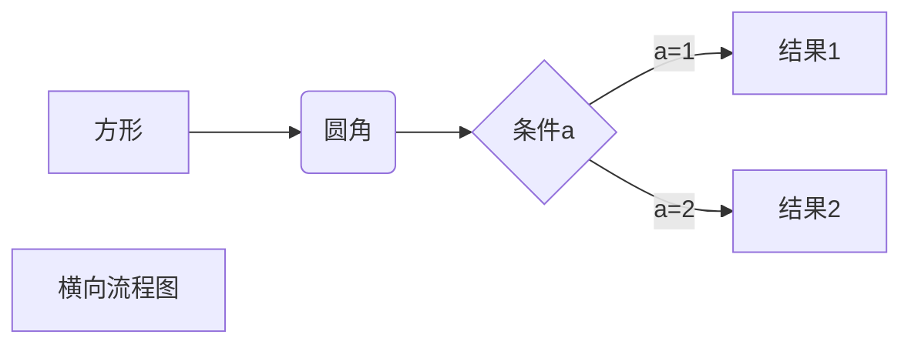

等号最高阶标题
====================
减号第二阶标题
---------------------
# 11第三方岁的dsfsdf
## 22第三方岁的dsfsdf
### 33第三方岁的dsfsdf
#### 44第三方岁的dsfsdf
##### 55第三方岁的dsfsdf
###### 66第三方岁的dsfsdf
只是回车换行的话，在显示的时候两行间就会变成用空格连接起来
有空行的话，不管空几行都会被视为两个段落，从而在段落间增加间距

空一行
空一行


空两行
空两行


只是需要换行而不需要段落间距的话    
可以使用在行末加四个空格一个回车来实现    
1. 这一点在列表中同样适用    
   而且会自动调整好行首间距    
   如果在列表中一个项目间加上空行的话    

    1. 该列表中所有同级项目与其它内容间都会加上空行        
    而且会自动调整好行首间距    
     测试文本    
    1. 测试文本        
    测试文本    
    1. 测试文本        
    测试文本    
1. 测试文本    
测试文本   
1. 测试文本    
测试文本   
1. 测试文本    
测试文本    
## 在文本中加入空格 会在显示时宽度不足时分成两行 标题中也适用
所以可以考虑在每一个标点符号后加入空格
>这一部分是在行首用角括号 “ > ” 引用的效果
> 
> 
> 
> 
>>在这里的一行或多行空白同样会被变成段落的分割标志
>>相邻行同样会变成被空格连接
>
>
>## 这行除了 “ > ” 还加了两个井号

>尝试只在段首用 “ > ”    
并且用 在段尾4个（或以上）空格一个回车来换行    
>>尝试简写方法的多级,第几级就要加几个 “ > ”      
似乎只能 越往下一行越加级，而不能减级。比如这一行是前面没加 “ > ” 的     
>而这一行加了一个 “ > ”      
>>而这一行加了一个 “ >> ” 

斜体：用*左右各一个星号*或者 _左右外侧空格内侧一个下划线_ 包裹
粗体：用**左右各两个星号**或者 __左右外侧空格内侧两个下划线__ 包裹
（在标题上无法使用粗体）

## 无序列表使用星号、 加号和减号来做为列表的项目标记， 符号后要加一个空格
使用星号：

* Candy.
* Gum.
* Booze.

加号：

+ Candy.
+ Gum.
+ Booze.

和减号

- Candy.
- Gum.
- Booze.

都会输出 HTML 为：

<ul>
<li>Candy.</li>
<li>Gum.</li>
<li>Booze.</li>
</ul>

## 有序的列表则是使用 *一般的数字接着一个英文句点及一个空格* 作为项目标记：

1. Red
2. Green
3. Blue
5. Red
0. Red

### 有序列表中用任意数字对最终显示没有任何影响

1. s
1. a
1. d
1. v
1. b
### 行首用四个空格缩进可以达到多级列表的目的
1. a
1. a
    1. a
    1. a
        1. a
        1. a
        1. a
    1. a
    1. a
1. a
1. a
1. a
1. a
1. a
1. a
1. a
1. a
1. a
1. a

## 行内链接和参考链接
### 可以打开同主机的文件
直接写相对路径就行
路径前加斜杠 “ / ” 可以 [点击文字](/vue 笔记.md) page for details.

路径前不加斜杠 “ / ” 也可以 [点击文字](vue 笔记.md) page for details.
#### 跳转到文件内指定位置

以下两种写法曾经都行，但是现在不行了

- 尝试跳转到文件的指定位子 [点击文字](vue 笔记.md##缩写) page for details.
- 尝试跳转到文件的指定位子 [点击文字](vue 笔记.md/##缩写) page for details.

不行的环境是：

- 版本：0.9.89(beta)
- 日期：2020年8月7日

### 行内链接
个人觉得行内链接比参考链接好 [example link](http://example.com/).
链接也可以写标题，格式是**一个**井号后紧连着标题内容[一个#](#参考链接).


这个链接加有titile属性 [example link](http://example.com/ "这是Title内容").
### 参考链接
[1]: http://google.com/ "Google"
[2]: http://search.yahoo.com/ "Yahoo Search"
[3]: http://search.msn.com/ "MSN Search"
个人理解：把链接赋值给一些变量，直接使用变量就等于使用链接 [Google][1] than from
[Yahoo][2] or [MSN][3].

### 需注意：webstorm中预览无法打开链接

## 可以使用HTML标签

但是style标签不生效

### 连写无属性的标签
> 需要注意的是：HTML标签后要加空行，不然后续一行的markdown语法会失效
<table><tr><td>Foo</td><td>Bar</td></tr></table>
> 需要注意的是：HTML标签后要加空行，不然后续一行的markdown语法会失效

### 有格式地写有属性的标签

  <table>
    <tr>
        <td style='width:333px;background:blue;position:absolute;'>Foo</td>
        <td style='width:333px;background:blue;'>Foo</td>
    </tr>
  </table>

## 分隔线
三种方式：

    <hr> 标签
<hr>
3个或以上星号
***

3个或以上减号

---

减号和星号间都可以加空格
*****
* * *
-------  ------------------   --------------
不过要注意：减号形式的上一行要是空行，不然上一行会被当作标题处理，如这一行
---
### 需注意：webstorm不仅无法显示分隔线，还会导致分隔线上下行重合


## 代码

- 行内代码  
  `aaa`
  - 行内代码中携带『\`』  
    - 实现方法：用『\`\`』包裹内容实现  
      像``1`1``这样  
      如果行内代码中的『\`』在边缘，需要加上空格，像`` ` ``这样
  
- 用『\`』包裹内容但是不希望变成行内代码（并且显示出『\`』）  
  实现方法：在『\`』前面加个 `\`就行


# 以下内容未在github上测试

## 数学类

- $左右各一个美元号开启行内数学公式^{112}$  

- 用两个美元符开启多行数学公式  
  $$
  \begin{align*}
  y = y(x,t) &= A e^{i\theta} \\
  &= A (\cos \theta + i \sin \theta) \\
  &= A (\cos(kx - \omega t) + i \sin(kx - \omega t)) \\
  &= A\cos(kx - \omega t) + i A\sin(kx - \omega t)  \\
  &= A\cos \Big(\frac{2\pi}{\lambda}x - \frac{2\pi v}{\lambda} t \Big) + i A\sin \Big(\frac{2\pi}{\lambda}x - \frac{2\pi v}{\lambda} t \Big)  \\
  &= A\cos \frac{2\pi}{\lambda} (x - v t) + i A\sin \frac{2\pi}{\lambda} (x - v t)
  \end{align*}
  $$

- `^`号开启上标  

- 开方：$\sqrt[开方数]{被开方数}$

- 像上标、开方这种符号默认都是取符号后第一个字符进入数学符号  

  要多字符进入数学符号的话要在左右加`{`与`}`  
  但是如果花括号里只有单字符的话在typora里解析会有问题


# 相关工具

### 导出html

- **Typora**  
  外观和编辑器里的一致  
  但是没有目录

- **i5ting_toc**  
  无法解析表格  
  有目录

- **marked+ejs**  
  可以解析表格  
  没有目录  
  样式不好看

### 生成文档

- **gitbook**  
  功能完整  
  可以把整个项目变成一个电子书  
  电子书的目录依据最外层的`SUMMARY.md`生成

  - `SUMMARY.md`的使用方式看下面这个例子就懂了  

    ```markdown
      # Summary
    
      * [Introduction](README.md)
      * [预备周：基于认知科学的信息训练法](ch0/preface.md)
          * [检索实操](ch0/RepSearchPractice.md)
          * [基础任务](ch0/RepTaskBasic.md)_
          * [进阶任务](ch0/RepTaskAdvanced.md)
          * [个人教程](ch0/handbook.md)
      * [第一讲：从现实问题到学科信息](ch1/README.md)
          * [检索实操](ch0/RepSearchPractice.md)
          * [基础任务](ch1/RepTaskBasic.md)
          * [进阶任务](ch1/RepTaskAdvanced.md)
          * [个人教程](ch1/handbook.md)
    ```

- VuePress与VitePress  
  
>- VuePress使用webpack与vue2
  >- VitePress使用vite与vue3
  >- VitePress有所有VuePress优点
  >
  >—— 尤雨溪（[视频](https://www.bilibili.com/video/BV1JK4y1G7bf)第10分钟）

  - vuepress  
    [vue3文档](https://github.com/vuejs/docs-next-zh-cn)应该就是用vuepress转的
  
  - VitePress
    
  - > 如果有新项目要做文档，推荐VitePress —— 尤雨溪（[视频](https://www.bilibili.com/video/BV1JK4y1G7bf)第13分钟）
    
    - > 可以用，但还在开发阶段—— 尤雨溪（[视频](https://www.bilibili.com/video/BV1JK4y1G7bf)第13分钟）
  
- [vue-router3](https://github.com/vuejs/vue-router/tree/dev/docs/zh)的文档就是用md写的  
  估计也是用vuepress

- docsify  
  能把md转为网站

- [看云](https://help.kancloud.cn/41497)  
  还未研究
  
- webpack有md相关的loader

- [animate.css的文档](https://github.com/animate-css/animate.css/tree/main/docsSource)似乎也是md生成的

# 待研究内容


- 点击后展示更多内容  
  [github-sheetJS](https://github.com/SheetJS/sheetjs)


[typora画流程图、时序图(顺序图)、甘特图](https://jingyan.baidu.com/article/48b558e3035d9a7f38c09aeb.html)




