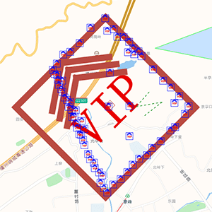

名词定义

- FeatureCollection  
  用通俗的话说就是 整份的geojson数据源  
- turf里说的geojson对象  
  包含FeatureCollection与feature（不知道有没有包含其他内容）


# geojson数据转换

- 其他数据转成geojson
  - @turf/helpers模块  
    都是各种把数据转成geojson或geojson的一部分的方法  
    - 生成feature的方法  
      比如：`point`、`multiPoint`、`polygon`  
      第一个参数都是数组，第二个参数会被放进`properties`
  - `points`  
    官方文档里没写  
    功能：输入多点数组，生成FeatureCollection
- geojson转geojson
  - 克隆geojson对象  
    `clone`  
    官网说比`JSON.parse` + `JSON.stringify`的方法快3到5倍
  - 多边形转单点  
    `explode`  
    首尾点都会被转进去（就是说点数量会比多边形角数量多1）
  - 展平  
    `flatten`  
    比如说可以把多多边形转为多个多边形


# 判断拓扑关系

除了专用于点的方法，其他方法的几何体输入要求都是([Geometry](https://tools.ietf.org/html/rfc7946#section-3.1)|[Feature](https://tools.ietf.org/html/rfc7946#section-3.2) )  
（这里说的专用于点的方法指的是：`booleanPointInPolygon`和`booleanPointOnLine`）


### 判断一个几何体是否包含另一个几何体  

`turf.booleanContains(大的几何体,小的几何体)`或`turf.booleanWithin(小的几何体,大的几何体)`


**判断结果为多边形包含线的条件**：  
线不超出多边形的同时线又不能完全在多边形的边缘上  
<span style='color:red'>有时候判断会出错</span>：  
出错几率高的情况：

- 三角形与镜像Z折线
- 多边形接近包含折线的情况（实际上肉眼可以判断出是没有包含的）

解决办法：  
判断包含后再判断一下相交，相交的话99%以上几率就说明是不包含的


**2个多边形在不同拓扑关系下的判断结果**：

- 区域完全一致：属于包含关系
- 完全包含但边缘有重合：属于包含关系
- 完全包含且边缘没有重合：属于包含关系
- 没有包含关系但是有部分重叠：<b style='color:red'>不</b>属于包含关系


`booleanContains`和`booleanWithin`面对2个多边形或者多边形与线时的区别：  
<span style='opacity:.5'>（其他几何体还未做测试）</span>

- 感觉效果只是头2个参数对调了一下  
- 感觉`booleanContains`是`booleanWithin`的升级版
- 源码差异约有70%  


性能测试：  
判断一万次点在三角形内只用了80毫秒（第二次测试中结果在20~58之间）  


报错：

- 如果几何体类型不对的话会报错  
  比如大的几何体是线，小的几何体是多边形就会报错  
  报错内容为：`feature2 第二个参数的几何类型 geometry not supported`


`booleanContains`

- 已知可用的几何结构组合
  - `turf.booleanContains(polygon, polygon)`
  - `turf.booleanContains(polygon, line)`
  - `turf.booleanContains(polygon, point)`
  - `turf.booleanContains(line, point)`
- 略微提升性能  
  可以选择使用这个模块里的子方法  
  子方法在文档里找不到不过可以在源码里找到  
  子方法的入参都只能是几何体而不能是feature


##### 判断点是否在多边形内

- 判断多点是否在多边形内  
  `pointsWithinPolygon`  
  输入不定数量的点和多边形，返回在多边形内的点  
  返回形式是geojson

  ```js
  var points = turf.points([
      [-46.6318, -23.5523],
      [-46.6246, -23.5325],
      [-46.6062, -23.5513],
      [-46.663, -23.554],
      [-46.643, -23.557]
  ]);
  
  var searchWithin = turf.polygon([[
      [-46.653,-23.543],
      [-46.634,-23.5346],
      [-46.613,-23.543],
      [-46.614,-23.559],
      [-46.631,-23.567],
      [-46.653,-23.560],
      [-46.653,-23.543]
  ]]);
  
  var ptsWithin = turf.pointsWithinPolygon(points, searchWithin);
  ```

- 判断单点是否在多边形内  
  `booleanPointInPolygon`  

  ```js
  var pt = turf.point([-77, 44]);
  var poly = turf.polygon([[
    [-81, 41],
    [-81, 47],
    [-72, 47],
    [-72, 41],
    [-81, 41]
  ]]);
  
  turf.booleanPointInPolygon(pt, poly);
  ```

源码解读

- booleanContains  
  有使用booleanPointInPolygon  
  源码解读：判断2个参数分别属于什么类型，不同类型使用不同方法
- pointsWithinPolygon  
  遍历后使用booleanPointInPolygon
- booleanPointInPolygon  


### 判断几何体边缘是否有接触

- 判断2个类型<span style='color:red'>不同</span>的几何体  
  `turf.booleanCrosses(几何体,几何体)`  
  （已在线与多边形上验证了功能）
- 判断2个类型<span style='color:red'>相同</span>的几何体  
  `turf.booleanOverlap(几何体,几何体)`  
  `booleanOverlap`的功能是：判断交集在拓扑上是否和2个几何体都不同  
  通俗地对功能进行解释就是：判断2个几何体是否『坐标点不完全一致且边缘有接触』  
  （已在线与多边形上验证了功能）


### 判断2个几何体是否没有交集  

`booleanDisjoint`  
这里记的是官网的说明，个人并未测试


# 得到点线（非拓扑）关系

<span style='opacity:.5'>`pointToLineDistance`和`nearestPointOnLine`间没有相互依赖的关系</span>

- 计算点与线间的距离  
  `pointToLineDistance`
- 找到线上距离某点最近的一个点  
  （同时会返回输入点和最近点之间的距离）  
  `nearestPointOnLine`


# 旋转

 `transformRotate`  
是顺时针转的（官网说的“negative clockwise”可能是针对从地面往天上看的情况，毕竟说了“right-hand rule”）  
角度区间至少支持(-360,360)  

- `mutate`选项  
  - 作用：官网说这个选项设为`true`的话可以提高性能  
  - BUG：个人测试中设为`true`的话会导致变形  
    具体变形情况：正方形变梯形  
    环境：npm包`"@turf/transform-rotate": "^5.1.5"`


# 其他（简易）方法

- 取出2个多边形中重合部分 `intersect`
- 简化多边形 `simplify`
- 移动
  - `lineOffset`
  - `transformTranslate`
- 缩放 `transformScale`
- 求线条交点 `lineIntersect`