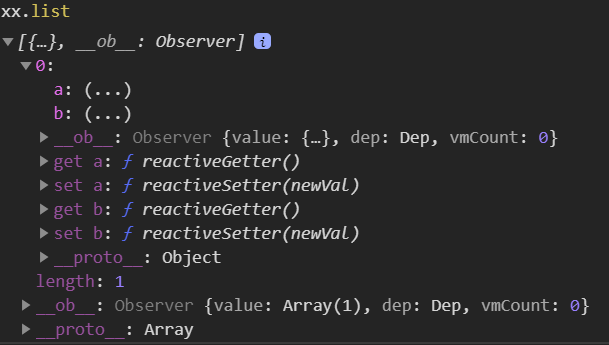
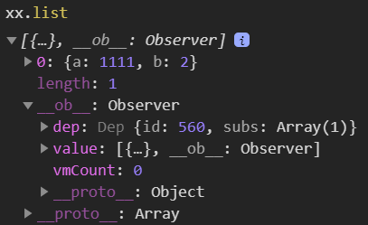

# 待研究

- created里执行的函数的this是undefined
- 在method里调用函数，函数的this居然不是组件实例？
  中间加一层this.$nextTick的话this就是组件实例了  
  计算属性里的也是
- mounted 中window.addEventListener method  
  method里的this是vue实例
- 了解data在生命周期里的执行时机，其中data先于mounted执行。和其他时机对比的先后顺序待了解、data是否能执行methods待了解
- 实例中的`$options`等成员
- keep-alive  
  不知道是啥东西，只知道没见过
- component标签
- 测试不加mixin钩子是不是还是数组


记录vue混合和模板

- https://segmentfault.com/q/1010000016743391
- https://forum.vuejs.org/t/mixin-and-templates/5053/4
- http://jsfiddle.net/6x2v9y20/24/


构建vue项目可以用到的内容

- vue-cli
- vue-loader  
  webpack的loader，提供单文件组件支持
- `npm install vue`
- vueify  
  已废弃。  
  github上说正在集中精力搞webpack and rollup  
  
  > 用于Browserify的Vue组件转换 —— [JavaScript中文网](https://www.javascriptcn.com/read-63210.html)


有空整理一个有less，vuex配置完全，去掉默认页面,build.js引入前面去掉 / ,四空格缩进的模板  
（原本写在《vue-loader 学习笔记》里）

# 起始

支持ie9

### 版本


**术语**

- 编译器  
  将模板字符串编译成为js渲染函数的代码
  
- 选项  
  组件配置对象的第一级属性
  
- attribute  
  vue官网中的attribute指的都是标签上的属性
  
- [指令](https://cn.vuejs.org/v2/guide/syntax.html#%E6%8C%87%E4%BB%A4)  
  
  > 带有 `v-` 前缀的特殊 attribute
  
  

##### 版本的维度

有4个维度来描述版本

- 完整版或运行时

  - 完整版  
    包含『运行时』和『编译器』

  - 仅运行时（runtime-only）  
  不包含『编译器』的版本  
    
    > 当使用 vue-loader 或 vueify 的时候，*.vue 文件内部的模板会在构建时预编译成 JavaScript。你在最终打好的包里实际上是不需要编译器的，所以只用运行时版本即可。 —— [官网](https://cn.vuejs.org/v2/guide/installation.html#%E8%BF%90%E8%A1%8C%E6%97%B6-%E7%BC%96%E8%AF%91%E5%99%A8-vs-%E5%8F%AA%E5%8C%85%E5%90%AB%E8%BF%90%E8%A1%8C%E6%97%B6)

- 不同的模块化方案

  - UMD版
  -  CommonJS版
  - 给构建工具使用的ES Module版
  - 给浏览器使用的ES Module版

- 开发版或生产版

- 版本号

**[版本清单](https://cn.vuejs.org/v2/guide/installation.html#%E5%AF%B9%E4%B8%8D%E5%90%8C%E6%9E%84%E5%BB%BA%E7%89%88%E6%9C%AC%E7%9A%84%E8%A7%A3%E9%87%8A)**<span style='opacity:.5'>（👈点这里查看）</span>


### 查看编译后的源代码的方法

谷歌控制台sources选项卡 -> Page选项卡 -> Top文件夹 -> webpack://文件夹 -> src文件夹

# 综合

- 尽量不要去修改vue生成的dom，不然可能导致视图更新错误  
  - 例子：  
    写了一个组件，组件内用v-if写了个div  
    如果把组件根元素作为echarts容器，那么这个带v-if的div就再也不会出现了
- 模板里有时候可以去掉双引号


### 缩写
- `<a v-bind:href="url"></a>` 缩写-> `<a :href="url"></a>`
- `<a v-on:click="doSomething"></a>` 缩写-> `<a @click="doSomething"></a>`


### `.nextTick`

1、Vue.nextTick(function () {...})
   页面中所有dom渲染好之后立即执行当中函数内容（[官网](https://cn.vuejs.org/v2/api/#mounted)是这么说的，但是如果vue模板解析时报错的话执行时dom也会有没渲染好的），（由于vue的智能渲染，直接运行的函数会先运行，然后再渲染dom，所以nextTick中获取的数值都是先运行这些函数后才获得的）
   setTimeout延迟0毫秒效果同上。延迟更长时间就能获取到更长时间后改变的数据，这点nextTick做不到。

  nextTick在watch中似乎没有效果,setTimeout0有  
  （例子：建2个data，watch一个data，被watch的data改变后调用nextTick改变另一个data。似乎不管什么时候两个data值都是相等的，套2层nextTick也一样）

2、this.$nextTick(function () {...})
   实例中套与不套好像没什么差别


### 混合mixins

存在于Vue.extend中<span style='opacity:.5'>（？？？）</span>，所以实例、组件都可以使用，使用例子：

```js
var mixin = { //先声明要混合的部分
  created: function () {
    console.log('混合对象的钩子被调用')
  }
}
new Vue({
  mixins: [mixin], //将要混合的部分用中括号包裹后放入mixins选项中即可完成混合
  created: function () {
    console.log('组件钩子被调用')
  }
})
```

- 可以用mixin把模板和其他内容拆开

- data和methods都可以用mixins进行拆分

- 同名钩子函数混合规则：  
  两个函数都保存，混合对象的钩子先调用，原钩子再调用。

- 值为对象的（非自定义）选项的同名混合规则：（这个说的是data吧？？？）  
  对象键名冲突时，取原对象的键值对。

- 值为对象的（自定义）选项的同名混合（的默认）规则：  
  不产生任何效果。

- 可以通过 “optionMergeStrategies” 自定义混合规则【还未研究】

- 全局混合：（所有实例和组件都会受到混合）  

  ```js
  Vue.mixin({
    ...
  })
  ```

- mixin里也可以拥有mixin


### 自定义指令

（有文章说用于DOM操作）
对使用自定义指令的对象执行函数。
使用方法：在需要使用的标签中添加 “v-指令名” 属性
全局注册写法：

```js
    Vue.directive('focus', { //标签中加入 “v-focus” 属性即可使用
      inserted: function (el) { //inserted是钩子
        el.focus()// 聚焦元素
      }
    })
```

局部注册写法：
    directives: {
      focus: {
        // 指令的定义---
      }
    }
1、自定义指令有一套不同于 组件的生命周期钩子 的钩子，详见：
https://cn.vuejs.org/v2/guide/custom-directive.html#钩子函数
已知的有：
bind：只会在指令第一次绑定到元素时调用一次。
      不过其中可以设置事件，以此来达到多次调用部分代码的目的；
      而且事件中能改变bind的变量值，并反应到bind层级的函数内。
update：当其中语句依赖的数据发生改变后才会触发（应该是这样）
2、钩子函数的参数：
    el: 指令所绑定的元素，可以用来直接操作 DOM 。
    binding: 一个对象，包含以下属性：
        name:指令名，不包括v-前缀
        value:指令的绑定值（写在该自定义指令等号后面双引号中的内容）（会计算后得出最终数值）可以写对象（直接在标签中写{q:{a:1,b:2}}都可以），可以访问到对象后代数据
        oldValue:指令绑定的前一个值，仅在 update 和 componentUpdated 钩子中可用。无论值是否改变都可用。
        expression:指令的绑定内容，写在等号后面双引号中的内容以字符串形式写出来。
        arg:传给指令的参数。例如 v-my-directive:foo， arg 的值是 "foo"。
        modifiers:一个包含修饰符的对象。 例如： v-my-directive.foo.bar, 修饰符对象 modifiers 的值是 { foo: true, bar: true }。
    vnode.context代表所属实例的this
    其他vnode和oldVnode【不知道怎么用】
3、钩子只挂载在bind和update上的简写：
    Vue.directive('name', function (el, binding) {
      el.style.backgroundColor = binding.value //从渲染开始背景颜色就是value，后面value变动后背景颜色也会更新为value
    })


### 指令与vuex的结合使用

方法一：
局部引入其他文件指令，且指令中引入store的情况下，例子如下：
    store,
    钩子() {
        // store.state.数据名 可以使用
        // store.commit(xxx) 也可以使用，不过似乎无法使用辅助函数
    }
方法二：（不推荐使用，因为指令中部分独有代码可能要写在.vue文件中）
在.vue文件中注册mutation，并在指令中用vnode.context.xx()使用

【有需要再试验】能不能在指令中使用所有能在实例中用的vuex功能

### render函数（渲染函数，组件中的一个选项）

**【其实并不了解，需要一些实操后再整理】**

代替template渲染html（如与template同时存在template将会失效）
例子：
    render: function (createElement) {
        // 这里可以写一些东西 在后面的return里调用
        return createElement(标签名,设置该标签各内容的对象,包含在首尾标签中的内容);
    }
设置该标签各内容的对象（三个常用属性）：
1、class:{
       class1:true,
       class2:false
   }
2、style:{
      color: 'red'
  }
3、attrs: {
      href: 'www.baidu.com',
      'sa':'sa',
      'aaa':[1,2,3] //不能用对象，如果值为false则整个属性都不会显示，属性名和属性值都可以用变量代理
  }
还有更多属性，详见： https://cn.vuejs.org/v2/guide/render-function.html#深入-data-对象
包含在首尾标签中的内容：
写字符串就生成文本节点，也可以再写一个createElement生成一个子标签（再写createElement的话一定要包裹在数组中），也可以写变量来达到前两种效果，也可以写一个数组生成多个内容


##### 小知识点

VNodes必须唯一【测来测去好像多个VNodes也没什么问题】
在createElement生成的标签中写vue的html部分只会被当成普通html

- 默认不支持`v-model`这样的双向数据绑定  
  不过可以自己实现，[官方](https://cn.vuejs.org/v2/guide/render-function.html#v-model)有教

**坑**

- .vue文件里style标签的scoped影响不到渲染函数渲染出来的元素


### 模块

从.vue文件导入的模块会渲染为局部注册格式，而局部注册格式与全局注册格式不同（组件和自定义指令的全局注册都是传参格式而局部注册是对象格式），所以从.vue文件导入的模块都只能局部注册

将自定义指令写在.vue文件中时，export default内可以套directives: {}也可以不套
使用例子：
directives: {
    aaa
}
不过个人推断自定义指令的最佳封装方法为：封装于js文件中，并在局部进行引入
js中格式：
export default {
    focus: {
        ...
    }
}
局部引入格式：
directives: {
    ...aaa //import重命名可随意取，最终引入的指令名称都会与js文件中的一致
}


### 标记标签为html

即让模板中某个标签及其后代作为纯html渲染（不以模板语法渲染）

实现方法：用[`v-pre`](https://cn.vuejs.org/v2/api/#v-pre)指令

[`v-cloak`](https://cn.vuejs.org/v2/api/#v-cloak)似乎有类似功能，不过目前还没研究清楚


### [过滤器](https://cn.vuejs.org/v2/guide/filters.html)

`|`
真的和官网说的一样不能用在v-for里面


# 数据驱动视图


### “Mustache” 语法
双大括号，如“<span v-once>This will never change: {{ msg }}</span>”
可包含单个JS表达式，如“{{ message.split('').reverse().join('') }}”
当中语法与JS一致，可包含限定作用域内变量，限定作用域为：用new Vue(){}新建对象中data的属性值。可用逗号“,”隔开多个内容。

- 有些内容不会被渲染  
  已知的如下：
  - null
  - undefined
  - 空串
- 布尔值是会被渲染的


### v-html="rawHtml"与mustache的区别
v-html用加号（+）连接多个变量
v-html中似乎不能对变量进行运算
经过测试v-html可以用v-html="a.trackingDayBegin<=now&&now<a.trackingDayEnd?1:2"，而mustache只能{{a.trackingDayBegin<=now?1:2}}

- mustache中弄出来的字符串会被转义，而`v-html`不会


### v-model
input、textarea等自然输入控件中属性加上v-model="xxx"，可实现input中输入数据与Vue对象data属性中的xxx属性的双向绑定，即输入数据===xxx属性，显示也同步。该点在单多选下拉input中同样适用。
多选按钮：在xxx声明为数组时可以获取选中框的value（使用vue的标签中应用v-bind），声明为空时将以true、false反映选中状态。
单选按钮：只要有声明xxx，xxx值都为选中按钮的value。（相同v-model的单选按钮会自动绑定到一起）
select下拉列表：只要有声明xxx，xxx值都为选中选项option中的内容。
勾选框：true或false。绑定数值方法：v-bind:true-value="'a'"
（因为v-model是双向数据绑定，所以用v-for循环出来的内容直接写循环中的某一项就行，不用再从循环依赖的数据里一层一层点出来）

- v-model可以传入v-for循环出来的东西

坑：

- v-model的值必须在data、computed等内容里存在
  - 也就意味着不能直接写一个原始类型值
  - 也意味着不能写表达式  
    要放computed里  
    如果v-model输入非法值的话编译会阻塞报错：`'Assigning to rvalue'`


##### v-model的修饰符
添加在v-model.后
lazy:使v-model不会在输入未完成时就同步
number:将输入数值变为Number类型（如果原值的转换结果为 NaN 则返回原值，如果输入第一位为数字，那后续也只能输入数字）
trim:过滤用户输入的首尾空格


### data选项

- 必须是函数，在其中写入“return{a:1}”可以让所有同名组件拥有独立的a数据（值为1）

- Vue对象中data属性用来存放vue操作的数据，可在Mustache中写属性名直接打印，也可在其他vue属性中用 this.属性名 来调用，vue对象外可用 `vue对象名.属性名` 调用。

- 可用对象代理

- 子项与视图更新
  - 子项变化会不会触发视图更新取决于子项在初始情况存不存在
  
  - 如果希望在操作初始不存在的子项后更新视图
    - 赋值：`vm.$set(对象或数组,键名或序号,新值)`
    - 删除：`vm.$delete(对象或数组,键名或序号)`
    
    这两个方法在`Vue`全局对象上也是存在的
  
- 对象直接赋值的话不会触发视图更新【】有空再确认下  
  键名应该可以是中文
  
- 重置指定data  
  `this.data名=this.$options.data().data名`
  
- 异步更新  

  - 同组件data  
    虽然官网说data是异步更新的  
    但是如下写法仍然可行  

    ```js
    const obj={}
    this.dataA={}
    console.log(this.dataA===obj) // 结果为true
    ```

  - “跨组件data”    
    如果说父组件把data传给子组件的prop  
    并且在更改data后立即调用子组件方法  
    那么方法里的prop是不会立即更新的
  
- 可以使用循环引用的数据


- push和$set都不会让vue devtool更新（vue2.6.11，vue devtool5.3.4）


**关于数组视图更新的研究**

结果和上面说的“不会触发视图更新”是相反的，不过[vue官网](https://cn.vuejs.org/v2/guide/reactivity.html#%E5%AF%B9%E4%BA%8E%E6%95%B0%E7%BB%84)也确实说“给数组子项赋值是不会触发视图更新的”

实验结果：  

- $set、push在各方面都有着相同的表现  
  <span style='opacity:.5'>具体有：更新视图、给子项属性赋值后更新视图、给子项赋值对象后更新视图、打印结果、给子项赋值对象后的打印结果、map循环遍历</span>
- 测试中的所有情况都会触发视图更新  
  除了上面↑列出来的内容外，`data名[0]=1`也是会更新的（这个data之前只用`[]`初始化过）
- `$set`或`push`后的打印结果  
  
- `$set`或push，给子项赋值对象后的打印结果  
  

实验环境：

- 无人机项目  
  vue2.5.10
- home页面  
  `'/'`路由就是这个页面，不过`router.beforeEach`里进行了判断，一开始会跳到另一个页面
- 控制台操作`vm`

### 计算属性

（computed选项的属性的属性名）

（不可与data重名）
getter作用：依赖几个数据生成另一个数据，并赋值给计算属性。
getter的简写方法：在计算属性中直接写入无参数匿名函数，return一个值。
在Mustache中写入计算属性，会直接运行getter中的函数。
使用计算属性会进行缓存，函数只有当其依赖数据（使用的变量）改变时才会重新运行，多次调用只会调用计算结果而不会运行函数。

可以让路由参与运算，并且一开始计算结果就是正确的

- 用getter来做相关操作可能会出现问题  
  （可能setter可以）  
  （引导记下这条笔记的例子也有点问题，组件内没把value绑到再下级的组件上）  
  getter感觉只是保证了值的正确，然而其中的代码似乎不一定每次都执行
  - 例子  
    写了个组件，内外用v-model通信  
    外部一开始传入null，内部输出都是对象  
    写了个计算属性为输出结果，并在getter中emit、console.log  
    然而经常是不打印的，而且vue devtools（2.6.10）里数据也不一定及时更新


##### 计算属性的setter（set属性）
要使用setter必须有一个getter（这种情况下要写为计算属性的get属性），setter只能以单参数匿名函数放于计算属性的set属性中，参数代表计算属性新赋的值，当直接操作计算属性的值时运行setter（get计算结果变化并不会运行setter）。
任何方法都无法通过操作计算属性来改变其值，setter也不行。

### watch属性（watcher）


- 提醒：一个watch不会因为其他watch而失效  
  - 可以触发无限长的watch链条
  - 这一点在面对如下情况时也不会改变：  
    有多个watch监听了同一个data的不同后代
- 提醒：不允许写出立即触发自身的watch  
  否则报错：`[Vue warn]: You may have an infinite update loop in watcher`


除了基础写法外还可以用[“编程式”的写法](https://cn.vuejs.org/v2/api/#vm-watch)来产生watch


**基础写法**（选项写法）

```
watch: {
    监听变量A: function (代表监听变量A的参数) {
        函数内容
    }
}
```
- watcher中的匿名函数为单参数时，被监听变量一旦改变就执行函数内容，单参数代表监听变量变化后的值
- 匿名函数为双参数时，前一个参数代表变化后的监听变量，后一个代表变化前的。

- 这种格式的watch无法发现数组、对象的后代内容变化，也无法输出后代内容。  

  - 一次测试中发现可以发现数组子项的变化  
    vue版本：^2.6.11  
    写法：  

    ```js
    'monitor.idxChain'(val){
      console.log(val,'monitor.idxChain');
      const [idx0,idx1,idx2]=this.monitor.idxChain
    }
    ```
    


**监听子项**

监听变量处用字符串写法，子项前只能用点，数组的话在点后写序号

- 监听对象属性的话，该属性消失后也会触发回调。  

- 可以监听一开始不存在的属性，在该属性出现后是会触发回调的。

- 初次渲染时是否会执行回调  
  取决于watch的值是否是布尔值


**多个针对同data的watch的触发流程**

- 例子  
  该data是一个长度为3的数组  
  3个watch如下：
  1. `'该data.0'(){该data[1] = 0}`
  2. `'该data.1'(){该data[2] = 0}`
  3. `'该data'(){一些代码}`
- 有2个规则  
  1. 对data的总watch会迟于子项的watch执行
  2. 如果遇到`该data.0`的watch会触发`该data.1`的watch的情况  
     那么顺序会是：`该data.0`、`该data.1`、`总watch`  
     而不是：`该data.0`、`总watch`、`该data.1`、`总watch`
  3. 【】有空建个新页面，给data整体赋值看看，触发情况（要深入细节）


#### watch的2个选项


##### 深度监听
专用于数组、对象，每一次后代内容变化都会触发，也可以输出后代内容，格式为：
```js
watch:{
    arrayName:{//个站中有用不同格式写法
        handler:function(newVal,oldval){ // “handler:”为固定格式一部分，
            console.log(newVal.name.y1)
        },
        deep:true //这句为固定格式一部分
    }
}
```

- 监听失效的情况  
  - 对于Date实例，调用setFullYear、setMonth等方法，就算用深度监听也监听不到
- `newVal`与`oldVal`一致的情况
  - 例子A（未记录）
  - 例子B  
    监听值为对象的prop，并用`JSON.stringify`打印`newVal`与`oldVal`  
    - 发现修改prop的属性的话，打印内容都是一致的
    - 直接给prop赋值的话，打印内容会有区别


##### [immediate](https://cn.vuejs.org/v2/api/#vm-watch)

用来设置回调是否在一开始就执行  
设为true的话会在beforeCreate和created之间执行


### methods选项

Vue对象中methods属性的 属性 可以匿名函数为值，在Mustache中输入该属性名加() 则可执行函数，例：“属性名()”，可在js中直接调用，例：“Vue对象名.属性名()”。  
使用methods属性不会进行缓存，函数在每次调用、依赖数据改变时都会重新运行。  

- 方法名含中文的话有时候会有问题  
  事件触发的方法的名称带有中文的话，是不会触发这个方法的

### [v-bind](https://cn.vuejs.org/v2/api/#v-bind)


**v-bind:a="b**

可以简写为`:a="b"`

- 在标签中插入以上内容让标签中显示出加入a属性，属性值为b的内容（b为data中的对象，b对象的值将作为标签中a属性的属性值）
- a可以是html中原本不能显示的非法属性，加了v-bind后就能显示（看起来好像没什么用）
- 若不加v-bind直接在标签中写a="b"，那么渲染后将原封不动如字符串一般展示出a="b"  
- 若要只显示a属性不要属性值，可直接在标签中写a，无需加上v-bind。  
  b可以是一个三元表达式，以此选择出现的属性值  


一种可能正确的解读

不用`v-bind`代表属性值用字符串，用的话代表用动态数据作为属性值


**v-bind="对象"**

也就是批量`v-bind:a="b"`的语法糖

- 标签上如果单条写法和对象写法给同一个prop赋了值，那对象写法的将不会生效


# 样式


### v-bind:class
标签中输入v-bind:class="{ a:b }"，b为真时class="a"；  
v-bind:class="['a','b']"，class="a,b"；  
v-bind:class=""中可直接写data中的属性名来调用（属性值可为数组可为对象）；  
v-bind:class="[ a , b ]"，这种写法调用data中的a、b属性；a、b处也可以写三元表达式  
以上两行亦可调用计算属性；  
class的值可以直接写三元表达式  
v-bind不会覆盖组件已有样式  


### v-bind:style
使用驼峰式，书写规则参照jq样式，其余与v-bind:class相同，对于需要hack的属性会自动增加前缀。如：  
v-bind:style="{ color: activeColor, fontSize: fontSize + 20 + 'px' }"  
三元表达式例子：  
    :style="true?{marginBottom:45+'px'}:null"  

- 长度里的单位不能省略


### （增删）过渡效果

##### 单个元素过渡

`transition`标签

- 所有显示/不显示切换都可以带上该种过渡效果
- 需加效果部分须在transition标签内
- 可以在transition标签中加入appear来设置节点在初始渲染的过渡
- 可以使用css的animation属性

##### 多个元素过渡

`transition-group`标签

用法和transition基本相同，不过在需要v-for循环元素拥有动画效果的话，只能选择transition-group。

其中所有元素都要加上key值

`transition-group`默认会渲染成span标签，可在标签中通过 “tag” 属性修改渲染成的标签。  
加在`transition-group`上的非动画属性会加到新生成的标签上

比transition标签用法的过渡效果类名多一个v-move，作用是：当循环生成元素位子发生改变后，用css属性transition控制其过渡动画。（实现方式是FLIP，即首末倒置）（解决删除行内元素后无动画的方法：v-leave-active中加入 “position: absolute;” ）

注意：

- FLIP动画在空间不足的情况下可能会有不好的动画效果  
  比如元素都是inline-block的情况


##### 用name选项设置一套效果

使用前提： 以name值为前缀的css class要先写好一套
各样式后缀功能见： https://cn.vuejs.org/v2/guide/transitions.html#过渡的-CSS-类名


##### 用标签属性单独设置过渡效果各个阶段的css class

在transition标签中加入一系列属性来达成该目的，这种方法的优先级高于普通的类名。
可与Animate.css结合使用，使用方法：
    属性名="animated 效果名"
可加属性为：
appear
appear-class
appear-to-class
appear-active-class
enter-class
enter-active-class
enter-to-class
leave-class
leave-active-class
leave-to-class


##### 显性地设置过渡持续时间

在transition标签中加入属性来设置，拥有最高优先级的权重，两种方法的例子：
1、 “:duration="1000"”
2、 “:duration="{ enter: 500, leave: 800 }"”


##### 用js设置过渡效果

在transition标签中加入 @XX 属性来设置各个阶段执行代码，代码放在methods中。
（推荐在仅用JS过渡的transition标签中添加 v-bind:css="false"，Vue 会跳过 CSS 的检测。这也可以避免过渡过程中 CSS 的影响。）
可加属性如下：
before-appear
appear
after-appear
appear-cancelled
before-enter
enter
after-enter
enter-cancelled（cancelled后缀的应该是中途取消而执行的代码）
before-leave
leave
after-leave
leave-cancelled
【教程未提及】methods中的直接写法（教程只有结合Velocity.js的写法）【教程未提及】


##### 结合 Velocity.js 后用js操作过渡效果的methods部分写法

例子：
methods: {
            beforeEnter: function (el) {//这个不加ie9无法运行
                el.style.opacity = 0
                el.style.marginLeft = 0
            },
            enter: function (el, done) {
                Velocity(el, { opacity: 1,marginLeft:'22px'}, { duration: 300 })//duration为该行语句动画持续时间
                Velocity(el, { opacity:0.5,marginLeft:'112px'}, { duration: 100 })
                Velocity(el, { opacity:1,marginLeft:'0px'},  { complete: done })//enter和leave必须加complete: done，传参也要加上done
            },
            leave: function (el, done) {
                Velocity(el, {marginLeft:'1110px' }, { duration: 1100 })
                Velocity(el, {marginLeft:'666px' }, { duration: 1100 , loop: 2})//loop为循环次数
                Velocity(el, {opacity:0,marginLeft:'0px'},  {  duration: 3100 ,complete: done })
            }
        }
该例子中所有css数值以及duration、loop等数值都可以动态加载，直接写this.xxx即可。
complete可以改写为：
complete: function () {
    //... //这里是该阶段动画（leave或enter）结束后执行的函数，写在done()后面也没什么区别
    done()
}
velocity引进地址：

<script src="https://cdnjs.cloudflare.com/ajax/libs/velocity/1.2.3/velocity.min.js"></script>

（与jq1.10.2不兼容）


##### 过渡模式

transition标签中的mode属性，值可为
in-out: （默认）离开过渡与进入过渡同时进行
out-in: 离开过渡完成后开始进入过渡


### 样式作用域

更多内容看[官方文档](https://vue-loader.vuejs.org/zh/guide/scoped-css.html)

使用方式：在`style`标签上增加`scoped`属性

效果：

- `style`标签内的样式将只作用于当前组件

原理：

- 在一个作用域内给所有覆盖到的html标签加上相同的 『随机属性』  
  在样式的最后一级也加上这个『随机属性』  
  这样就能实现作用域

注意：

- 加`scoped`后外部还是能控制内部样式的
- 『随机属性』加不到渲染函数渲染出的标签上
- 『随机属性』会加到`slot`标签间的内容

更多

- [深度作用选择器](https://vue-loader.vuejs.org/zh/guide/scoped-css.html#%E6%B7%B1%E5%BA%A6%E4%BD%9C%E7%94%A8%E9%80%89%E6%8B%A9%E5%99%A8)  
  `>>>`或`/deep/`或`::v-deep`  
  
  - 在样式里加『随机属性』属性时加在深度作用选择器前面的那个元素上  
  
  - 深度作用选择器之后的内容编译成css后，都不会带『随机属性』
  
  - 深度作用选择器会被编译成一个后代选择器（也就是` `）  
    （hrt的sxy系统与ptxy系统中只能用`::v-deep`）  
    （hrt的sxy系统与ptxy系统中`.a::v-deep.b`并不会编译成`.a .b`，要自己在中间加上空格才行，不过下面这种情况会编译出后代选择器）  
  
    ```scss
    .el-select{
      width: 100%;
      ::v-deep.el-input__suffix{
        display: none;
      }
    }
    ```
  
  

# 判断与循环

> v-for优先级高于v-if —— [官网](https://cn.vuejs.org/v2/guide/list.html#v-for-%E4%B8%8E-v-if-%E4%B8%80%E5%90%8C%E4%BD%BF%E7%94%A8)


### v-if、v-else、v-else-if
`<h1 v-if="ok">Yes</h1>`  
`<div v-if="type === 'A'">`  
复用性：除非标签名或者标签中key属性不一样，不然都只会更改标签中改有差异的部分，被更改的部分不会进行缓存(如jq写的style、input输入的内容)  
这写属性前面不用加:也能获取代理的内容，加了反而会有问题  

可以用在`template`标签上


### v-show
通过css选择显示隐藏

**注意**

- 不支持else
- 不支持在template标签中多次切换【】？  


### 循环

即使用`v-for`指令

**语法**

`v-for="in前 in in后"`  
（可以用 `of` 替代 `in` 作为分隔符）  

- `in后`处都是被迭代内容

- `in前`处是单次迭代的信息  
  有2种写法

  - 写法一：  
    直接写一个变量  
    （[官网](https://cn.vuejs.org/v2/guide/list.html#%E7%94%A8-v-for-%E6%8A%8A%E4%B8%80%E4%B8%AA%E6%95%B0%E7%BB%84%E5%AF%B9%E5%BA%94%E4%B8%BA%E4%B8%80%E7%BB%84%E5%85%83%E7%B4%A0)称为别名）
  - 写法二：  
    `(a,b)`或`(a,b,c)`

  `in前`处的信息的维度数量不同（[官网](https://cn.vuejs.org/v2/guide/list.html#%E7%94%A8-v-for-%E6%8A%8A%E4%B8%80%E4%B8%AA%E6%95%B0%E7%BB%84%E5%AF%B9%E5%BA%94%E4%B8%BA%E4%B8%80%E7%BB%84%E5%85%83%E7%B4%A0)称维度为参数）  
  如果只想用第一个维度，那么用写法一即可  
  如果想用第二个或第三个维度，那么必须用写法二  
  （`()`中的内容就是各个维度）
  
- `in后`可以是method

**可迭代数据类型**

- 数组  
  有2个维度
  1. 数组子项
  2. 迭代序号
- 对象  
  有3个维度
  1. 属性值
  2. 属性名
  3. 迭代序号
- 正整数  
  有1个维度  
  那就是：当前迭代所属的次数  
  （比如说用v-for迭代3，那输出结果就是1、2、3）
- 字符串  
  就相当于对`字符串.split('')`使用


##### 对循环进行筛选
v-for="a in computedC"中computedC可为计算属性，计算属性中写

```js
function () {
    return this.c.filter(function (c) {
        return 筛选条件写在这
    })
}
```

在计算属性不适用的情况下 (例如，在嵌套 v-for 循环中) 可以使用method方法

`v-for="a in e(c)"`

```js
methods: {
    e: function (c) {
        return c.filter(function (c) {
            return 筛选条件写在这
        })
    }
}
```


# [事件](https://cn.vuejs.org/v2/api/#v-on)

- 可以有动态事件
- 可以用这种写法：`@click="a(1,2,事件对象)"`  
  未测试
- 监听器是按顺序触发的  
  比如说在模板和mounted里监听了同一个事件，那模板的会先触发，mounted的后触发
- 事件名可以包含冒号  
  （[官网](https://cn.vuejs.org/v2/guide/components-custom-events.html#sync-%E4%BF%AE%E9%A5%B0%E7%AC%A6)的例子上就有用）

### 事件处理方法

**常规用法**

`<button v-on:click="greet">XXX</button>`

1. click处（个人）称为“事件名”

   - 已知的有：
     - click
     - submit
     - keyup  
       只能给文本框使用`keyup.你要的按键（字母、空格、方向键等）`，详见：https://cn.vuejs.org/v2/guide/events.html#按键修饰符  
     - input  
       （未测试，估计是文本框专用的，输入内容一变化就触发）  

   除此外可能还有更多的事件名，没有深入研究。事件名应该是vue规定的。

   - 使用html的事件  
     例子：`@mousemove="greet"`  
     注意：不用在事件名前面加`on`  
     （本笔记之前在这里记录了“很多html事件不可用”，不过可能是错的，还未进行验证）

2. greet处（个人）称为“事件命令”  
   可以输入脚本语句，也可以输入函数名（官方称函数名为“事件处理方法”）  
   只在这里放一个函数名的话可以不加括号，但在多个函数名或者与脚本语句混用的情况下，要加括号，如：  
   `<a @click="脚本语句,函数名()">分配完毕</a>`  
   用分号“;”或者逗号“,”做间隔  
   加括号的话可以往括号里传参数（【】未验证会返回参数的事件）

   - **写脚本语句时的this**  
     脚本语句里的data等不需要加`this.`  
     脚本语句里的`this`值为`null`，而使用`window`是会报错的  
     （不过放箭头函数里可以获取到`this`，而window不行）
   - 写语句时获取事件对象  
     用`$event`  
     面对原生标签时也可以获得原生事件对象

**[官网的用法列表](https://cn.vuejs.org/v2/api/#v-on)**

比如有动态写法和对象写法


### 事件修饰符

在v-on:XX后加入的.XXX称为事件修饰符  

- .stop  阻止事件冒泡  
  比如在元素a上加了@click.stop=""  
  那么在点击元素a或者其后代元素时，就不会触发元素a的祖先元素的点击事件
- .prevent  让表单提交不重新加载页面  
  （正常提交表单也不会重新加载吧）
- .capture  让默认事件方式从冒泡阶段中监听改为捕获阶段中监听  
  例如：@click.capture="a($event)"的嵌套中会让从里到外触发even.currentTarget变为从外到里触发  
- .self  只在当前元素触发事件  
  比如单击子元素不触发事件  
- .once  事件只执行一次  

更多修饰符看[这里](https://cn.vuejs.org/v2/api/#v-on)


# 模板

- 模板的根节点可以是一个组件  
  甚至可以用单标签写法（`<组件名 />`）  
  
- 模板的根节点可以是transition标签

- 可以用v-if生成根标签  
  下面是例子  

  ```vue
  <template>
    <标签a v-if="条件"></标签a>
    <标签b v-else></标签b>
  </template>
  ```

  


# 组件


### 组件与实例的生成

按目前的理解，组件就是“实例的类”的一种形式，注册后就可以直接在模板里使用

- 生成 “类”  
  [`Vue.extend`](https://cn.vuejs.org/v2/api/#Vue-extend)  
  其实例的`$mount`方法应该是用来生成dom的，可以传入类似`'#id'`这样的方法来挂在到其他dom下，也可以不传  
  生成的dom可以手动加入其他dom，具体看[博客](https://www.jianshu.com/p/b931abe383e3)
  
  - vue的“仅运行时”版本无法使用其实例的`$mount`方法  
    如果像普通组件一样注册之后在模板里用的话，是没问题的
  - 提醒：
    - 这个“类”的配置时机和正常类不一样  
      这个类是`Vue.extend(配置)`时配置（生成类时配置）  
      而不是实例化时配置
  - 【】有空测一下new "类"生成的是不是vue组件的实例
  - `Vue.extend(配置)`生成的实例的name  
    是`'VueComponent'`
  
- 生成 实例  
  
  - `new`Vue.extend生成的“类”  
    这个时候应该也是可以传配置的  
    element的message组件就有这样的代码：`({data: options})`
    
  - [`new Vue(配置)`](https://cn.vuejs.org/v2/guide/#%E5%A3%B0%E6%98%8E%E5%BC%8F%E6%B8%B2%E6%9F%93)  
  
    - vue的“仅运行时”版本可用
  
    - `new Vue`还有一种方法生成实例，代码如下  
  
      ```js
      new Vue({
        el: dom,
        render: (h) => h(配置),
      }).$children[0]
      ```
  
      
  
- vue 基础组件走完才会生成 总体的Vue实例那个变量  
  不过实例通过this去调，是能调到的（这个不知道是不是因为钩子执行时组件整体已经走完了）
  
- 如果自己用new Vue或extend插入实例  
  
  - 那vue devtools的components选项卡里是找不到这个实例的  
    （即使传入components选项也没用）  
    （element-ui的Message组件在body标签下加入extend出的实例，devtools也捕获不到）  
    （element-ui的MessageBox组件大致了解了下，和Message应该也是一样的情况）
  - 不会热更新  
    （有一次发现会，改内联style、文本、css都会更新）
  
- 挂载  
  new Vue和extend都有挂载的概念  
  挂载时指定的元素会被替换为vue实例控制的元素  
  而不是说指定元素不动，vue只在里边插入自己控制的元素
  
- new Vue或extend的实例的入参  
  放配置的[`propsData`](https://cn.vuejs.org/v2/api/#propsData)选项里


**待了解内容**

- 用js在实例中插入实例


### 组件注册
用类的方式使用组件：[这个内容可能有助于“用类的方式使用组件”](https://cn.vuejs.org/v2/guide/typescript.html#%E5%9F%BA%E4%BA%8E%E7%B1%BB%E7%9A%84-Vue-%E7%BB%84%E4%BB%B6)

- 全局注册：要在父实例前注册才有效
  
  ```js
  Vue.component('my-component', {
    template: '<div>A custom component!</div>'
  })
  ```
  
  - 第二个参数
    - 可以传配置  
      就像例子一样
    - 可以传实例  
      测试过用`Vue.extend(配置)`生成的实例
- 局部注册：可用 `<div is='components'></div>` 动态更换组件，可用对象动态加载内容，全局注册不能动态加载
  
  ```js
  new Vue({
    components: {
      'my-component':{
      template:'<div>A custom component!</div>'}
    }
  })
  ```

字符串模版（js中的名称）可用大小驼峰或者kebab-case (短横线隔开式) 命名，在非字符串模板（html中的名称）中用kebab-case都能捕获到。  
（就算在html中使用模板语法，也只有引号内可以分辨大小写，引号外依旧不分别）  
（template在实例中也可用，会把捕获到的dom内容替换为template中内容）  

- name属性不可以是中文名  
  官方提示是：要符合html标签命名规则，同时又不能是html已有标签名
- `Vue.extend`似乎也可以注册  
  看这个[例子](http://jsfiddle.net/6x2v9y20/24/)

### [单文件组件](https://cn.vuejs.org/v2/guide/single-file-components.html)

组件可以单文件化，放进`.vue`文件里

- 可以把模板、样式、js分成3个文件  
  示例代码如下：

  ```vue
  <template>
    <div>This will be pre-compiled</div>
  </template>
  <script src="./my-component.js"></script>
  <style src="./my-component.css"></style>
  ```


- src 导入要遵循和require() 调用一样的路径解析规则，也就是说需要用以 ./ 开头的相对路径，引用npm资源的话不用加 ./
- .vue文件的编写
  - 一整个文件就是一个组件，所以不能用vue实例。
  - 与普通组件不同之处是最外层组件是包裹在 export default中，用
  - name属性代表组件名称。
  - 单文件组件中要使用全局组件的话，要先import Vue from 'vue'  
    - 一次测试发现不是这样  
      - 测试环境  
        在main.js里`Vue.component`了
      - 测试时间  
        2021.5.18
- 单文件组件的使用
  要先 import componentName from './fileName.vue'
  然后再在引入文件的components属性中写上componentName，之后组件就能正常使用了
  （componentName与被引入文件中代码无关）


- .vue文件生成的就是一个配置对象  
  （vue组件实例的配置对象）


更多内容看[Vue 单文件组件 (SFC) 规范](https://vue-loader.vuejs.org/zh/spec.html)及[vue-loader指南](https://vue-loader.vuejs.org/zh/guide/)


### 让组件在超出html标签嵌套规则的情况下正常使用
在需要组件的地方先写一个符合 标签嵌套规则 的标签，加上is属性，如：  
```
<table>
    <tbody is="little"></tbody>
</table>
```
这样组件就能在table标签中显示了  


### 组件实例


##### this

实例中this会代理data、computed、method
可以用于钩子、method、computed中
this就代表实例本身，也就是说：<b style='color:red'>实例对象===实例内的`this`</b>


- 获取到指定的vue组件实例的方法  
  - `this.$parent`
  
  - `this.$children`  
  
    > `this.$children`的排序是不确定的，不建议使用 —— 郑涛
  
  - `this.$refs`
  
  - 访问根实例  
    `this.$root`
- 实例名.$el.textContent = 该实例dom里所有文本内容   
  ？？？


##### `this.$refs`

可以用于普通dom也可用于vue组件实例

- 普通dom  
  获取到的就是dom  
  注意：如果对dom使用了v-if，if值如果刚设为true，那这时dom其实是不存在的。`this.$nextTick`中才会存在
- vue组件实例  
  操作方式：在子组件html标签中写 “ref='a'” ，再通过`this.$refs.a`获取到组件实例  
  `this.$refs`在mounted中获取不到，要加个`this.$nextTick(() => {})`才行  
  但是一次测试中是可以的。环境：无人机项目，一个后期通过路由导航到的页面，这页面的mounted里用`this.$refs.`可以立即获取到内容

特性

- vue的ref似乎只会加，不会减
  比如说2个if else的组件用了同一个ref，从一个组件切到另一个组件后ref元素数量就从1变成2了
- 可用`this.$refs`的生命周期  
  - `beforeDestroy`可用
  - `destroyed`不可用


##### `v-for`中的`ref`

- v-for元素及其后代元素中  
  取出ref元素都要在数组里取，即使对应ref元素只有一个

- 找到 v-for中有ref的组件 的方法：
  `this.$refs.ref值[序号]`
  这里序号指的是：如果想要定位到的组件在拥有这个ref值的组件中排第n个，序号就是n-1
- 这种情况ref可以用动态生成，不过动态生成后找到组件的方法还是和上一条一致


##### [生命周期钩子（函数）](https://cn.vuejs.org/v2/api/#%E9%80%89%E9%A1%B9-%E7%94%9F%E5%91%BD%E5%91%A8%E6%9C%9F%E9%92%A9%E5%AD%90)

这里记录不完整，具体看官网


- data也算


作为方法写在实例中（也就是）new Vue({})中，例子：

```
mounted: function () {
    this.show = false
}
```

- beforeCreate  
  这里就可以获得路由信息了（注意：在同组件的不同路由间切换的话是不会触发钩子的）
  
- [mounted](https://cn.vuejs.org/v2/api/#mounted)  
  mounted的时候可以获取到其模板里的dom  
  一开始就访问带这个组件的路由也可以获取到  
  不过模板里有报错的话就不一定了  

  > `mounted` 不保证所有的子组件也都一起被挂载。如果你希望等到整个视图都渲染完毕，可以在 `mounted` 内部使用 [vm.$nextTick](https://cn.vuejs.org/v2/api/#vm-nextTick)

  - 提示  
    如果模板里依赖mounted里才制造的数据的话是有问题的，因为模板先于mounted渲染  
    解决方法是放在beforeMount里
  
- updated：data变更时调用*【】未实测、未测试prop改变的情况、未测试data变而视图不变的情况*

- 疑似bug：mounted中如果引用methods中函数前有语句的话，会报错  
  解决方法：在这些函数后面加上分号“;”
  
- 销毁钩子与`this.$refs`  
  `beforeDestroy`里`this.$refs`是正常的  
  到了`destroyed`里`this.$refs`的各项就都为`undefined`了
  
- [renderError](https://cn.vuejs.org/v2/api/#renderError)  

  > - 只在开发者环境下工作
  > - 当 render 函数遭遇错误时，提供另外一种渲染输出（注意，渲染输出指的是dom上的）


### 组件的事件

- vue组件上@click不会触发事件，@click.native才行

**js操作**

（以下内容未测试对原生事件的效果）

- 监听事件
  - [持续监听](https://cn.vuejs.org/v2/api/#vm-on)  
    `实例.$on(事件名,参数不定的函数)`  
    （上一行的”事件名“可以是字符串也可以是数组）
  - [单次监听](https://cn.vuejs.org/v2/api/#vm-once)
- [触发事件](https://cn.vuejs.org/v2/api/#vm-emit)  
  `实例.$emit('字符串事件名',参数a，参数b,...参数z)
- [移除监听器](https://cn.vuejs.org/v2/api/#vm-off)


**事件在模板中组件的表现**

- 监听自定义事件的方式  
  `<组件名 @事件名="函数"></组件名>`

- 原生事件  

  - 不使用`.native`修饰符的话是无法监听原生事件的  
  - 使用`.native`修饰符可以在组件的根元素上监听原生事件
  - 组件自定义事件名可以和原生事件重名

  


### 组件通信

##### 组件的入参

有2种方法：`props`选项、其他属性（组件标签上的其他属性）   
这一部分只介绍`props`选项  
关于其他属性的介绍在本笔记内搜索“其他属性”进行查看

- 把一个对象的所有属性都作为prop传入组件  
  `<组件名 v-bind="承载对象的变量"></组件名>`  

  - 双向绑定  
    - 第一级属性  
    默认不绑定，加上[sync](https://cn.vuejs.org/v2/guide/components-custom-events.html#sync-%E4%BF%AE%E9%A5%B0%E7%AC%A6)修饰符与对应事件后可以绑定  
      （[《sync教程》](https://cn.vuejs.org/v2/guide/components-custom-events.html#sync-%E4%BF%AE%E9%A5%B0%E7%AC%A6)有提到这种用法）  
    - 第二级属性  
      都会默认绑定，且不需要再写其他代码

- prop必须存在于props选项，不然无法使用

- prop无法更名  
  （不能像es6一样对函数的入参进行更名）

- 在组件标签上属性部分写`A属性='XX内容'`就可以将子组件的props选项的A属性改为XX内容字符串。  

- 不能在声明的时候赋值。  
  一次测试中在mounted里是可以获取到的（环境：无人机项目一个后期路由到的页面的子组件，如果一开始就跳到这个路由，结果也还是可以的）  
  
- 每次父组件变化都会更新子组件的props中的属性，如果想要 继承数据 在继承后不随着 父组件数据 更新，可使用如下方法使用SON_A：  
  
  ```js
  data: function () {
    return { SON_A: this.a }
  }  
  ```
  （这种方法修改子组件数据可以规避控制台警告，目前建议使用这种方式）
让 继承数据 经过处理后再显示有三种方法：

1. 直接在{{}}里写表达式，效果与第二点相同
  
  2. ```js
     computed: {
          counter: function () {
            return this.myMessage+10
          }
      }
     ```
  
  3. 要 继承数据 不随 父组件数据 更新的话只能用如下方法
  
     ```js
     data: function () {
       return { sona: this.myMessage+10 }
     }
     ```

- 默认值  

  - 默认值不符合要求  
    取默认值时如果默认值不符合校验规则，也是会报错的  
    不过有一些值是例外的，比如：`null`与`undefined`
  - props收到undefined会用默认值，null不会

- method作为prop传入后并不会改变this  
  甚至加上bind都不好使


小技巧

- prop可以命名为`data`


##### 对props进行验证

作为子组件设置props中的属性时可用 “propA: Number” 限制传入数据的类型，如不合规格则会在控制台发出提醒，可限制为多种类型，可自定义函数来验证，详见：[这个页面](https://cn.vuejs.org/v2/guide/components.html#Prop-验证)


注意：  

> 对象或数组默认值必须由一个函数返回 —— [官网](https://cn.vuejs.org/v2/guide/components-props.html#Prop-%E9%AA%8C%E8%AF%81)

- props的相关函数没有`this`   
（已在 `validator`中验证）
  
  > prop 会在一个组件实例创建**之前**进行验证，所以实例的 property (如 `data`、`computed` 等) 在 `default` 或 `validator` 函数中是不可用的。 —— [官网](https://cn.vuejs.org/v2/guide/components-props.html#Prop-%E9%AA%8C%E8%AF%81)

- 类型

  - 写法

    - ```js
      props:{
        propA:类型
      }
      ```

    - ```js
      props:{
        propA:[类型a,类型b,类型c,]
      }
      ```

    - ```js
      props:{
        propA:{
          type:类型
        }
      }
      ```

  - 对象类型  
    也就是`Object`  
    数组、date等js原生构造函数的实例无法通过`Object`的校验  
    （自建类的实例是可以的）

  - 不校验的类型  

    > `null` 和 `undefined` 会通过任何类型验证 —— [官网](https://cn.vuejs.org/v2/guide/components-props.html#Prop-%E9%AA%8C%E8%AF%81)


##### 双向数据绑定

对于组件来说有v-model和[.sync](https://cn.vuejs.org/v2/guide/components-custom-events.html#sync-%E4%BF%AE%E9%A5%B0%E7%AC%A6)两种方式

v-model只能绑定一个传参，而.sync绑定传参的数量没有限制


##### 接收模板代码

- 官方名称：[插槽](https://cn.vuejs.org/v2/guide/components-slots.html)
- vue2.6.0前后插槽api是不同的

使用步骤：

1. 在组件中写`<slot></slot>`
2. 使用组件的时候，在组件首尾标签间的模板就会渲染到`<slot></slot>`处

可接收的模板代码：

- 不定数量不定层级的标签
- 文本

特性：

- 一个组件可以接收多份模板代码（`slot`）  
  这情况官方名称是：[具名插槽](https://cn.vuejs.org/v2/guide/components-slots.html#%E5%85%B7%E5%90%8D%E6%8F%92%E6%A7%BD)  
  写法有4种  
  - `<普通标签 slot="插槽名">xxx</普通标签>`
  - `<template slot="插槽名">xxx</template>`
  - `<template v-slot:插槽名>xxx</template>`
  - `<template #插槽名>xxx</template>`

疑似bug：

- elemenUI代码如下

  - 详细描述   
    下面不可用的例子里不管v-if条件如何，似乎都占用了template  
    表现就是：判断为真则符合预期，判断为假则表格里对应单元格没有任何东西

  - 可用  

    ```vue
    <template v-for="(item, key) in colDict">
                <el-table-column
                  :prop="key"
                  :label="item.name"
                  :key="key"
                  v-if="item.valFn"
                >
                  <template slot-scope="scope">
                    {{ item.valFn(scope.row[key]) }}
                  </template>
                </el-table-column>
                <el-table-column
                  :prop="key"
                  :label="item.name"
                  :key="key"
                  v-else
                ></el-table-column>
              </template>
    ```

  - 不可用  

    ```vue
    <el-table-column
                v-for="(item, key) in colDict"
                :prop="key"
                :label="item.name"
                :key="key"
              >
                <template v-if="item.valFn" slot-scope="scope">
                  {{ item.valFn(scope.row[key]) }}
                </template>
              </el-table-column>
    ```

  


##### 组件向外传值
- 可以用组件的自定义事件来传


【】下面内容待整理

1. 达成以上目的还有一个更通用但是稍长的办法：  
   组件标签内写`v-model='b' `   
   触发父组件写`this.$emit('input')`
2. 触发父组件函数时带上一个子组件数据
   `this.$emit('a',b)`中b就是能带上的内部数据，父组件methods中单参数函数中的单参数就能捕捉到内部数据b


用这种方法向组件外传值是可以发生引用传递的，因引用传递导致组件外数据变化时甚至能用watch监听到（未做详细测试）


##### 在子组件上触发methods中的函数（在html子组件上用本地事件触发method中的函数）
在子组件标签中写好“@click.native="b"”就会在点击后触发b函数


##### 依赖注入

祖先组件与后代组件通信的方式

- ### [依赖注入](https://cn.vuejs.org/v2/guide/components-edge-cases.html#依赖注入)

- [api](https://cn.vuejs.org/v2/api/#provide-inject)

- 可以注入方法

- 默认写法注入的数值是不会动态更新的  
  （默认写法指的是provide写函数或对象）  


##### 递归组件

利用组件可以调用自身的特性就可以制作递归组件

调用自身的方法：

1. 写好`name`
2. 在模板里直接用自身  
   组件名就是`name`


### 其他属性

也就是组件标签上既不是prop也不是class、style的属性

- 组件内获得其他属性  
  [`this.$attrs`](https://cn.vuejs.org/v2/api/#vm-attrs)  
- 其他属性一样可以在模板中使用  
  但是需要通过`$attrs.属性名`这种形式调用
- 响应式  
  其他属性一样可以是响应式的   
  这意味着：如果传入的其他属性是动态的，那就可以被watch，值更改后也会更新视图
- 其他属性默认会渲染在html上  
  关闭这个特性的方法：把[inheritAttrs](https://cn.vuejs.org/v2/api/#inheritAttrs)选项设为false


### 获得传给本组件的监听器

[`this.$listeners`](https://cn.vuejs.org/v2/api/#vm-listeners)  

- 这个属性不会返回带了`.native`修饰符的监听器
- 这个属性不会返回用`组件实例.$on`监听的监听器


### 组件教程更新未看内容

[这](https://cn.vuejs.org/v2/guide/components-edge-cases.html#%E7%A8%8B%E5%BA%8F%E5%8C%96%E7%9A%84%E4%BA%8B%E4%BB%B6%E4%BE%A6%E5%90%AC%E5%99%A8)及之后


# 用类的形式写组件

vue2虽然原生也支持类的写法，不过会有一些问题（比如method里没有this）

建议使用这2个依赖：[vue-class-component](https://class-component.vuejs.org/)、[Vue Property Decorator](https://github.com/kaorun343/vue-property-decorator)

### vue-class-component

**使用前提**

> 需要在项目中配置[TypeScript](https://www.typescriptlang.org/)或[Babel](https://babeljs.io/) —— [官网](https://class-component.vuejs.org/guide/installation.html#build-setup)


##### 模板

可以用.vue的模板也可以用渲染函数

- 用`.vue`的模板  

  ```vue
  <template>
    <div>{{ message }}</div>
  </template>
  
  <script>
  import Vue from 'vue'
  import Component from 'vue-class-component'
  
  @Component
  export default class HelloWorld extends Vue {
    message = 'Hello World!'
  }
  </script>
  ```

- 用渲染函数  

  ```jsx
  import Vue from 'vue'
  import Component from 'vue-class-component'
  
  @Component
  export default class HelloWorld extends Vue {
    message = 'Hello World!'
    render() {
      return <div>{{ message }}</div>
    }
  }
  ```


##### 直接在类中写的内容

```jsx
import Vue from 'vue'
import Component from 'vue-class-component'

@Component
export default class HelloWorld extends Vue {
  
  // 声明data
  firstName = 'John'
  lastName = 'Doe'
    
  // 声明方法
  onClick(){}
    
  // 声明钩子
  mounted(){}
    
  // 声明渲染函数
  render() {
    return <input v-model="name" @click="onClick">
  }

  // 声明计算属性的getter
  get name() {
    return this.firstName + ' ' + this.lastName
  }

  // 声明计算属性的setter
  set name(value) {
    const splitted = value.split(' ')
    this.firstName = splitted[0]
    this.lastName = splitted[1] || ''
  }
    
}
```


##### 其他选项

其他选项传给装饰器

```vue
<template>
  <OtherComponent />
</template>

<script>
import Vue from 'vue'
import Component from 'vue-class-component'
import OtherComponent from './OtherComponent.vue'

@Component({
  components: {
    OtherComponent
  }
})
export default class HelloWorld extends Vue {}
</script>
```


# [vNode](https://cn.vuejs.org/v2/api/#VNode-%E6%8E%A5%E5%8F%A3)

sxy项目做MyTableCol组件时依据观察得来的结论


- tag属性应该就是vNode的标签名  
  文本节点的tag是undefined
- children属性是vNode的子节点列表  
  如果没有子节点的话该属性值为undefined
- text属性  
  总是字符串
  - 作用  
    这里仅记录对于文本节点以及无后代的标签节点的作用  
    <span style='opacity:.5'>（这里假设在el-table-column组件的setColumnRenders方法里打断点时就是渲染前。该方法里的children变量在在该组件间插入template时，children变量的后代就是vNode）</span>
    - 渲染前  
      elm属性为`undefined`
    - 渲染时  
      elm是一个dom  
      这个dom的文本就是text属性的值
      - 注意：  
        就算text属性有值，vNode的children属性也仍然是`undefined`
    - 渲染后改变text不会更新dom
    - 【】验证上述内容对children属性为`[文本vNode]`的标签节点是否生效  
    - 【】验证上述内容对children属性为undefined的标签节点是否生效  
      不生效

- 文本节点  

  - 文本节点的elm属性值为text实例
  - data属性值为undefined

- 标签节点  

  - 标签上的“其他属性”  
    存放于data属性的attrs属性中

    - 在标签上值是什么数据类型到了vNode中也是什么类型
    - 对于标签上无值的属性  
      到了vNode中值为空串
    - 没有“其他属性”时  
      attrs属性是不存在的

    


# 错误定位

- 报一堆因某个data未定义引起的错误  
  实际上这个data定义了

  - 错误原因  
    另一个data在data()里赋值不正确，比如把某个属性设为了未定义的变量

  - 一次经验  
    一堆报错中基本都是第一个data（data()return的第一个属性）的错  
    接近中间的位置报了一个真正的错


# 风格指南

[官方风格指南](https://cn.vuejs.org/v2/style-guide/)


个人经验

- 不要把很多业务逻辑写在watch里，还是函数调函数可读性好  
    即使用watch能减少代码量，但是在未来有功能修改的话，改起来会多花很多时间


# 周边工具


### Vue Devtools

xml里组件名来源

- 优先找组件的name属性
- 其次找用组件时的名字  
  （比如说在模板里这个组件叫`<Aa></Aa>`，那在devtools的xml里也会是这个名字）
- 再次找路由的`path`  
  如果路由到了一个前2条都找不到名字的组件  
  那么`path`去掉`/`后首字母大写，就会是组件名  
  （部分情况下这条不会生效）
- 还找不到名字的话就会叫`Anonymous`

bug

- 有时vuex在使用的组件里已经更新了  
  但是在vuedevtool的vuex分析里，是没更新的  
  —— 2020.12


### element

**按需导入**

官方例子让你配`babel-preset-es2015`实际上这样是不好的，没装`babel-preset-es2015`的话会遇到问题，`babel-preset-es2015`早就被babel放弃了，跟上潮流把`babel-preset-es2015`改成`@babel/preset-env`才能让一切顺利


##### input框
- 处理数字建议用InputNumber组件
  InputNumber组件把按钮隐藏后对数字的各方面操作基本都强于Input组件
  如果在监听 Input组件绑定值 的计算属性中给 Input组件绑定值 赋值，那后续再输入一次，这个值就会变成字符串（因为绑定值在Input组件内其实都是字符串，因此容易出现这种bug）
- InputNumber组件
  如果绑定值为null的话这个组件会将绑定值改为0（会触发视图更新）（undefined的话则不会被更改）


##### 下拉框
- 让下拉框能转换没有显示的选项的方法
  v-for使用拥有所有能转换的数据
  v-show再过滤出需要显示的选项（这里用v-if的话就只能转换有显示的选项的数据）
- 下拉框不会触发blur事件  
  这点导致在写表单rule时，trigger要写change而不是blur  
  （在令彰4.1日系统的项目上好像是这样，不过自己测了发现并没有这回事(这里说的测试和4.22日不是同一次)）  

  - 4.22日blur测试结果  

    | 类型 | 组件事件     | 表单验证触发时机 |
    | ---- | ------------ | ---------------- |
    | 单选 | 基本都触发   | 不触发           |
    | 多选 | 大部分不触发 | 不触发           |

    触发具体情况：

    - 单选  
      - 呼出下拉框后点击组件外都触发
      - 点击输入框关闭下拉框面板都不触发
      - 点击下拉框面板后关闭下拉框面板的话有时触发有时不触发  
        目前还没掌握到规律
      - 有选值的话组件销毁时会触发

    - 多选
      - 不可搜索  
        已有选择项的情况：点下拉框内内容使呼出面板消失可触发  
      - 可搜索  
        不管什么时候点边框都可以触发，其它时候都不触发

    上面的测试结果在可搜索情况下也适用

    测试版本："element-ui": "2.13.2"  "vue": "2.6.10"
  
- 多选下拉框  
  多选下拉框会在初始化时把v-model绑定值改为数组


##### 表单
- 某一项改变后其他项也会重新赋值
  不过因为vue的数据是集中智能异步渲染的，这个 智能 使改变后全等的值不会触发视图更新也不会触发watch，所以平时基本感觉不到重新赋值【】这个智能渲染有空可以做专门测试（虽然是集中渲染，不过监听还是挺可靠的。比如：改变了a，a的watch中emit改变了b，b传入一个组件，这个组件中watch了b，这时watch都能正确运行）
  不过在赋值为依赖某项重新计算得到的数组或对象时，这就会体现出差别了
  
- 验证
  ```
  整个表单的验证规则:{
      某一个子项:[
          {} // 这个就是某一条验证规则，可以有多条
      ]
  }
  ```
  一条验证规则可以有的属性：type、required、message等，其中message可以是jsx  
  在async-validator里（网址是：https://github.com/yiminghe/async-validator）  
  说到某个属性在不同类型下表现不同时，其实指的是**这一条验证规则**的type属性传入不同类型时这个类型的表现不同？？？在Element和async-validator文档里都没看到这句话
  
  - 赋值为null有有些情况会触发验证  
    赋值为undefined都不会触发验证
  - 中文  
    prop和from的属性都写中文的话验证是不能完全生效的  
    （一次经验中是只生效的第一项）
  - 自定义验证规则
    就是validator方法（与type、required、message等同级）
    validator方法形参为：rule、 value、 callback、 source、 options
    rule中有与validator同级的type、required、message等信息
    value是要验证的值
    callback是验证方法（validate）的回调，不传参代表符合验证条件，有传参则代表不符合验证条件，会触发相关视图效果
    callback是单参数的，这个传参是控制台提示信息，会在不符合验证时在控制台进行打印
  - 触发验证的时机  
    由rules属性的属性的子项的trigger属性控制  
    默认值似乎是change
    - blur  
      一般是用这个  
      不过如果el-form-item里不是select、input这种元素的话不生效  
      （el-form-item里是一个包裹input元素的组件也不生效）  
      （自己写一个有blur事件的组件也不生效）
    - change  
      el-form-item里不是select、input这种元素也可以生效  
      不过el-form-item里的元素一定要绑v-model，且这个元素一定要是能接收v-model的  
      不然不生效
  - 调用api验证某一项  
    `组件实例.validateField(rules属性的属性名)`  
    [官网](https://element.eleme.cn/#/zh-CN/component/form#form-methods)没提到这个用法
  - 验证数组值是否存在  
    数组length为0的话也会被判断为不存在  
    （就算手动把length改为1也会判断为存在）  
    具体写法：`{ required: true,type: 'array',其他内容 }`  
  
- `:model`是必填的
  prop也要填model传入对象的属性
  表单的各种操作都是依据model和prop完成的（包括清空表单）
  （虽然个人感觉没必要设计model）
  
- 重置表单
  `this.$refs.表单ref值.resetFields()`
  会尽量把表单绑定data的各属性还原成默认值
  
  - 属性值为对象或数组的话无法还原
  - 这里确定默认值的方法  
    某个生命周期钩子执行后的对应data值  
    （钩子时机不早于create不晚于mounted）  
    之所以这样说是因为2次测试结果：
    1. 某次在同组件的不同路由间跳转时没有重置data，但是有重新调用生命周期钩子。结果后续调用这个方法还原到的，就是跳转路由后的data
    2. 在created里改了相关data，重置后就会回到改了后的data，而mounted就不会
  
- 允许多个el-form-item标签用相同的prop  
  验证效果是跟着el-form-item标签走的
  
  - 不过不建议这样用  
    因为element错误提示是设计为显示在输入框下面的，如果没有输入框的话，那样式肯定是不如预期的
  
- [动态表单的验证](https://element.eleme.cn/#/zh-CN/component/form#dong-tai-zeng-jian-biao-dan-xiang)  
  
  - 关于要不要在`prop`的最后加上`.value`  
    例子里在prop的最后加了.value  
    不过如果原值是null的话，在util.js（element的源码）里找不到.value  
    最终验证就是无效的  
    把prop最后的.value去掉后，对原来为null的项目就可以验证了


##### 表格
- 自定义单元格内容
  ```vue
  <template slot-scope="scope">
    需要的dom（最外层没有标签也可以）
  </template>
  ```
  template中可以用scope.row调取（传给表格的data中）属于这一行的子项
  scope.column调取这一列的内容
  scope.$index调取这一行的序号（从0开始）
  scope中还有一些其他数据
  template改成其他标签也可以
  el-table-column标签上无法加样式与类名


怀疑有的bug

- 固定表头时在表格高度足够的情况下，高度会被压缩至出现滚动条  
  （固定表头指的是设置height属性，百分比还是px写法都有该bug）  
  - 详细描述  
    被压缩高度指的是表格body的高度，表格本身的高度是正常的  
    这个bug是初次渲染时出现的，后续只要表格高度有变化，那这个bug就会消失
    - 表格上有加v-loading
    - 表格父元素是el-scrollbar组件
  - 出现bug的文件  
    sxy项目：`data-analysis\data-notionalPooling\city-report-system\myReport\outlier.vue`


##### 导航框
el-menu
路由的话官网其实写错了，route属性的值就是路由到的地址（就相当于router-link标签的to属性）
lin


##### 自动消失型提示
- this.$message.error(参数)各种传参情况
  - 空串：空白
  - null、undefined、false、数字：提示不出现且控制台阻塞报错
  - 对象：传入对象的表现与给this.$message()传入对象的表现基本一致，其中传空对象也会提示，但没有提示内容
- 似乎直接引入就可以用  
  `import {  Message } from 'element-ui'`  
  起码在vue-cli项目里是这样

##### 上传组件

- 目前没找到自己封装请求的方法  
  http-request可能可以

- 文件列表  
  这个属性只能用来往组件里传东西，不能取东西  
  往这个属性里传东西可以改变组件各钩子的fileList参数

- 多选

  - 用组件的上传行为上传多个文件只能分多次请求

    > 这点得到了杭兴的确认

  - 多选支持设置和不设置没发现区别  
    对应属性是：multiple  
    例子代码如下：   

    ```vue
    <el-upload
      ref="upload"
      :action="reportUrl"
      :headers="reportHeaders"
      name="multipartFiles"
      :data="{
        // 点保存后的额外参数
        taskId: id,
        reportUnitId,
      }"
      :on-success="onSaveSuccess"
      :on-error="onSaveFail"
      :auto-upload="false"
      multiple
    >
      <el-button slot="trigger" size="small" type="primary">
        上报
      </el-button>
      <div slot="tip" class="limitDescription">
        只能上传 .xls、.xlsx 文件
      </div>
    </el-upload>
    ```

    

##### 时间选择组件

- 设置[日期格式](https://element.eleme.cn/#/zh-CN/component/date-picker#ri-qi-ge-shi)后该组件并不会格式化初始值  
  也就是说，在选择日期前组件不会改变v-model的绑定值

  

##### 源码

- 直接引入node_modules中的特定组件是不行的  
  比如`import qq from 'element-ui/packages/table-column/index.js'` 然后再去用qq这个组件  
  这个可能是因为源码中用了jsx而项目中不支持jsx

可以复制到项目里用，比如el-table-column的  
el-table的不行，会报一个并不真实的错误，我觉得应该是依赖问题，因为element是用yarn装依赖，而我测试的项目是用npm，npm装好后本身就报了4个高危错误

- 表格  
  - 单元格的代码在el-table里（而不是在el-table-column里）  
    el-table-column甚至没有单元格的数据
  - el-table-column代表一个列
    - 把源码复制到项目里制造出新组件  
      新组件和原组件混用会报错（暂时没发现其他问题）  
      - 报错原因  
        table/src/table-column.js里的columnIdSeed会重合
      - 解决办法  
        把新组件的初始columnIdSeed设大点就行了


##### 运行源码

- 用yarn1可以安装成功  
  （1次经验是：没用淘宝镜像装完有报警告和错，不过可以用）
- npm run dev的地址和终端里输出的不一样  
  是http://localhost:8085/  
  而不是http://0.0.0.0:8085/


##### 使用源码

名词解释

- 目标项目  
  要使用修改源码后的elementUI的项目


使用方式

- 修改目标项目node_modules的方法  
  npm run dist后用生成的lib文件夹替换掉目标项目node_modules里elementUI的lib


##### 其他

- [加载状态](https://element.eleme.cn/#/zh-CN/component/loading)  
  `v-loading="布尔值"`
  
  - 如果给某个组件加了该指令  
    那么在加载状态结束后会重置组件内的data（这点挺好的）
  - 如果给按钮加了这个指令  
    那在加载状态中还是可以触发点击事件
  - 这个指令可以给template以外的任意标签使用  
    <span style='opacity:.5'>（不仅仅是element组件可以用）</span>  
  
  报错
  
  - `[Vue warn]: Failed to resolve directive: loading`  
    原因：没Vue.use(Loading)或没Vue.use(Element)
  
- 隐藏组件  

  > 官方在 github 的 issues 中表示不会写在文档中，需要用的自己看源码进行调用  —— [博客](https://blog.csdn.net/u012260238/article/details/103907206) 
> （[A](https://github.com/Leopoldthecoder)和[B](https://github.com/QingWei-Li)确实在2016、2017年在多个isuue里说了该问题，但是2021.5.24时他们并不是[饿了么前端的poeple](https://github.com/orgs/ElemeFE/people)）

  - el-scrollbar  
  
    - 猜测用法：在可能需要滚动条的地方套上  
    
      ```html
      <父>
        <el-scrollbar>
          <子 />
        </el-scrollbar>
      </父>
      ```
    
      就这样写就行，子元素过高时就会自动出现滚动条
    
    - bug  
    
      - `div.el-scrollbar__wrap`这个元素上有`margin-bottom: -5px; margin-right: -5px;`  
        这个至少导致了子元素下方5px的消失  
        （右侧5px有没消失没研究）


### iview
- 有几率bug
  template做if else时，其中第一个formitem 下无法验证，调用局部验证还会报错“第一个参数不是字符串”
- 3.0的Layout 布局没什么卵用，用了反而增加开发成本

**事件**

iview3组件的事件名真的和文档写的医院，都带`on-`

##### 表单

- 验证函数的`this`是一个对象  
  这个对象有4个属性：`field`、`fullField`、`type`、`validator`  
  验证函数直接写箭头函数是不会改变`this`指向的，不过用在`data`方法`return`外声明的箭头函数是可以改变`this`指向的


3.0Page组件@on-change并不是完全可靠，有一次用中文方法名就不行

替代方案：监听:current.sync


##### 表格

- 自定义单元格内容
  - 使用render函数  
    使用render函数的话，在`columns`props中的对应列不用指定`key`
  - 使用模板  
    官方名称叫[slot-scope 写法](http://v3.iviewui.com/components/table#slot-scope_XF)  
    详细内容可以点 ↑↑↑ 链接去官网看
  
- 关于修改样式

  - 边框  
    iview3（其他版本没试过）的表格边框做的十分恶心，对于控制边框样式不建议用官方的border属性  
    有以下示例代码供参考  

    ```less
    // 摘抄自无锡大屏项目
      .ivu-table-wrapper{
        overflow:unset; // 解决iview坑爹的边框若隐若现问题
        &.use-border{
          @borderColor:#0582b5;
          border: 1px solid @borderColor;
          .ivu-table{
            &:before,&:after{
              background-color: @borderColor;
            }
          }
          border-bottom: 0;
          border-right: 0;
        }
        &.dont-use-border{
          border: none;
          .ivu-table{
            &:before,&:after{
              display: none;
            }
          }
        }
        .ivu-table{
          th,td{
            border: none;
          }
        }
      }
    ```

    不用这套样式的话就要面对令人难以接受的滚动条问题了


##### 弹窗

默认弹窗的dom是body标签的子元素

可以选择把dom插入位置改得和模板中的位置一致  
方法是把`Modal`标签的`transfer`属性设为`false`


### vant

**[第二版](https://vant-contrib.gitee.io/vant/#/zh-CN/)**

- Picker组件的setValues对于树结构的columns也可以正常生效

- popup组件的close、before-leave、leave事件都不好使

  


### [async-validator](https://github.com/yiminghe/async-validator)

一个用来做表单校验的库，被element与iview所依赖

【】把element里的相关内容挪下来，iview中的表现和element里写的一致

开篇就提了2个没用过的用法

1. 验证函数传入validator属性  
   验证函数为：`(rule, value) => value === 'muji'`
2. 验证函数传入asyncValidator属性  
   验证函数返回一个Promise，可以reslove也可以reject


### 其他

- [固定插件](https://www.npmjs.com/package/vue-affix)