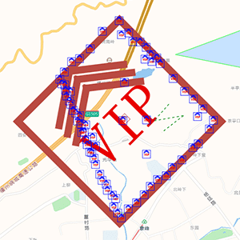

# 库


### tween

- `TWEEN.update(时间)`这个方法就算传入准确的时间差会延迟开始（时间差是指当前时间到第一次调用`update`之间的时间差）  

  延迟时间不定  

  而且在性能极限情况下会出现数值闪动  

  彗星组件中一个实例超过两个彗星也会无法开始

- 在从一个`TWEEN.Tween`实例到另一个实例的那一帧  

  会按顺序执行两个实例的`onUpdate`  

- 多次调用  

  - `to`  

    `onUpdate`不会重叠执行  

    在没有`stop`的情况下会时间跳跃（解决方案：同一帧内`stop`后`to`后`start`）  

  - `start`  

    `onUpdate`会重叠执行

- “TWEEN.Tween实例”的`stop`  

  会按顺序触发其`chain`链上的`onStop` （https://cdnjs.cloudflare.com/ajax/libs/tween.js/16.3.5/Tween.min.js）

- 一个“TWEEN.Tween实例”的`onComplete`里无法调用自己的`start`bug  （17.3.5的"src/Tween.js"会）（https://cdnjs.cloudflare.com/ajax/libs/tween.js/16.3.5/Tween.min.js的不会）

  允许调用的方法：将`start`放进`setTimeout 0`内

- 获取正在运行的tween实例

  `TWEEN.getAll()`

  返回一个数组

- 回调没有队列

  已测试：`onComplete`


### jsdoc

**版本**

- GeoGL：^3.6.2
- eleSym：^3.6.4

**概念与特性**

- jsdoc依据模板将文档转为html  
  我们可以编辑模板，也可以创建新的模板
- 可以插入md也可以插入html  
  不过对md的实现并不理想（【】md不加插件应该不会生效吧）  
  而html（含css）在各个地方都能正确生效
- 只要是以`/**`开头的注释都会被解析（就算加了`@private`也一样）
- [官方文档](https://jsdoc.app/index.html#block-tags)里写的`synonyms`其实是别名，而不是同义词
- 方法的自动识别  
  如果能自动识别的话就可以省略一些标签  
  可以自动识别es5的写法（甚至可以识别出是静态方法还是实例方法）（es6写法应该也可以）  
  不能自动识别的话需要增加的标签如下  
  - `@memberof`： 所属的类
  - `@instance`：表明这是实例方法，不加的话默认会被解析为静态方法
- 属性成员的自动识别  
  如果是函数组成的类，在函数里给this赋值而形成属性成员的话会自动识别  
  可以省略以下内容
  - `@memberof`
  - `@instance`
  - `@member`  
    可以只用`@type`标签写成员类型  
    `@member`标签除了可以写类型，还要传入成员名
- `@description`  
  对于方法来说这个标签可以省略  
  最上方的内容会被识别为描述  
  注意：
  - 这个标签前的文本将会被忽略（不会显示到描述里）

**资源**

- [github主页](https://github.com/jsdoc/jsdoc)有一些模板、工具

**操作**

- **序号后无空行bug**  

  在序号后加一行空行并加一行`<i></i>`即可

- **一个页面插入两个部分**  
  可能有效的操作方法：  
  用两个文件来写同一个类，一个文件会在页面上方，而另一个在下方
  
- **css**  
  可以在`@description`里写插入style标签，里面的内容会辐射整个页面
  
- **文件递归**  
  在命令最后加上`-r`  
  （配置文件是无法开启文件递归的，配置文件只能配置递归深度）
  
- **类与构造函数**  
  并没有把类与构造函数分开  
  `@class`与`@constructor`是相等的  
  
  - 自动识别  
    如果放在生成变量语句之前的话会自动识别<span style='opacity:.5'>（class关键字也会生成变量）</span>  
    会自动识别的话直接加`@class`或`@constructor`就行  
    不然要写成`@class 类名`或`@constructor 类名`
  
  <span style='opacity:.5'>暂时不要用`@constructs`，没理解它的作用</span>
  
- **类型**  
  `@param {类型} 参数名`中的就是类型  
  如果在这里写未定义类型的话生成的文档在这里的类型就是字符串  
  如果写有定义过的类型的话这里就会是一个链接  
  点击链接可以跳转到类型的说明  

  - 类型表达式  
    详见[type标签](https://jsdoc.app/tags-type.html)（jsdoc类型表达式是[Google Closure Compiler类型表达式](https://github.com/google/closure-compiler/wiki/Types-in-the-Closure-Type-System)的超集）  
    下方是一些例子

    - 表示数组成员的类型  
      `Array<类型>`或`类型[]`

  - 定义一个类型  
    详见[typedef标签](https://jsdoc.app/tags-typedef.html) 

    ```js
    /**
     * 描述
     * @typedef {类型表达式} 类型名
     * */
    ```

  - 类型处可以输入[JSDoc namepath](https://jsdoc.app/about-namepaths.html)  
    比如你注释中的另一个类  
    如果有类型和[JSDoc namepath](https://jsdoc.app/about-namepaths.html)重名的话，会跳转到类型
  
- 对回调增加说明  
  <span style='opacity:.5'>这个说明应该就是一种『类型』，默认模板里也是写到“**Type Definitions**”里</span>  
  下方是说明『专用于单个类的回调』的例子：  

  ```js
  /**
   * 描述
   * @callback 类名~回调名
   * @param {number} 回调实参1
   * @param {string} 回调实参2
   */
  ```

  要注意使用这个说明时要写`类名~回调名`  

  - 说明全局回调  
    与专用于类的回调相比，只需要去掉`类名~`就行
  
- 标记注释为私有  
  用`@private`标签  
  一般不会出现在文档中，除非是以下情况：

  - 修改了相关配置，或用`-p/--private`命令行选项运行JSDoc
  
- 在首页中增加内容  
  目前只知道通过markdown添加内容的方式：

  - [2种命令行方式](https://jsdoc.app/about-including-readme.html)  
    带`--readme`的那个不用配置markdown插件
  
- [配置文件](https://jsdoc.app/about-configuring-jsdoc.html)  

  - 可以配置命令行
  - 可以配置要转文档的文件的地址
  
- 方法

  - `@returns`  
    `@returns {类型} 其他`只有`类型`会被解析，`其他`会被忽略（测试环境：默认模板）

  - 一个方法增加多条说明  
    加`@method 方法名`（不加`@method`的话是无法实现多条说明的）  
    最终文档显示的顺序和代码里的是相反的（环境：默认模板）  
    **不过在子类上只会显示1个说明**

- 事件  
  `@property`可能代表事件触发的函数的参数  
  <span style='opacity:.5'>（下面是一个能生成文档但不确定语义是否正确的例子）</span>

  ```js
    /**
     * 点击事件
     *
     * @event Graphic#click
     * @property {number} idx - 序号
     * @property {boolean} clickedGraphicList - 被点到的图形列表
     */
  ```


**未整理笔记**

- 生成文档  
  全局安装的命令：`jsdoc 文件或目录地址`  
  局部安装的命令：`./node_modules/.bin/jsdoc 文件或目录地址`  
  （上面2条都是[github主页](https://github.com/jsdoc/jsdoc)上提到的）
- 局部安装似乎也可以使用`jsdoc`（做电气符号库时发现的）


### 思极地图

- **Marker**  
  - 如果`offset`写`[]`会导致dom元素固定在左上角（虽然官方文档就是这么写）
  - **显隐**  
    `remove`和`addTo(地图)`  
    对dom的改变在显隐后还会存留  
    在dom隐藏期间也可以对dom进行操作  
- 有的时候不支持路径中含有中文（文件名可以有中文）

##### bug

- 容器标签的`id`必须是`map`  
  不然地图渲染不出来  
  <span style='opacity:.5'>mapbox没有这个问题</span>

##### bug排查

- **点击事件不生效**<span style='opacity:.5'>（但是画面正常）</span>  
  原因有2个可能
  - 面型数据源中坐标点未闭合  
    <span style='opacity:.5'>（最后没加上第一个点的坐标）</span>
  - 使用了mapbox的raster图层  
    该图层无法拥有交互事件


### amd库

在用script标签引用库的话，这些库对后续js都会产生影响  
amd库标签前的代码不会受到影响  
产生的影响有：

1. 部分语句无法正确执行
2. geogl.min.js不可用

**require.js**

- 多了三个全局变量：`requirejs`、`require`、`define`


### lodash

**节流**

`throttle(函数,毫秒数)`  
功能类似自己写的`frequencyController`  
节流期间（上一次执行后`毫秒数`内）请求的函数在节流时间结束后是会被调用的

**数组比较**

前置概念说明：  
比较器（comparator）是一个函数，用来比较2项之间是否有某种关系，返回一个布尔值代表是否有关系

- 返回由不符合比较器的部分组成的数组  
  `_.differenceWith(第1个数组, 第2个数组, 比较器)`  
  返回由『第1个数组中 不符合比较器结果的项』组成的数组


### axios

拥有代理功能（环境：vue-cli 的dev）


### turf

FeatureCollection用通俗的话说就是 整份的geojson数据源  
turf里说的geojson对象包含FeatureCollection与feature（不知道有没有包含其他内容）

- geojson数据转换
  
  - 其他数据转成geojson
    - @turf/helpers模块  
      都是各种把数据转成geojson或geojson的一部分的方法  
      - 生成feature的方法  
        比如：`point`、`multiPoint`、`polygon`  
        第一个参数都是数组，第二个参数会被放进`properties`
    - `points`  
      官方文档里没写  
      功能：输入多点数组，生成FeatureCollection
  - geojson转geojson
    - 克隆geojson对象  
      `clone`  
      官网说比`JSON.parse` + `JSON.stringify`的方法快3到5倍
    - 多边形转单点  
       `explode`  
      首尾点都会被转进去（就是说点数量会比多边形角数量多1）
    - 展平  
      `flatten`  
      比如说可以把多多边形转为多个多边形
  
- 碰撞判断  

  - 判断一个几何体是否在另一个几何体内  
    `turf.booleanContains(大的几何体,小的几何体)`  
    允许的几何结构：

    - `turf.booleanContains(polygon, point)`
    - `turf.booleanContains(line, point)`

    性能测试：判断一万次点在三角形内只用了80毫秒（第二次测试中结果在20~58之间）  

  - 判断多点是否在多边形内  
    `pointsWithinPolygon`  
    输入不定数量的点和多边形，返回在多边形内的点  
    返回形式是geojson

    ```js
    var points = turf.points([
        [-46.6318, -23.5523],
        [-46.6246, -23.5325],
        [-46.6062, -23.5513],
        [-46.663, -23.554],
        [-46.643, -23.557]
    ]);
    
    var searchWithin = turf.polygon([[
        [-46.653,-23.543],
        [-46.634,-23.5346],
        [-46.613,-23.543],
        [-46.614,-23.559],
        [-46.631,-23.567],
        [-46.653,-23.560],
        [-46.653,-23.543]
    ]]);
    
    var ptsWithin = turf.pointsWithinPolygon(points, searchWithin);
    ```

  - 判断单点是否在多边形内  
    `booleanPointInPolygon`  

    ```js
    var pt = turf.point([-77, 44]);
    var poly = turf.polygon([[
      [-81, 41],
      [-81, 47],
      [-72, 47],
      [-72, 41],
      [-81, 41]
    ]]);
    
    turf.booleanPointInPolygon(pt, poly);
    ```

  源码解读

  - booleanContains  
    有使用booleanPointInPolygon  
    源码解读：判断2个参数分别属于什么类型，不同类型使用不同方法
  - pointsWithinPolygon  
    遍历后使用booleanPointInPolygon
  - booleanPointInPolygon

- 点线关系  
  <span style='opacity:.5'>`pointToLineDistance`和`nearestPointOnLine`间没有相互依赖的关系</span>

  - 计算点与线间的距离  
    `pointToLineDistance`
  - 找到线上距离某点最近的一个点  
    （同时会返回输入点和最近点之间的距离）  
    `nearestPointOnLine`

- 旋转 `transformRotate`  
  是顺时针转的（官网说的“negative clockwise”可能是针对从地面往天上看的情况，毕竟说了“right-hand rule”）  
  角度区间至少支持(-360,360)  

  - `mutate`选项  
    - 作用：官网说这个选项设为`true`的话可以提高性能  
    - BUG：个人测试中设为`true`的话会导致变形  
      具体变形情况：正方形变梯形  
      环境：npm包`"@turf/transform-rotate": "^5.1.5"`

其他（简易）方法

- 取出2个多边形中重合部分 `intersect`
- 简化多边形 `simplify`
- 移动
  - `lineOffset`
  - `transformTranslate`
- 缩放 `transformScale`
- 求线条交点 `lineIntersect`


# 终端


### cmd
- **`cd`**  
  功能：在当前盘下更改路径  
  支持绝对路径和相对路径  
  盘符开头的路径会被认为是绝对路径，反之为相对路径  
- 绝对路径中盘符写法示例：  
  `C:/`
- 进入状态后，可连按两次ctrl+c来退出当前状态
- **放弃当前行，开启新的一行**  
  `ctrl+c`
- **清屏**  
  `cls`
- 开启软件的示例：  
  `start "绝对地址"`  
  （开ie时路径写到文件夹和写到exe的效果一致）  
- **开启浏览器**  
  除了上方内容外还要写：  
  ` 网址`


### DOS命令

（上面一部分cmd的内容需要移到DOS下）

**`ipconfig`**

> ipconfig (winipcfg) 用于windows NT及XP(windows 95 98)查看本地ip地址，ipconfig可用参数“/all”显示全部配置信息 —— [W3Cschool](https://www.w3cschool.cn/dosmlxxsc1/ojpuu8.html)

- 查看物理地址（MAC地址）  
  用`ipconfig /all`可以查看
- 查看端口占用情况  
  `netstat`命令，具体看[W3Cschool](https://www.w3cschool.cn/dosmlxxsc1/ojpuu8.html)  
  （有[百度经验](https://jingyan.baidu.com/article/3aed632e61a580701080919f.html)说用`netstat -ano`，暂时观察发现`netstat -ano`和`netstat -an`的区别就是多了`PID`）


### PowerShell

- **复制/黏贴**  
  都是鼠标右键
- **快速输入地址**  
  直接拖入文件或者文件夹  
  配合`cd`命令还可以快速切换地址（先敲`cd空格`后拖入）
- **`cd`**  
  支持跨盘切换路径


# 其他


### UAP

- 找工作空间地址
  MAIN/WebContent/WEB-INF/configuration/policy.cml里点module-repository
- 引入检出后的模块，也是点上面的东西，加上module，然后module里写上模块名
- Apache Tomcat v6.0（不知道哪开的）  => Open launch configuration => Arguments => VM arguments末尾加一行`-Xms1024M -Xmx1024M -XX:PermSize=256M -XX:MaxNewSize=256M -XX:MaxPermSize=256M`


### webstorm

- 用npm在项目中本地安装babel之类文件数量比较多的模块（包）时，要在设置中把node_modules文件夹Excluded（排除）掉，禁止他索引，不然索引时间会非常长
- **更改项目名称**  
  这个方法在2018.3版本上可行
  
  1. .idea文件夹里有一个“项目名.iml”的文件  
     把这个文件名改成你想要的项目名称
  2. 打开.idea文件夹里的“modules.xml”文件  
     将“原项目名.iml”字样都替换成“想要的项目名.iml”
- 搜索
  - 限定搜索  
    Comments的意思是注释
  
- 重构（refactor）  

  - 更换代码所处的文件夹  
    操作步骤：

    1. 选中代码
    2. 右击选中代码
    3. 点refactor后点Move
    4. 输入需要移动到的文件

    如果代码中包含导出代码的话，对应的引用代码也会正确更改


##### node相关


**将js文件作为node程序启动**

操作步骤：

1. 在ide内右键js文件
2. 在呼出菜单里选择`Run '文件名.js'`或者`Debug '文件名.js'`

`Run`与`Debug`的区别：

- `Run`：不会进断点
- `Debug`：会进断点  
  已知有2种方式打断点：
  - 直接在代码里写`debugger`
  - 在要打断点的代码行上点起小红点

右上角菜单：  
  

下面从左到右依次介绍这个菜单的几个部分

- 下拉列表  
  曾经被作为node程序执行过的js文件会被收集进下拉列表里  
  可以在这里选择不同的js文件
- “三角形”图标  
  <b style='color:green'>不</b> 进断点地将js文件作为node程序执行
- “瓢虫”图标  
  <b style='color:green'>会</b> 进断点地将js文件作为node程序执行


**调试**

（还有其他内容未进一步研究）

- 断点  
  进断点后可以看到各个变量值，2种查看变量值的方式
  - 把鼠标移到代码中的变量上
  - 在下方的“Debugger”标签内查看


### svn

- **把版本库里的代码下下来**  
  鼠标右键后点“SVN Checkout”

提交commit、更新update

- **忽略文件或文件夹**  
  
  1. 在要忽略的目标上右键
  2. 点“TortoiseSVN”
  3. 点“Unversion and add to ignore list”
  
- **新建版本库**  
  右键后点“TortoiseSVN”再点“create repository here”  
  然后就算啥都不点版本库也会创建好  
  新建好后会跳出地址，地址保存起来以后下载代码时用  
  右键文件夹或者进文件夹后右键效果是一样的  
  
- **处理冲突**  
  
  1. 在要忽略的目标上右键
  2. 点“TortoiseSVN”
  3. 点“Edit conflicts”
  
  哪边是哪个版本或者本地版本并不清楚  
  似乎也没办法冲突的两个版本代码块都保留  
  很多时候还是要手敲
  
- **失败经历——1️⃣**  
  Checkout后弹窗“Certificate validation failed”，然后无限要求输入帐号，不管输啥帐号都会继续要求  
  实际情况是服务端的问题，服务端配置后即可正常使用


### vpn

- 可以打开host文件屏蔽的网站


### 代理

很多软件都可以设置代理  
代理也可以设置为本机的端口（port）  
例如：`172.0.0.1:7890`  
像用vpn时只希望部分软件的请求从vpn走，就可以把这些软件的代理地址设为本机vpn的地址（测试了v2ray的Clash，就可以。Clash是一个vpn的名字）


### postman

- param里的内容会像get请求的参数一样加进url
- body是post携带参数的方式，可以选择类型


### notepad++

- **编码**  
  目前电脑上装的版本不支持unicode  
  notepad++似乎有两个版本，unicode和ansi版本


### 表格

##### 金山文档

- 限定可输入数值  
  点上方“数据” -> 点“数据有效性”  
  - 条件选“自定义”时可以限定只能选之前已经输入的部分数值  
    比如说表格中有些单元格里输入了值，选“自定义”后就可以框选这些单元格，最终可选值就只能是这些单元格里的值
- 选中某个方向所有单元格
  ctrl+shift+方向键
- 为各单元格的不同值（文本）响应不同样式  
  上方“数据”标签 -> “条件格式”标签  
  （WPS里不知道怎么操作）

**wps表格**

- 隐藏不符合需求的单元格  
  上方导航栏中点击“数据” -> 点击第二行的“自动筛选”  
  - 可以选中部分列让这些列添加『筛选』功能
  - 不选中情况下点击可以给所有列添加『筛选』功能
  
- 图表  
  新建图表操作步骤如下：  

  1. 在表格中选中图表的数据来源  
     数据来源有一些格式要求：
     1. 每一条数据需要横向排列（比如最左侧是这条数据的名称，其他单元格是这条数据中每一项的值）
     2. 第一行要是每个列的说明文本
  2. 点击上方导航栏的“插入”，然后点击“插入”下面一行的“数据透视图”
  3. 在弹出窗口里点击“确定”
  4. 把右侧几个文本拖到合适的位置  
     右侧几个方块内可以把文本拖来拖去  
     这些文本来源于（表格中的）数据来源的第一行  
     下文将会称这些文本为首行文本（这个称呼是自己定的）
     1. 把代表图标数值的首行文本拖入名为“值”的方块  
     2. 依次对“值”方块中所有首行文本做以下操作
        1. 左键单击首行文本  
        2. 在弹出的菜单中点击“值字段设置”选项  
        3. 在弹出窗口中选择“求和”后点击“确定”
     3. 把“图例（系列）”方块中的“∑值”文本拖入“轴（类别）”方块中
     4. 如果需要的话把首行文本拖入“筛选器”  
        “筛选器”的意思是过滤条件  
        首行文本在这里存在就意味着：图表将会多出一个这个首行文本代表的过滤条件  
        每个过滤条件的值是首行文本所在列其他单元格的值  
        一个图表可以拥有任意数量的过滤条件，过滤条件也可以单选或者多选
  5. 图表生成完毕

  表格中数据源更新后需要手动更新图表，操作方法如下：

  1. 单击图表
  2. 选中上方导航栏中的“分析”按钮
  3. 单击“分析”下一栏的“刷新”按钮
  4. 数据更新完毕


### rimraf

删除用  
可以快速删除node_modules，不用rimraf的话删除非常慢  
一种通用的命令写法：`rimraf dist/geogl*.js`