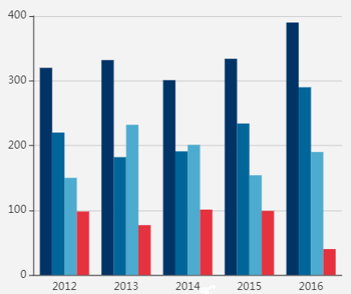

# 库


### echarts

[总览echarts建议从这个页面开始](https://echarts.apache.org/zh/cheat-sheet.html)

本笔记当前假设echarts不存在dataset这个配置项，因为这个配置项会变更数据的输入方式

也假设都采用平面直角坐标系，其他坐标系暂未过多研究


- 有事件  
  - [这个是教程](https://echarts.apache.org/zh/tutorial.html#ECharts%20%E4%B8%AD%E7%9A%84%E4%BA%8B%E4%BB%B6%E5%92%8C%E8%A1%8C%E4%B8%BA)
  - [这个是api](https://echarts.apache.org/zh/api.html#events)

- 有些值写错的话不会报错，但是会导致展示上面有些错误  
  比如`title.textStyle.fontWeight`设为`'static'`会导致`title.textStyle.fontSize`失效

- echarts.init时第2项为dark的话，有些颜色会被改写。比如说label文本的颜色在不设dark且series子项.data 的子项 .itemStyle.color有值时，取的是这个color值，而有dark时，就不会取这个值

  


第一级配置项意义

- 系列列表：`series`  
  重点，本笔记下方有进一步说明
- 标题：`title`
- 图例：`legend`
- 平面直角坐标系的x轴：`xAxis`
- 平面直角坐标系的y轴：`yAxis`
- 图表主体4个边的位置：`grid`
- 提示框：`tooltip`  
  也就是鼠标划到图表主体上时跟随鼠标显示的东西
- 背景色：`backgroundColor`
- 数据截取功能：`dataZoom`


##### series

官方介绍在[这个页面](http://echarts.apache.org/zh/tutorial.html#ECharts%20%E5%9F%BA%E7%A1%80%E6%A6%82%E5%BF%B5%E6%A6%82%E8%A7%88)中搜索“系列”进行查看

『series』这个词在官网里具有二义性

- 有可能代表第一级的配置项`series`  
  中文名是系列列表  
  系列列表是一个图表的核心，主要负责图表主体，很多时候也会略微影响到其他内容
- 也有可能代表第一级的配置项`series`的子项  
  中文名是系列  
  系列代表图表主体中的一张“图”  
  比如说一圈的环状图，比如说一条折线，比如说一组柱状图

系列列表可以拥有多个系列，多个系列在图表主体上呈现的就是有多条折线的折线图、或多圈的环状图、或多组的柱状图  
下图就是多组的柱状图，一个颜色对应的是一个系列  



##### 系列的详细说明

系列有很多种类型，比如饼图、折线图、柱状图  
不同类型的系列要设置不同的`type`  
也拥有不同的配置，比如[这个是饼图的配置](http://echarts.apache.org/zh/option.html#series-pie)、[这个是折线图的配置](http://echarts.apache.org/zh/option.html#series-line)、[这个是柱状图的配置](http://echarts.apache.org/zh/option.html#series-bar)  
下面是一些系列的进一步描述

- label属性的formatter属性里的`a`、`b`、`c`
  - `a`  
    series数组子项的`name`属性
  - `b`  
    series数组子项的`data`属性的子项的`name`属性
  - `c`  
    series数组子项的`data`属性的子项的`value`属性


饼图

- 标注连线  
  `series-pie.labelLine`  
  官方名称是：视觉引导线
- 饼图中“饼”的文本标注  
  文本来源：系列的data属性的子项的name属性  
  【】可能其他类型的系列也是这样


### 思极地图

- **Marker**  
  - 如果`offset`写`[]`会导致dom元素固定在左上角（虽然官方文档就是这么写的）
  - **显隐**  
    `remove`和`addTo(地图)`  
    对dom的改变在显隐后还会存留  
    在dom隐藏期间也可以对dom进行操作  
  
- 画面工具  
  mapbox里原生应该没有这个功能  
  `epgis.DrawPolygonHandler`  
  画好的面有选中状态和不选中状态（颜色是不一样的）  

  - 面画好后会触发`'draw.polygon.end'`事件  
    返回对象里的`feature`属性就是那个面的feature（geojson里的feature）

  - 从不选中变成选中的话图层层级会提到最高  
    并触发`'edit.polygon.start'`事件

  - 选中状态是可以拖拽编辑的  
    编辑后会触发`'edit.polygon.end'`事件

  - 不过这个编辑不能穿透  
    <span style='opacity:.5'>（就是说如果想编辑的图层被其他图层完全盖住的话，那光用鼠标就编辑不了你想编辑的图层了）</span>

  - 从选中到不选中状态会触发`'edit.polygon.end'`事件

    

- 有的时候不支持路径中含有中文（文件名可以有中文）

##### bug

- 容器标签的`id`必须是`map`  
  不然地图渲染不出来  
  <span style='opacity:.5'>mapbox没有这个问题</span>

##### bug排查

- **点击事件不生效**<span style='opacity:.5'>（但是画面正常）</span>  
  原因有2个可能
  - 面型数据源中坐标点未闭合  
    <span style='opacity:.5'>（最后没加上第一个点的坐标）</span>
  - 使用了mapbox的raster图层  
    该图层无法拥有交互事件


### amd库

在用script标签引用库的话，这些库对后续js都会产生影响  
amd库标签前的代码不会受到影响  
产生的影响有：

1. 部分语句无法正确执行
2. geogl.min.js不可用

**require.js**

- 多了三个全局变量：`requirejs`、`require`、`define`


### lodash

**节流**

`throttle(函数,毫秒数)`  
功能类似自己写的`frequencyController`  
节流期间（上一次执行后`毫秒数`内）请求的函数在节流时间结束后是会被调用的

**数组比较**

前置概念说明：  
比较器（comparator）是一个函数，用来比较2项之间是否有某种关系，返回一个布尔值代表是否有关系

- 返回由不符合比较器的部分组成的数组  
  `_.differenceWith(第1个数组, 第2个数组, 比较器)`  
  返回由『第1个数组中 不符合比较器结果的项』组成的数组


### qs

[官方github首页](https://github.com/ljharb/qs)  
官方说明应该是制造与解析querystring的库  
[官方github首页](https://github.com/ljharb/qs)里用的`assert`库应该是用来判断2个变量是否相等的

- 制造querystring  
  `qs.stringify(对象)`  
  把js对象变成`'键名a=键值a&键名b=键值b'`这种形式，其中内容会变成URI编码  
  如果键值为空串的话`=`后就不会有内容
- 解析querystring  
  `qs.parse(querystring)`
- querystring  
  可能是：get请求url`?`后面的内容


### axios


##### 实例

`axios`对象似乎拥有axios实例的所有功能，`axios`对象比axios实例多的内容是十分有限的，而且一眼就能区分出来<span style='opacity:.5'>（可能`axios`对象『未准备废弃的api』中只比axios实例多了`axios.create`）</span>  
因此本笔记在记录api时就不在`axios`对象和axios实例上重复说明了


##### 请求

- 请求配置  
  这里包含了很多功能，具体看[官方github](https://github.com/axios/axios#request-config)  

  - `validateStatus`  
    定义服务器响应时是触发`catch`方法里的回调还是`then`方法里的回调  
    （不知道对响应拦截器里两个回调的触发时机有没有影响，这个要动手才知道，官方只说200是第一个，其他第二个）  

    ```js
    validateStatus: function (服务器状态码) {
      // `return true` 触发then的回调
      // `return false` 触发catch的回调
    }
    ```

    

- 关于请求地址  
  给 axios实例 传入`baseURL`的话  
  给 axios实例 传入`url`参数可以省略`baseURL`传入的部分  
  不过`url`处写完整地址也是可以的（最终请求地址就会是`url`处的内容）

- 请求方式  
  可以直接执行`axios`对象也可以调用`axios`对象的`get`、`post`等方法  
  具体看[官方github](https://github.com/axios/axios#axios-api)


请求参数会变成多项的2个情况

1. ```js
   instance({
     url: 'module/param/add',
     baseURL: config.BASE_PATH,
     method: 'post',
     data:xxx,
   })
   
   /*
   这个data有在transformRequest里用qs.stringify()转一下【】测试axios中转的是不是都会变成formData？不转的话那又是什么？
   Content-Type是application/x-www-form-urlencoded【】了解下这个是不是axios post的默认值？
   
   对上面2个问题的答复：应该默认是使用json格式来发送请求，但是用qs转过之后就是x-www-form-urlencoded了（x-www-form-urlencoded应该是一种formData）。判断依据是[官方github](https://github.com/axios/axios#using-applicationx-www-form-urlencoded-format)
   */
   ```

   这种方法`data`属性传入对象字面量，字面量属性包含一维数组，在请求中数组会变成多个参数  
   无人机项目的后端这时是无法正常接收的

2. `axios实例.post(url,FormData实例)`  
   FormData实例有参数是子项为对象的数组时，请求参数会被完全展开  
   后端可以正常接收  
   【】且formData参数看不见  
   【】Content-Type: multipart/form-data; boundary=----WebKitFormBoundary8Bji8CSvkAyzSif6


##### 默认值

```js
axios.defaults.baseURL = 'https://api.example.com';
axios.defaults.headers.common['Authorization'] = AUTH_TOKEN;
axios.defaults.headers.post['Content-Type'] = 'application/x-www-form-urlencoded';
```


##### x-www-form-urlencoded

[官方github](https://github.com/axios/axios#using-applicationx-www-form-urlencoded-format)有说明，不过暂未深入研究


##### 处理响应

- 一般用`then`方法  
  `then`方法回调的形参见[官方github](https://github.com/axios/axios#response-schema)

- 有时需要`catch`方法  
  `catch`方法回调的形参见[官方github](https://github.com/axios/axios#handling-errors)  

  > `形参.toJSON()`可以获得一个有更多HTTP error信息的对象 —— [官方github](https://github.com/axios/axios#handling-errors)


##### 拦截

在请求或响应被 `then` 或 `catch` 处理前拦截它们。

```js
// 添加请求拦截器【】2个回调的触发条件还明确
axios.interceptors.request.use(function (config) {
  // 在发送请求之前做些什么
  return config;
}, function (error) {
  // 对请求错误做些什么
  return Promise.reject(error);
});

// 添加响应拦截器
axios.interceptors.response.use(function (response) {
  // 状态码为2xx的话会触发这个回调
  // 对响应数据做点什么
  // 服务端返回的数据会放在`response.data`里
  return response;
}, function (error) {
  // 状态码不是2xx的话会触发这个回调
  // 对响应错误做点什么
  return Promise.reject(error);
});
```

如果你想在稍后移除拦截器，可以这样：

```js
const myInterceptor = axios.interceptors.request.use(function () {/*...*/});
axios.interceptors.request.eject(myInterceptor);
```


##### 其他

- [取消请求](https://github.com/axios/axios#cancellation)  
  没深入研究，不过感觉没什么用
- 代理  
  ~~拥有代理功能（环境：vue-cli 的dev）~~  
  应该是[http-proxy-middleware](https://github.com/chimurai/http-proxy-middleware#proxycontext-config)吧，[官方](https://cli.vuejs.org/zh/config/#devserver-proxy)说的（虽然在`package.json`里找不到，只能在`package-lock.json`里找到）  
  不过有一个`proxy`配置项，在网上没找到详细资料，估计只有动手才能知道这是干嘛用的


### tween

- `TWEEN.update(时间)`这个方法就算传入准确的时间差会延迟开始（时间差是指当前时间到第一次调用`update`之间的时间差）  

  延迟时间不定  

  而且在性能极限情况下会出现数值闪动  

  彗星组件中一个实例超过两个彗星也会无法开始

- 在从一个`TWEEN.Tween`实例到另一个实例的那一帧  

  会按顺序执行两个实例的`onUpdate`  

- 多次调用  

  - `to`  

    `onUpdate`不会重叠执行  

    在没有`stop`的情况下会时间跳跃（解决方案：同一帧内`stop`后`to`后`start`）  

  - `start`  

    `onUpdate`会重叠执行

- “TWEEN.Tween实例”的`stop`  

  会按顺序触发其`chain`链上的`onStop` （https://cdnjs.cloudflare.com/ajax/libs/tween.js/16.3.5/Tween.min.js）

- 一个“TWEEN.Tween实例”的`onComplete`里无法调用自己的`start`bug  （17.3.5的"src/Tween.js"会）（https://cdnjs.cloudflare.com/ajax/libs/tween.js/16.3.5/Tween.min.js的不会）

  允许调用的方法：将`start`放进`setTimeout 0`内

- 获取正在运行的tween实例

  `TWEEN.getAll()`

  返回一个数组

- 回调没有队列

  已测试：`onComplete`


### CanvasSpliner.js

功能：做出可交互编辑的曲线（也可以做最多3个线段的折线。环境是在平面直角坐标系下的）

github地址：https://github.com/jonathanlurie/canvasSpliner


**api**

下面没列出的api看官方demo  
<span style='opacity:.5'>（列出的api大多都是样式相关的）</span>

- 建立UI视图  
  建立视图会在容器内新建一个canvas  
  ```js
  const cs = new CanvasSpliner.CanvasSpliner(
      视图容器div的id或div本身, 
      canvas的width,
    canvas的height
  )
  ```
  注意：这里输入的canvas的width、height需要和最终canvas的宽高一致，不然交互区域会和视图不符
  
- 增加节点  

  ```js
  cs.add( {x:0, y: 0, xLocked: true} );
  cs.add( {x:0.25, y: 0.15} );
  cs.add( {x:0.75, y: 0.85} );
  cs.add( {x:1, y: 1,  xLocked: true} );
  ```

  - `xLocked:true`和`yLocked:true`的意思：锁定x值或者y值
  - x、y坐标要求在[0,1]内，不然这个方法不会生效

- 获取所有节点  
  <span style='opacity:.5'>（要求x、y取值是[0,1]内的）</span>

  ```js
  function getCSPLByCs(cs) {
    const {width,height}=cs._canvas
    return cs._pointCollection._points.map(({x,y})=>{
      return [x/width,y/height]
    })
  }
  ```

  除了上述代码外没有其他方法

- 依据`x`得到`y`  
  `cs.getValue(x)`  
  x、y的区间都是[0,1]


**操作**

- 在canvas上双击可以增加节点


##### glfx.js

目前学习代码都放在learnCZ_1文件夹里


# node工具


### jsdoc

**版本**

- GeoGL：^3.6.2
- eleSym：一开始是^3.6.4 后面又改成了^3.6.2


**资源**

- [github主页](https://github.com/jsdoc/jsdoc)有一些模板、工具


##### 概念与特性

- jsdoc依据模板将文档转为html  
  我们可以编辑模板，也可以创建新的模板
- 可以插入md也可以插入html  
  不过对md的实现并不理想（【】md不加插件应该不会生效吧）  
  而html（含css）在各个地方都能正确生效
- 只要是以`/**`开头的注释都会被解析（就算加了`@private`也一样）
- [官方文档](https://jsdoc.app/index.html#block-tags)里写的`synonyms`其实是别名，而不是同义词
- 方法的自动识别  
  如果能自动识别的话就可以省略一些标签  
  可以自动识别es5的写法（甚至可以识别出是静态方法还是实例方法）（es6写法应该也可以）  
  不能自动识别的话需要增加的标签如下  
  - `@memberof`： 所属的类
  - `@instance`：表明这是实例方法，不加的话默认会被解析为静态方法
- 属性成员的自动识别  
  如果是函数组成的类，在函数里给this赋值而形成属性成员的话会自动识别  
  可以省略以下内容
  - `@memberof`
  - `@instance`
  - `@member`  
    可以只用`@type`标签写成员类型  
    `@member`标签除了可以写类型，还要传入成员名
- `@description`  
  对于方法来说这个标签可以省略  
  最上方的内容会被识别为描述  
  注意：
  - 这个标签前的文本将会被忽略（不会显示到描述里）


##### 注释操作

- **序号后无空行bug**  

  在序号后加一行空行并加一行`<i></i>`即可

- **一个页面插入两个部分**  
  可能有效的操作方法：  
  用两个文件来写同一个类，一个文件会在页面上方，而另一个在下方

- **css**  
  可以在`@description`里写插入style标签，里面的内容会辐射整个页面

- **文件递归**  
  在命令最后加上`-r`  
  （配置文件是无法开启文件递归的，配置文件只能配置递归深度）

- **类与构造函数**  
  并没有把类与构造函数分开  
  `@class`与`@constructor`是相等的  

  - 自动识别  
    如果放在生成变量语句之前的话会自动识别<span style='opacity:.5'>（class关键字也会生成变量）</span>  
    会自动识别的话直接加`@class`或`@constructor`就行  
    不然要写成`@class 类名`或`@constructor 类名`

  <span style='opacity:.5'>暂时不要用`@constructs`，没理解它的作用</span>

- **类型**  
  `@param {类型} 参数名`中的就是类型  
  如果在这里写未定义类型的话生成的文档在这里的类型就是字符串  
  如果写有定义过的类型的话这里就会是一个链接  
  点击链接可以跳转到类型的说明  

  - 类型表达式  
    详见[type标签](https://jsdoc.app/tags-type.html)（jsdoc类型表达式是[Google Closure Compiler类型表达式](https://github.com/google/closure-compiler/wiki/Types-in-the-Closure-Type-System)的超集）  

    下方是一些『类型表达式』的例子  
    （对象和函数摘抄自[Google Closure Compiler类型表达式](https://github.com/google/closure-compiler/wiki/Types-in-the-Closure-Type-System)，并未在jsdoc里编译成文档过）

    - 表示数组成员的类型  
      `Array<类型>`或`类型[]`
    - 表示对象成员的类型  
      `{key1:类型,key2:类型,key3:类型}`
    - 函数
      - 指定入参  
        `function(string, boolean)`
      - 指定返回内容  
        `function(): number`

  - 定义一个类型  
    详见[typedef标签](https://jsdoc.app/tags-typedef.html) 

    ```js
    /**
     * 描述
     * @typedef {类型表达式} 类型名
     * */
    ```

    注意：  
    这个块级注释里『类型表达式』里的类型不能引用自身的类型  
    不过用`@params`标签的话就可以引用自身的类型了  

  - 类型处可以输入[JSDoc namepath](https://jsdoc.app/about-namepaths.html)  
    比如你注释中的另一个类  
    如果有类型和[JSDoc namepath](https://jsdoc.app/about-namepaths.html)重名的话，会跳转到类型

- 对回调增加说明  
  <span style='opacity:.5'>这个说明应该就是一种『类型』，默认模板里也是写到“**Type Definitions**”里</span>  
  下方是说明『专用于单个类的回调』的例子：  

  ```js
  /**
   * 描述
   * @callback 类名~回调名
   * @param {number} 回调实参1
   * @param {string} 回调实参2
   */
  ```

  要注意使用这个说明时要写`类名~回调名`  

  - 说明全局回调  
    与专用于类的回调相比，只需要去掉`类名~`就行

- 标记注释为私有  
  用`@private`标签  
  一般不会出现在文档中，除非是以下情况：

  - 修改了相关配置，或用`-p/--private`命令行选项运行JSDoc

- 方法

  - `@returns`  
    `@returns {类型} 其他`只有`类型`会被解析，`其他`会被忽略（测试环境：默认模板）

  - 一个方法增加多条说明  
    加`@method 方法名`（不加`@method`的话是无法实现多条说明的）  
    最终文档显示的顺序和代码里的是相反的（环境：默认模板）  
    **不过在子类上只会显示1个说明**

- 事件  
  `@property`可能代表事件触发的函数的参数  
  <span style='opacity:.5'>（下面是一个能生成文档但不确定语义是否正确的例子）</span>

  ```js
    /**
     * 点击事件
     *
     * @event Graphic#click
     * @property {number} idx - 序号
     * @property {boolean} clickedGraphicList - 被点到的图形列表
     */
  ```


##### 配置与命令行

- 在首页中增加内容  
  目前只知道通过markdown添加内容的方式：

  - [2种命令行方式](https://jsdoc.app/about-including-readme.html)  
    带`--readme`的那个不用配置markdown插件

- [配置文件](https://jsdoc.app/about-configuring-jsdoc.html)  

  - 可以配置命令行
  - 可以配置要转文档的文件的地址

- 禁止在文档中插入源码  
  （默认是会插入的）  
  在配置文件里把`module.exports`的对象的`templates`属性的`default`属性的`outputSourceFiles`属性设为`false`

- 增加对markdown的编译支持  
  官方里说得很简单：加一行代码就行——`"plugins": ["plugins/markdown"],`  

  - 下面的文字有空整理下【】  
    实际上怎么操作都不行，甚至包都卸载重装了，配置文件用js或json都不行。  
    不知道为什么GeoGL是可以的，GeoGL里把模板的插件去了也还是可以。  
    实际上是html标签的锅，把`<h5>`标签去了md就生效了

- 在生成文档的时候携带一些文件  
  在配置的`templates.default.staticFiles.include`数组里增加路径  
  路径指向的文件夹里的内容都会被复制到文档所在文件夹下  
  （文件夹里的文件夹也会被复制）

- 生成文本的文档（而不是html）  
  `jsdoc -t templates/haruki -d console`

- 更换文档的模板  
  目前试了3个

  - haruki 成功  
    操作请参考上一条：“生成文本的文档”

  - silent 失败

  - docdash 成功  
    <span style='opacity:.5'>（docdash是目前github最火的jsdoc模板）</span>  
    操作步骤如下：

    1. `npm install docdash`
    2. 配置对象的`opts`属性的`template`属性设为`"node_modules/docdash"`
    3. package.json的`scripts`属性增加一条：`"generate-docs": "node_modules/.bin/jsdoc -c jsdoc.json"`
    4. 正常运行jsdoc即可依据新的模板生成文档

    要对docdash进行配置的话就在jsdoc的配置对象上加一个docdash属性  
    关于docdash属性的操作看[官方文档](http://clenemt.github.io/docdash/#options)（有很多实用的操作。如果只用jsdoc而不用模板的话，那么对文档的操作是很有限的）


**未整理笔记**

- 生成文档  
  全局安装的命令：`jsdoc 文件或目录地址`  
  局部安装的命令：`./node_modules/.bin/jsdoc 文件或目录地址`  
  （上面2条都是[github主页](https://github.com/jsdoc/jsdoc)上提到的）
- 局部安装似乎也可以使用`jsdoc`（做电气符号库时发现的）
- 命令行或配置文件错误  
  有时候会在终端报错，有时候不报错也不生成文档


### rimraf

删除用  
可以快速删除node_modules，不用rimraf的话删除非常慢  
一种通用的命令写法：`rimraf dist/geogl*.js`


# 命令行工具


### cmd

- 按`tab`键补全命令（未详细测试）


- **`cd`**  
  功能：在当前盘下更改路径  
  支持绝对路径和相对路径  
  盘符开头的路径会被认为是绝对路径，反之为相对路径  
- 绝对路径中盘符写法示例：  
  `C:/`
- 进入状态后，可连按两次ctrl+c来退出当前状态
- **放弃当前行，开启新的一行**  
  `ctrl+c`
- **清屏**  
  `cls`
- 开启软件的示例：  
  `start "绝对地址"`  
  （开ie时路径写到文件夹和写到exe的效果一致）  
- **开启浏览器**  
  除了上方内容外还要写：  
  ` 网址`


### PowerShell

特性

- 可以用git的命令

操作

- **复制/黏贴**  
  都是鼠标右键
- **快速输入地址**  
  直接拖入文件或者文件夹  
  配合`cd`命令还可以快速切换地址（先敲`cd空格`后拖入）
- **`cd`**  
  支持跨盘切换路径


# Windows


**环境变量**

[这篇介绍epclipse安装方法的博客](https://blog.csdn.net/qq_39135287/article/details/82108080)里有提到Path环境变量的配置


### DOS命令

似乎是windows特有的，不过没找到确凿资料进行佐证

DOS：Disk Operating System

（上面一部分cmd的内容需要移到DOS下）

**`ipconfig`**

> ipconfig (winipcfg) 用于windows NT及XP(windows 95 98)查看本地ip地址，ipconfig可用参数“/all”显示全部配置信息 —— [W3Cschool](https://www.w3cschool.cn/dosmlxxsc1/ojpuu8.html)

- 查看物理地址（MAC地址）  
  用`ipconfig /all`可以查看
- 查看端口占用情况  
  `netstat`命令，具体看[W3Cschool](https://www.w3cschool.cn/dosmlxxsc1/ojpuu8.html)  
  （有[百度经验](https://jingyan.baidu.com/article/3aed632e61a580701080919f.html)说用`netstat -ano`，暂时观察发现`netstat -ano`和`netstat -an`的区别就是多了`PID`）

**寻找可执行文件所在路径**  
示例：`where node`  
返回`node.exe`的绝对路径  
<span style='opacity:.5'>在powershell里不可用</span>  
（有进阶用法）


### PowerShell

特性

- 可以用git的命令

操作

- **复制/黏贴**  
  都是鼠标右键
- **快速输入地址**  
  直接拖入文件或者文件夹  
  配合`cd`命令还可以快速切换地址（先敲`cd空格`后拖入）
- **`cd`**  
  支持跨盘切换路径

经验

- 卡住的话应该是命令正在进行中，等足够时间就好了


### [hosts文件](c:\windows\system32\drivers\etc)

- 存储了电脑上域名到ip地址的映射表  
  似乎无法具体到主机名上，比如说存了一条映射，那么所有带这个域名的http地址，不管用什么主机名都会应用这条映射规则  
  （能否具体到`com`、`cn`、`gov`这种后缀上未测试）
- 注释  
  行首加前缀——`#`
- 好像不能用记事本打开并保存  
  会导致编码变更


# 其他


### UAP

- 找工作空间地址
  MAIN/WebContent/WEB-INF/configuration/policy.cml里点module-repository
- 引入检出后的模块，也是点上面的东西，加上module，然后module里写上模块名
- Apache Tomcat v6.0（不知道哪开的）  => Open launch configuration => Arguments => VM arguments末尾加一行`-Xms1024M -Xmx1024M -XX:PermSize=256M -XX:MaxNewSize=256M -XX:MaxPermSize=256M`


### webstorm

- 用npm在项目中本地安装babel之类文件数量比较多的模块（包）时，要在设置中把node_modules文件夹Excluded（排除）掉，禁止他索引，不然索引时间会非常长
- **更改项目名称**  
  这个方法在2018.3版本上可行
  
  1. .idea文件夹里有一个“项目名.iml”的文件  
     把这个文件名改成你想要的项目名称
  2. 打开.idea文件夹里的“modules.xml”文件  
     将“原项目名.iml”字样都替换成“想要的项目名.iml”
- 搜索
  - 限定搜索  
    Comments的意思是注释
  
- 重构（refactor）  

  - 更换代码所处的文件夹  
    操作步骤：

    1. 选中代码
    2. 右击选中代码
    3. 点refactor后点Move
    4. 输入需要移动到的文件

    如果代码中包含导出代码的话，对应的引用代码也会正确更改
    
  - 更换函数所在文件夹  
    和上一条类似  
  
    - 但是可以批量移动  
      在选择移动一个函数时会弹出窗口  
      在窗口里可以勾选其他函数一起移动
  
  - 重构对象的属性名  
    （这个功能很强大）
  
    - 不仅会更改所有用到这个属性名的地方
    - 甚至会影响到生成这个属性的函数  
      （一次修改某个data的属性，这个data在data方法里使用另一个函数生成的，结果那个函数里的属性名也被更改了）
    - 甚至会影响到属性所在对象传入的组件  
      （一次修改某个data的属性，这个data传入了一个组件，那个组件有props校验，结果props校验里的代码和prop里的属性也被更改了）
    
  - 更改样式的类名  
    这个功能不那么智能  
    使用这功能的时候会在html和样式里更改所有同名的类名


##### node相关


**将js文件作为node程序启动**

操作步骤：

1. 在ide内右键js文件
2. 在呼出菜单里选择`Run '文件名.js'`或者`Debug '文件名.js'`

`Run`与`Debug`的区别：

- `Run`：不会进断点
- `Debug`：会进断点  
  已知有2种方式打断点：
  - 直接在代码里写`debugger`
  - 在要打断点的代码行上点起小红点

右上角菜单：  
  

下面从左到右依次介绍这个菜单的几个部分

- 下拉列表  
  曾经被作为node程序执行过的js文件会被收集进下拉列表里  
  可以在这里选择不同的js文件
- “三角形”图标  
  <b style='color:green'>不</b> 进断点地将js文件作为node程序执行
- “瓢虫”图标  
  <b style='color:green'>会</b> 进断点地将js文件作为node程序执行


**调试**

（还有其他内容未进一步研究）

- 断点  
  进断点后可以看到各个变量值，2种查看变量值的方式
  - 把鼠标移到代码中的变量上
  - 在下方的“Debugger”标签内查看


### svn

- **把版本库里的代码下下来**  
  鼠标右键后点“SVN Checkout”

提交commit、更新update

- **忽略文件或文件夹**  
  
  1. 在要忽略的目标上右键
  2. 点“TortoiseSVN”
  3. 点“Unversion and add to ignore list”
  
- **新建版本库**  
  右键后点“TortoiseSVN”再点“create repository here”  
  然后就算啥都不点版本库也会创建好  
  新建好后会跳出地址，地址保存起来以后下载代码时用  
  右键文件夹或者进文件夹后右键效果是一样的  
  
- **处理冲突**  
  
  1. 在要忽略的目标上右键
  2. 点“TortoiseSVN”
  3. 点“Edit conflicts”
  
  哪边是哪个版本或者本地版本并不清楚  
  似乎也没办法冲突的两个版本代码块都保留  
  很多时候还是要手敲
  
- **失败经历——1️⃣**  
  Checkout后弹窗“Certificate validation failed”，然后无限要求输入帐号，不管输啥帐号都会继续要求  
  实际情况是服务端的问题，服务端配置后即可正常使用


### vpn

- 可以打开host文件屏蔽的网站


### 代理

很多软件都可以设置代理  
代理也可以设置为本机的端口（port）  
例如：`172.0.0.1:7890`  
像用vpn时只希望部分软件的请求从vpn走，就可以把这些软件的代理地址设为本机vpn的地址（测试了v2ray的Clash，就可以。Clash是一个vpn的名字）


### postman

- param里的内容会像get请求的参数一样加进url
- body是post携带参数的方式，可以选择类型


### notepad++

- **编码**  
  目前电脑上装的版本不支持unicode  
  notepad++似乎有两个版本，unicode和ansi版本


### 表格

##### 金山文档

- 限定可输入数值  
  点上方“数据” -> 点“数据有效性”  
  - 条件选“自定义”时可以限定只能选之前已经输入的部分数值  
    比如说表格中有些单元格里输入了值，选“自定义”后就可以框选这些单元格，最终可选值就只能是这些单元格里的值
- 选中某个方向所有单元格
  ctrl+shift+方向键
- 为各单元格的不同值（文本）响应不同样式  
  上方“数据”标签 -> “条件格式”标签  
  （WPS里不知道怎么操作）

**wps表格**

- 隐藏不符合需求的单元格  
  上方导航栏中点击“数据” -> 点击第二行的“自动筛选”  
  - 可以选中部分列让这些列添加『筛选』功能
  - 不选中情况下点击可以给所有列添加『筛选』功能
  
- 图表  
  新建图表操作步骤如下：  

  1. 在表格中选中图表的数据来源  
     数据来源有一些格式要求：
     1. 每一条数据需要横向排列（比如最左侧是这条数据的名称，其他单元格是这条数据中每一项的值）
     2. 第一行要是每个列的说明文本
  2. 点击上方导航栏的“插入”，然后点击“插入”下面一行的“数据透视图”
  3. 在弹出窗口里点击“确定”
  4. 把右侧几个文本拖到合适的位置  
     右侧几个方块内可以把文本拖来拖去  
     这些文本来源于（表格中的）数据来源的第一行  
     下文将会称这些文本为首行文本（这个称呼是自己定的）
     1. 把代表图标数值的首行文本拖入名为“值”的方块  
     2. 依次对“值”方块中所有首行文本做以下操作
        1. 左键单击首行文本  
        2. 在弹出的菜单中点击“值字段设置”选项  
        3. 在弹出窗口中选择“求和”后点击“确定”
     3. 把“图例（系列）”方块中的“∑值”文本拖入“轴（类别）”方块中
     4. 如果需要的话把首行文本拖入“筛选器”  
        “筛选器”的意思是过滤条件  
        首行文本在这里存在就意味着：图表将会多出一个这个首行文本代表的过滤条件  
        每个过滤条件的值是首行文本所在列其他单元格的值  
        一个图表可以拥有任意数量的过滤条件，过滤条件也可以单选或者多选
  5. 图表生成完毕

  表格中数据源更新后需要手动更新图表，操作方法如下：

  1. 单击图表
  2. 选中上方导航栏中的“分析”按钮
  3. 单击“分析”下一栏的“刷新”按钮
  4. 数据更新完毕


### cordova

使用html、css、js开发移动端应用的平台

由Apache管理的开源、免费项目
