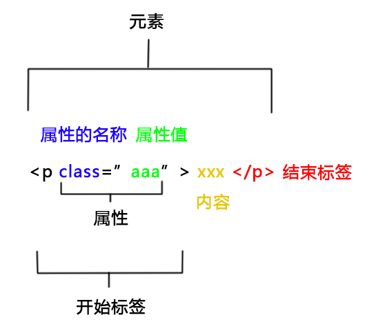

本笔记不包含js内容，不包含基于基础技术诞生的上层技术（比如css预处理器）


# 综合

> 网页可以视为可以包含任意数量分支的文档树（A web page could be considered as a document tree that can contain any number of branches） —— [《网页的基本架构》（MDN提供的链接）](https://www.sitepoint.com/basic-structure-of-a-web-page/)

> 一个web页面是一个文档。这个文档可以在浏览器窗口或作为HTML源码显示出来。DOM提供了对同一份文档的另一种表现，存储和操作的方式。 DOM是web页面的完全的面向对象表述，它能够使用如 JavaScript等脚本语言进行修改。 —— [MDN](https://developer.mozilla.org/zh-CN/docs/Web/API/Document_Object_Model/Introduction#%E4%BB%80%E4%B9%88%E6%98%AF_DOM)

> 在文档中的每个元素都是文档所属于的文档对象模型（DOM）的一部分 —— [MDN](https://developer.mozilla.org/zh-CN/docs/Web/API/Document_Object_Model/Introduction#DOM_and_JavaScript)

> DOM可以用js外的语言来编写，比如python —— [MDN](https://developer.mozilla.org/zh-CN/docs/Web/API/Document_Object_Model/Introduction#DOM_and_JavaScript)

- 元素是节点的子集

- **标签的id**  
  所有标签的id值都会作为键增加到`window`变量下  
  这个增加的属性的属性值就是标签对应的dom  
  <span style='opacity:.5'>可以通过window调用到这个增加的属性，不过当前未在打印出的window对象上找到这些属性</span>
  
- 网页的『相对路径』相对的地址是包含【路径】的  
  而不仅仅相对 协议+ip+端口
  
  

### 中文支持情况

ie5支持js中的中文  

- 测试环境：ie11模拟ie5

- 测试代码：  

  ```html
  <!DOCTYPE html>
  <html lang="en">
  <head>
    <meta charset="UTF-8">
    <title></title>
  </head>
  <body>
  <script>
    var 一 = 1
    var 对象 = {
      甲: 2,
      乙: 3
    }
    
    函数()
    function 函数() {
      对象.乙 += 一
      console.log(对象)
    }
  </script>
  </body>
  </html>
  ```

### js模块

浏览器的模块里路径的".js"不能省略


# HTML




- > 内容可以是文本但不一定是文本 —— [MDN](https://developer.mozilla.org/zh-CN/docs/Learn/Getting_started_with_the_web/HTML_basics)

- 可以用任意英文做标签名，但是用中文不行

- **中文乱码**  
  加`meta`标签即可解决，以下两个标签都可以

  1. `<meta charset="UTF-8">`
  2. `<meta http-equiv="Content-Type" content="charset=utf-8"/>`

- 可以通过插入`script`、`link`这种js或css的标签来使js或css生效

  - 电气符号库与GeoGL的鉴权服务就用了插入标签来执行js的方法
  - css  
    吉奥这有人用这种方式使css生效（个人未做详细测试）  
    
    >原理是浏览器会对所有的样式表的插入、移除做整个 CSSOM 的重构 —— [知乎文章](https://zhuanlan.zhihu.com/p/78362028)

- [预加载](https://developer.mozilla.org/zh-CN/docs/Web/HTML/Preloading_content)

- SEO  

  > - keywords  
  >   `<meta name="keywords" content="xxxxxxx">`  
  >   建议：5个左右,单个8汉字以内；禁忌堆砌，与网站主题无关。
  > - description网站描述  
  >   `<meta name="description" content="网站描述，字数尽量空制在80个汉字，160个字符以内！">`  
  >   建议：字数尽量空制在80个汉字，160个字符以内。
  >
  > —— [H-ui 书写规范](http://www.h-ui.net/Hui-notes-htmlStructure.shtml)

- 数字过大时在页面上会被转为科学计数法  
  还没找到合适的解决方案
  
- js的字符串字面量不能出现`</body>`  
  就算在`</body>`标签后写都不行，chrome会把`</body>`标签后的script标签移到body标签里  
  （原因未知）  

  - js文件里可以出现


### 标签

img标签

- alt属性  
  - 在图片加载失败后会显示alt里的文本（测了chrome90）
  - [w3school](https://www.w3school.com.cn/tags/att_img_alt.asp)说鼠标移到图像上后会显示alt里的文本，但是测试结果显示并不是（测试了IE11、chrome90、firefox88）

表格

- 边框  
  - [demo](https://github.com/mdn/learning-area/blob/master/html/tables/basic/minimal-table.css)  
    源自：[MDN](https://developer.mozilla.org/zh-CN/docs/Learn/HTML/Tables/Basics#%E8%A1%A8%E6%A0%BC%E9%A3%8E%E6%A0%BC)的“较小的 CSS 样式表”


# DOM

> 文档对象模型 （DOM：Document Object Model）是HTML和XML文档的编程接口 —— [MDN](https://developer.mozilla.org/zh-CN/docs/Web/API/Document_Object_Model/Introduction)

### 获得dom

- 获得dom子代  

  > - `dom.children`  
  >   获取元素节点，浏览器表现相同  
  >   
  >   > - 可以保证顺序 
  >   > - 返回类数组对象
  >   >
  >   > —— [MDN](https://developer.mozilla.org/en-US/docs/Web/API/HTMLCollection)
  > - `dom.childNodes`  
  >   IE：只获取元素节点  
  >   非IE：获取元素节点与文本节点
  >
  > —— [博客](https://www.cnblogs.com/ilovexiaoming/p/6853176.html)

- 获得根元素（`<html></html>`）  
  [flexible](https://github.com/amfe/lib-flexible)用的是`document.documentElement`  
  除了这个方法外还有3种方法也可以  
  
  - document.firstElementChild
  - document.lastChild
  - document.children[0]
  
- 获得dom的父元素  
  还没确定一个最佳方案，下面是一些记录  

  - chrome89下`dom.parentElement`和`dom.parentNode`是全等的
  - [这篇文章](https://www.cnblogs.com/zhishaofei/p/4091865.html)里说parentNode是w3c标准，而parentElement只有ie支持（当然chrome89也支持）
  
- [`offsetParent`](https://developer.mozilla.org/zh-CN/docs/Web/API/HTMLElement/offsetParent)  
  没整明白

##### 选择器

- 单个元素
  `document.querySelector(字符串格式的css选择器)`   
  详见https://developer.mozilla.org/zh-CN/docs/Web/API/Document/querySelector
- 多个元素
  `document.querySelectorAll(字符串格式的css选择器)`


### 在文档上增减dom

- 移动  
  dom应该是可以任意移动的
  移动不会丢失任何东西
  比如说把vue生成的某个dom `appendChild`到另一个dom里，所有数据驱动都正常（甚至和vue devtools都可以完美互动）
  就是原dom会消失（实际上是移动了）

插入或移动dom

- 作为最后一个子元素插入
  - `document.body.appendChild(dom)`  
    多次对一个dom执行这个方法只会生效一次  
    这个方法会同步生效，`appendChild`后马上就能从文档上获取到这个dom
  - [`append`](https://developer.mozilla.org/zh-CN/docs/Web/API/Element/append)  
    不支持IE（有profill支持到IE9）  
    和`appendChild`的差别见[`MDN`](https://developer.mozilla.org/zh-CN/docs/Web/API/Element/append)
- 插到某个元素前  
  [`insertBefore`](https://developer.mozilla.org/zh-CN/docs/Web/API/Node/insertBefore)  
  （需要获取到要插入的父元素）
  - 会返回要插入的元素（MDN里的说法会让人以为返回值不是要插入的元素）

移除dom

- `dom.remove()`
- `dom的父元素.removeChild(dom)`


### dom的属性操作

- 获得dom的属性值  
  `dom.getAttribute(字符串属性名)`
- 给dom的属性赋值  
  [setAttribute](https://developer.mozilla.org/zh-CN/docs/Web/API/Element/setAttribute)  
  没怎么用过
  - id的话可以用如下写法  
    `dom.id=id值`
  - `dom.原本不存在的属性=任意值`  
    这种写法不会在html上增加内容  
    不过dom对象上内容会加上


### 获得dom的其他信息

- 返回元素的大小及其相对于视口的位置  

  - [`getBoundingClientRect`](https://developer.mozilla.org/zh-CN/docs/Web/API/Element/getBoundingClientRect)  
  - [`getClientRects`](https://developer.mozilla.org/zh-CN/docs/Web/API/Element/getClientRects)  

  目前没查到2者明确功能上的区别，不过前者似乎更常用

##### getBoundingClientRect

返回`DOMRect`实例

x、y、left、top是元素距窗口左上角的水平或垂直距离

- padding、border不会影响结果，计算时会将transform的translate计算在内

- 没找到x、y与left、top的区别
  >- left通常与x相同
  >- top通常与y相同
  >
  >—— [《DOMRectReadOnly》](https://developer.mozilla.org/zh-CN/docs/Web/API/DOMRectReadOnly)


### 滚动

[Element](https://developer.mozilla.org/zh-CN/docs/Web/API/Element)上有不少滚动的东西  
原生的滚动行为都是瞬移的（目前没发现缓动的）

- 移动滚动区域  
  给[`scrollTop`](https://developer.mozilla.org/zh-CN/docs/Web/API/Element/scrollTop)属性赋值  
  （scroll方法和scrollTo方法也可以，不过兼容性稍差）
- 滚动滚动区域直到将元素显示   
  [`scrollIntoView()`](https://developer.mozilla.org/zh-CN/docs/Web/API/Element/scrollIntoView)   
  产生滚动区域的元素不是父元素也行（是祖先元素就行）
- 滚动事件的监听元素  
  基本上监听滚动事件都要放在产生滚动条的元素上
  但是在body与html标签上有些不一样，情况会复杂一点


### 样式相关

##### 更改dom的类名

- [`classList`](https://developer.mozilla.org/zh-CN/docs/Web/API/Element/classList)  
  兼容性不完美  
  mdn里没写api，不过api看[示例](https://developer.mozilla.org/zh-CN/docs/Web/API/Element/classList#%E7%A4%BA%E4%BE%8B)就能了解了
  - `replace(被替换类,新增类)`  
    替换，如果dom上没有`被替换类`的话，`新增类`也不会被加进去  
    老婆说这个方法兼容性不好

##### 控制内联样式

`dom.style`是[CSSStyleDeclaration](https://developer.mozilla.org/zh-CN/docs/Web/API/CSSStyleDeclaration)的实例

- 给样式属性赋值  
  `dom.style.属性=属性值`
- 移除样式属性  
  `dom.style.removeProperty(属性)`
- 查看样式属性  
  返回的都是带单位的字符串
  - `dom.style.getPropertyValue('font-size')`
  - `dom.style.fontSize`  
    chrome89可行，未寻找相关资料
- dom的style属性是可读可写的  
  这就意味着：可以把一个dom的style赋值给另一个dom

##### 控制css

- 听说直接修改style标签就可以，不过自己还未测试过
- 使用`CSSStyleSheet`实例


### iframe


##### 点击事件

监听iframe的点击事件不生效
捕获iframe的window后window.addEventListener也是一样的
百度了4篇博客，没有成功持续地监听成功过

- [这里的代码](https://www.cnblogs.com/limeiky/p/6632796.html)可行
  不过只会触发一次
- 解决方案  
  在iframe内部加点击事件，然后告知外部已点击


##### 通信

获取对方的`window`是通信的基础  
有了`window`后如果不跨域的话就可以为所欲为了（可以进行dom调整、调用方法等操作）  

- 获取iframe元素`window`的方法：  
  `iframe元素.contentWindow`

- iframe元素获取祖先页面`window`的方法：  

  > - [`window.parent`](https://developer.mozilla.org/zh-CN/docs/Web/API/Window/parent)返回当前窗口的直接父对象
  > - [`window.top`](https://developer.mozilla.org/zh-CN/docs/Web/API/Window/top)返回最顶层的窗口对象
  >
  > —— [MDN](https://developer.mozilla.org/zh-CN/docs/Web/API/Window/parent#See_also)

- 跨域  
  即使跨域仍然可以获得window  
  但是window里的东西基本都不能访问  

  - 跨域通信办法  
    通过`postMessage`
  - 跨域window可以访问属性  
    （个人收集，应该不全）
    - `postMessage`
    - `top`
    - `parent`


[**postMessage**](https://developer.mozilla.org/zh-CN/docs/Web/API/Window/postMessage)

使用方式
- 增加事件监听  

  ```js
  window.addEventListener("message", e=> {
    console.log(e)
  })
  ```

  e是MessageEvent实例，e.data里放了postMessage的第一个参数

- 触发事件  
  `另一个页面的window对象.postMessage(数据,'*')`  

  - 第二个参数  
    是配置允许跨域的源  
    '*'代表允许所有源跨域  
    <span style='opacity:.5'>不写星号不允许跨域这个设计是针对iframe往外传的场景的
    ，父传子不需要担心被别的网站拿到消息，因为子的url是父定的</span>
  - 如果源不符合要求  
    触发事件时会红色报错

特性

- 一个页面里自己用也可以  
  （不一定要用在iframe场景）
- iframe跨域通信的话不允许传递window  
  chrome92会有如下报错  
  `Uncaught DOMException: Failed to execute 'postMessage' on 'Window': #<Window> could not be cloned.`
- 异步的  
  （即使单页面里自己用也是异步）


##### 其他特性

- 在文档中变更后就相当于销毁了  
  再在文档里出现就要重新加载
- src"/"开头和“./”开头不一样  
  '/'开头是从域名开始,“./”是从用iframe的页面的路径开始


### [媒体](https://developer.mozilla.org/zh-CN/docs/Web/API/HTMLMediaElement)

媒体包含视频和音频

[WebRTC](https://developer.mozilla.org/zh-CN/docs/Web/API/WebRTC_API)应该也可以实现媒体


特性

- 可以设置播放速度
- 可以设置当前播放时间


##### [视频标签](https://developer.mozilla.org/zh-CN/docs/Web/HTML/Element/video)

- 目前video应该是不支持avi的  
  菜鸟教程上似乎有提到[可用视频格式](https://www.runoob.com/html/html5-video.html)  
  不过利用其他手段应该可以播放
  
- 尺寸  

  （已测chrome91）  
  已学习2种『尺寸策略』css  
  [`object-fit`](https://developer.mozilla.org/en-US/docs/Web/CSS/object-fit)  
  （右侧内容和策略无关：css、meta、video标签的各属性、chrome模拟设备）
  
  - 缩小  
    默认策略  
    将视频缩放至<span style='color:blue'>一个方向上吻合、一个方向上</span><span style='color:red'>不足</span>  
    （和background-size的contain值的策略一致）
  - 拉伸  
    `object-fit: fill;`
  
- 请求  
  对于静态资源的视频  
  也是会分多段请求的（甚至有时候一段只有几kb）（有时候请求会在network里出现红色canceled状态，但是视频还是可以继续播放）

  - 普通路径的视频  
    单独一段很少出现过MB的情况  
    只有在播然后暂停时最多出现3.3MB的请求
  - 带?通过接口获得的视频  
    很容易过MB  
    甚至有时候单请求大小会超过视频本身
  - 造成请求大小不一致的原因  
    应该是普通路径的视频是用[206](https://blog.csdn.net/dong123dddd/article/details/52038729)返回的，而接口视频是200


### 其他

- 克隆dom  
  [`cloneNode`](https://developer.mozilla.org/zh-CN/docs/Web/API/Node/cloneNode)  
  MDN👆里有关于拷贝后事件的描述
- 替换dom  
  [`replaceChild`](https://developer.mozilla.org/zh-CN/docs/Web/API/Node/replaceChild)


# 事件


- 阻止dom上事件继续执行   
  [`preventDefault`](https://developer.mozilla.org/zh-CN/docs/Web/API/Event/preventDefault)  
  起码可以阻止浏览器的默认事件


### 鼠标事件对象

- 点到border是会触发事件的


**坐标**

以下内容目前只在chrome上测试过

- `offsetX`与`offsetY`  
  代表相对于dom真正内容区域左上角的坐标  
  （上一行说的“真正内容区域”不包含border）  
  点到左上角第一个像素的的话坐标是`0,0`
- `clientX`与`clientY`  
  相对于html的坐标（带滚动条的情况未测试）


### touch事件对象

也就是[TouchEvent](https://developer.mozilla.org/zh-CN/docs/Web/API/TouchEvent)

**坐标**

存在`TouchEvent`实例的`touches`属性的子项里  
这个子项也就是[Touch](https://developer.mozilla.org/zh-CN/docs/Web/API/Touch)实例


**事件相关dom**

- 获取鼠标交互到的元素  
  `target`属性


### [拖动事件](https://developer.mozilla.org/zh-CN/docs/Web/API/HTML_Drag_and_Drop_API)

加了draggable="true"的元素才有拖动事件

- drag  
  包含dragover，但是dragover在鼠标离开元素后不会触发，drag会  
  - clientX  
    是距离窗口左侧的距离（在chrome92上测过）
    - dragstart的clientX和drag有时会有偏差  
      最左侧应该没有偏差，越往右偏差越大（在chrome92上测过）
    - [MDN](https://developer.mozilla.org/zh-CN/docs/Web/API/MouseEvent#%E5%B1%9E%E6%80%A7)的如下说法是错误的：  
      clientX是相对于元素左边的距离
  - 鼠标松开时触发的那次clientX是0
  
- 开始  
  dragstart
  
- 结束  
  dragend
  
- [拖动时出现的半透明内容](https://developer.mozilla.org/zh-CN/docs/Web/API/DataTransfer/setDragImage)  
  
  - 默认  
    默认就有  
    做可拖拽时间轴（sndp-ms影像志）时有时会出现半透明内容和实体内容有偏差的情况（具体原因未了解）
  
  - 自定义  
  
    - 方法  
      在dragstart事件里使用如下代码  
      `事件对象.dataTransfer.setDragImage(dom, x偏移, y偏移)`  
  
      > 这个dom通常是一个image元素，但也可以是canvas或任何其他图像元素 —— [MDN](https://developer.mozilla.org/zh-CN/docs/Web/API/DataTransfer/setDragImage)

- [拖拽时出现的鼠标样式](https://developer.mozilla.org/zh-CN/docs/Web/API/HTML_Drag_and_Drop_API#%E5%AE%9A%E4%B9%89%E6%8B%96%E6%8B%BD%E6%95%88%E6%9E%9C)  
  会覆盖css的cursor  
  没操作成功，操作代码如下  

  ```js
  // dragstart事件
  e.dataTransfer.effectAllowed ='copy'
  e.dataTransfer.dropEffect ='copy'
  
  // drag事件
  e.dataTransfer.dropEffect ='copy'
  ```

  


# CSS

可能要在mdn里从头学才能找到各部分的名称

- 可以使用`@import`语法组织代码

- 选择器可以进行连写，如：`.ivu-form-item-content>*:first-child`

- less会把空的样式去掉  
  纯css就算类名下没有样式，chrome控制台Elements->Styles标签里也会显示出该类名
  
- transform可以使用两个translate，rotateX和rotateZ也可以同时使用——源自mapbox

- 取消某个元素的交互能力  
  `pointer-events: none;`  
  - 产生影响如下
    - 不会触发js鼠标事件
    - 不会触发css的hover效果  
      （因此如果受影响元素上了`cursor`的话，`cursor`是体现不出来的）
  
- [渐变色](https://developer.mozilla.org/zh-CN/docs/Web/CSS/CSS_Images/Using_CSS_gradients)  
  实际上是`background-image`的（`background`上可以直接写`background-image`的属性）  
  可以同时上多条渐变（让它们叠加在一起）
  
- [选择器与组合器](https://developer.mozilla.org/zh-CN/docs/Web/CSS/CSS_Selectors)

- [权重](https://developer.mozilla.org/zh-CN/docs/Web/CSS/Specificity)

- 『font ico』的垂直居中  
  似乎只能用flex来做垂直居中，至少[vant2](https://vant-contrib.gitee.io/vant/#/zh-CN/icon)是要这样的
  
- `:not()`中用伪类的话伪类的冒号不能丢

- 在chrome里给span设margin也是能生效的

- “dpr选择器”  
  [lib-flexible](https://github.com/amfe/lib-flexible/tree/master#%E5%AD%97%E4%BD%93%E4%B8%8D%E4%BD%BF%E7%94%A8rem%E7%9A%84%E6%96%B9%E6%B3%95)有提到相关内容
  
- `:active`  
  按钮的`:active`就是点击的一瞬间的样式
  
- `background-position`写2个参数时  
  第一个是左（右），第二个是上下（已测chrome91）
  
- 对于上了cursor: pointer;的元素  
  安卓搜狗浏览器上，在点击时会加上一个蒙板动画
  
- [简写属性会覆盖特定属性](https://developer.mozilla.org/zh-CN/docs/Web/CSS/Shorthand_properties#tricky_edge_cases)

- 有时候img标签高度设置百分比不生效，不过宽度百分比可以
  例子是寿宁大数据移动端登录页面的图片标题
  具体触发的代码环境没测出来
  有问题的运行环境有：安卓搜狗浏览器、安卓uniapp的webview。其他PC、移动端浏览器都没有
  
- [`white-space`](https://developer.mozilla.org/zh-CN/docs/Web/CSS/white-space)  
  有2个功能：控制是否合并多个空格、控制换行

  - 就算是内联标签也可以设置white-space  
    比下面的代码，换不换行是span的css说了算，和.a的没有关系

    ```html
      <style>
        .a{
          white-space: nowrap;
          width: 200px;
          background-color: aqua;
        }
        span{
          white-space:normal;
        }
      </style>
      <div class="a">
        <span>1 111                       11 111111 1111 1111111 11 11111111 1</span>
        <span>111111111111111111111 222222222222222222222222222222222</span>
        <span>111111111111111111111 222222222222222222222222222222222</span>
        <span>111111111111111111111 222222222222222222222222222222222</span>
      </div>
    ```

    


### [动画](https://developer.mozilla.org/en-US/docs/Web/CSS/CSS_Animations)

给元素加动画的方式：选择一个[关键帧列表](https://developer.mozilla.org/zh-CN/docs/Web/CSS/@keyframes)即可拥有动画

- 播放次数  
  默认只播一次  
  无限播放代码：`animation-iteration-count: infinite;`
- 关键帧列表的作用域  
  不用web component的话只能是全局作用域
- 不设置持续时间动画就不会生效
- 缓动函数（[animation-timing-function](https://developer.mozilla.org/zh-CN/docs/Web/CSS/animation-timing-function)）  
  描述的是关键帧之间的补间动画  
  （注意是关键帧而不是关键帧列表）


### 布局

- 百分比布局时要注意1px或者2px问题  
  要注意一般浏览器最终绘制时都是用px来绘制的，但是px精度有限，所以有时候写百分比的渲染结果并不是你输入的百分比  
  这时就会导致『出现期望外的滚动条』等问题
- 绝对定位元素不受到滚动条影响
- 粘性布局  
  [`position:sticky;`](https://developer.mozilla.org/zh-CN/docs/Web/CSS/position)


##### margin

- 水平方向可以写百分比  
  可以符合直觉地生效
  - 垂直方向的百分比没搞懂是什么算法
- margin会穿透啥样式都没有的div（整个div穿过去）


##### flex

教程

- `flex-basis`  
  - 可以设百分比
  - 可以设为关键字

- [mdn为主的教程汇总](https://blog.csdn.net/sigmarising/article/details/102708734)
- [阮一峰教程](http://www.ruanyifeng.com/blog/2015/07/flex-grammar.html)

特性

- display:inline-flex  
  应该是对外inline-block，对内flex的意思  
  
  - 可以设置width、height
  
- flex可以对行内的子元素生效，但是子节点只有文本时，是无法作用于文本的  
  
  - chrome89可以作用于文本  
    但是文本换行的话对齐就是text-align管的了
  
- flex可以使后代的文本换行变得很智能
  只需要设置了最基础的`display: flex;`即可拥有该效果
  例子：子元素横排，孙元素多个span
  
- 与margin搭配  
  flex中的margin是可以保持定值或百分比的  
  （这点不会像width一样受到影响）  
  - `margin:auto`  
    由`margin:auto`产生的对齐效果是不会受到flex的对齐效果影响的
    - 单侧`margin:auto`  
      就相当于把物体向另一侧对齐
    - 双侧`margin:auto`  
      就相当于把物体居中
  - <span style='opacity:.5'>垂直方向把margin设为百分比在flex中仍然是不符合直觉的</span>
  - flex子项在主轴方向上margin也可以用负值  
    而且flex-grow1也工作得蛮好的（比如说2个元素，其中一个设了margin负值和flex-grow1，2个元素加起来还是会占满主轴。甚至再用margin正值留间距也是ok的）
  - flex用margin留出间距的方案有时不奏效  
    如果都是flex布局，后代内容过大就会不奏效  
    在父元素加boerder、padding、overflow都不奏效
  
- flex在主轴方向上也可以不定义长度，让子项来撑开

- flex子项在主轴上的默认长度为0

- flex竖排在多个子元素总高超高时flex元素也会超高
  解决办法A：设置height为1px
  
- flex-grow
  - 并不是按比例等分的
    已测试Chrome91
    阮一峰里说是等分的
    - 应该是会受到后代尺寸影响的
  - 在多个带flex-grow的元素中   
    没设尺寸且没有后代的元素将不占据空间  
  - flex-grow值≥1的元素  
    只要占据空间，就会尽可能多地占据
  
- `height:100%;`  
  在部分环境下会出现如下情况  
  若父元素是flex的子项，那该元素`height:100%;`不生效  
  （不仅主轴上不行，叉轴上也不行）

  - 解决办法：  
    1. 绝对定位 
    2. 把父元素设为flex元素，用flex的特性撑开
  - 会出现的环境
    - 安卓搜狗浏览器
    - uniapp webview的2个内核

- 竖排时子项的自适应【】有空试试横排的
  子项用height或flex-basis不影响效果
  - 会自适应的2个情况
    - 容器设置高度
    - 容器父级flex-direction为row且align-items为stretch
  - 容器父级flex-direction为column<span style='opacity:.5'>（容器设了flex-grow）</span>
    - 容器<span style='color:red'>设</span>高度时
      - <span style='color:blue'>在容器overflow为默认值（visible）时</span>  
        容器高度无法低于设置值
        （容器没有后代的话可以低于设置值）
      - <span style='color:green'>在容器overflow为hidden时</span>  
        表现比较符合常识
    - 容器<span style='color:red'>不设</span>高度时
      - <span style='color:blue'>在容器overflow为默认值（visible）时</span>  
        子项高度无法降至height或flex-basis以下
      - <span style='color:green'>在容器overflow为hidden时</span>  
        子项高度可以降至height或flex-basis以下

- flex项目设置flex-shrink后也有不会缩小的情况
  - 项目的子元素设置了高度  
    那么项目就不会小于这个高度
  
- flex默认不会限制叉轴的尺寸  
  （就算给容器上了固定尺寸，）

- flex主轴子项的尺寸也是可以超过父元素的  
  （横排竖排都测过）  
  默认情况下只要子项的后代比父元素尺寸大，那子项的尺寸就会跟着后代走  
  （下面2个办法在面对table时没用，子项是table没用，子项的子项是table也没用）
  
  - 办法A  
    给子项加上overflow:hidden
    
  - 办法B  
      过给子项设置一个width（横排用width）或height解决  
      这样子项就不会超过width或height
  
- 一般来说flex子项后代如果有超长文本的话，flex子项宽度是跟着文本走的
  解决办法：
  - 办法A  
    让子项等分空间（不管文本多还是少，宽度都是固定的）
    操作方法：给子项加`flex-grow: 1;width:0;`。《test1/flex省略号例外情况》里也有相关代码
  - 办法B  
    让子项依据文本宽度的比例分配剩余空间
    操作方法：给子项加如下代码

    ```css
    flex: 1 1 auto;
    overflow: hidden;
    ```


##### fixed
- 不会跟着滚动条走
- 设置left、top的话
  值都是相对于html而言的（嵌套也一样）
- 没设置left、top的话
  位置与static一致（当然，不会跟着滚动条走。fixed元素间互相也不会有影响）


### 滚动条

- 整个页面的滚动条  

  ```html
  <body>
    <div id='a'>
      <div id='b'></div>
    </div>
  </body>
  ```

  如果a高度没超过窗口高度而b超过了  
  那么一样会出现滚动条，除非a设了`overflow:hidden;`

- firefox滚动条的bug  
  （并不明确触发条件，约十分钟内进行的尝试有这个bug，结果之后不知道为什么没有了）  
  有元素大于视口，但是父元素已经`overflow: hidden;`了，结果还是会出现滚动条。  
  解决方案：body上加`overflow: hidden;`


以下内容没有深入了解，并不保证100%正确

[`::-webkit-scrollbar`系列选择器](https://developer.mozilla.org/zh-CN/docs/Web/CSS/::-webkit-scrollbar)可以改变滚动条样式，火狐与IE不支持，其他浏览器基本都支持

- 无法在鼠标移动到滚动条上时改变光标外观
- 注意：单独给滑块加样式是不会生效的，要先给整体加完样式，滑块的样式才会生效
- 有些样式在一个选择器里能生效但是在另一个里不生效  
  比如width在::-webkit-scrollbar生效而在::-webkit-scrollbar-thumb里不行

ie也有一套改变滚动条样式的方法，不过仅限于改变颜色


### 层级关系

下方是chrome和firefox的实操经验

- float不影响层级关系
- relative与absolute参与层级关系的计算的效果是相同的


### 渐变色文字

- 兼容chrome、firefox、ie
  
  ```html
  <svg width="81" height="22"><!--尺寸可以用css指定-->
    <defs>
      <linearGradient id="grad" x1="0%" y1="0%" x2="0%" y2="100%">
        <stop offset="0%" style="stop-color:#ffffff; stop-opacity:1" />
        <stop offset="100%" style="stop-color:#000000; stop-opacity:1" />
      </linearGradient>
    </defs>
    <text
      x="0"
      y="16"
      fill="url(#grad)"
      style="font-size:16px;font-weight: bold;"
    >文字文字文字文字文字</text><!--style可以用css指定-->
  </svg>
  ```

  [这篇文章](https://www.cnblogs.com/023cq/p/12875605.html)说这种方法可以兼容到IE8


### background-size

- cover  
  将背景图缩放至<span style='color:blue'>一个方向上吻合、一个方向上</span><span style='color:red'>过长</span>
- contain  
  将背景图缩放至<span style='color:blue'>一个方向上吻合、一个方向上</span><span style='color:red'>不足</span>
- 默认值  
  auto auto  
  原本什么尺寸就是什么尺寸  
  MDN说“以背景图片的比例缩放背景图片”是不对的


### [伪元素](https://developer.mozilla.org/zh-CN/docs/Web/CSS/Pseudo-elements)

除了::before和::after还有[首字母](https://developer.mozilla.org/en-US/docs/Web/CSS/::first-letter)、[首行](https://developer.mozilla.org/en-US/docs/Web/CSS/::first-line)、[选中内容](https://developer.mozilla.org/en-US/docs/Web/CSS/::selection)等伪元素


### 伪类

- [`:target`](https://developer.mozilla.org/zh-CN/docs/Web/CSS/:target)  
  跟url有关的，不知道怎么概括，具体看上一行的MDN


### 选中

可以通过[user-select](https://developer.mozilla.org/zh-CN/docs/Web/CSS/user-select)控制
一个iOS可用的例子如下
```
-webkit-touch-callout: none; /* iOS Safari */
-webkit-user-select: none; /* Chrome/Safari/Opera */
-khtml-user-select: none; /* Konqueror */
-moz-user-select: none; /* Firefox */
-ms-user-select: none; /* Internet Explorer/Edge */
user-select: none; /* Non-prefixed version, currently
not supported by any browser */
```
- iOS
  长按禁选元素会选中最近的可选中内容
  解决方案：全部禁选


### 模糊等滤镜

- [backdrop-filter](https://developer.mozilla.org/en-US/docs/Web/CSS/backdrop-filter)  
  功能：给元素后的区域添加滤镜  
  兼容性：IE和FF不支持，其他都支持


### 多行省略

```css
overflow: hidden;
text-overflow: ellipsis;
display: -webkit-box;
-webkit-box-orient: vertical;
-webkit-line-clamp: 3;
```

- 兼容性测试  

  | 浏览器  | 已测试版本 | 可行性 |
  | ------- | ---------- | ------ |
  | chrome  | 92         | √      |
  | firefox | 90         | √      |
  | IE      | 12         | ×      |

  

### 媒体查询

demo

```css
@media (max-height: 888px) {
  div{
    background:blue;
  } 
}
@media (max-height: 666px) {
  div{
    background:pink;
  } 
}
@media (max-height: 444px) {
  div{
    background:red;
  } 
}
```

- `max-height`、`max-width`这种语句间没有大的覆盖小的（或者小的覆盖大的）这种情况  
  达到条件都会出现  
  出现多条则取最后一条（其他css语句也都是这样的）

- ```css
  div {
    @media (max-height: 444px){
      background:red;
    } 
  }
  ```

  这种写法是不正确的  
  （不过less支持这种写法）

- 似乎可以依据媒体查询选择引用的文件  
  详见[mdn](https://developer.mozilla.org/zh-CN/docs/Web/CSS/Media_Queries/Using_media_queries)


# 浏览器行为

- 互联网的网页似乎也能请求到局域网的服务  
  前提是开网页的电脑能连到局域网的服务 


### [同源策略](https://developer.mozilla.org/zh-CN/docs/Web/Security/Same-origin_policy)

Same-origin policy

内容：  
协议、主机、端口都相同则为同源   
（注意：主机相同那的话那域名肯定也是相同的）

受同源策略限制的内容：

- DOM  

  > 禁止对不同源页面DOM进行操作  
  > 这里主要场景是iframe跨域的情况，不同域名的iframe是限制互相访问的  
  > —— [知乎回答](https://www.zhihu.com/question/26376773/answer/244453931)

- 请求

意义

- 


意义（笔记中的旧版）  ????

- 可以指定哪些“源”能下载哪些文件
- 用脚本加载脚本估计就能『禁止将网页下载下来使用』
- 对于客户端存储的同源策略可以防止信息被其他网站读取到


### 跨域

- js放到其他域名下没问题  
  css放其他域名下获取elementUI的字体时就跨域了


##### 跨域方法

在前端用脚本加载资源的话会受到同源协议限制，要真正打破这个限制的话只有让后端加跨域头部一个方法（前端不用加任何东西，包括fetch，不过非“简单请求”应该要有些改动）

- 后端增加跨域头部方法

  - php
    `header("Access-Control-Allow-Origin: http://localhost:8080");`

  - java的部分代码

    ```java
    HttpServletResponse response=(HttpServletResponse) res;
    response.setHeader("Access-Control-Allow-Origin","*");
    response.setHeader("Access-Control-Allow-Methods","POST,GET,OPTIONS,DELETE");
    response.setHeader("Access-Control-Allow-Max-Age","3600");
    response.setHeader("Access-Control-Allow-Headers","x-requested-with");
    chain.doFilter(req,res);
    ```

- JSONP
  对于json的话可以用JSONP技术获取跨域资源，js和css估计也可以  
  实现方法就是用js创建一个标签来获取json文件，然后获取加载的文件中的内容（因为标签发起的get请求不会受到同源协议限制，所以能实现）  

- 将浏览器设置为允许跨域  
  如：https://blog.csdn.net/caoyan0829/article/details/81064142  
  也可以参考：https://stackoverflow.com/questions/3102819/disable-same-origin-policy-in-chrome

- 跨域在network里也是报红  
  有的时候Status是(failed) net::ERR_FAILED有时候是(failed)  
  似乎有的时候跨域不报错？

- web socket
  
  


##### 下载跨域文件

下面这两个方法的本质都是访问网址（网址不能单独访问的话，这两种方法应该都不会生效。网址放入get方法会面临跨域问题。）

- 不用打开新页面的方法： 给`window.location.href`赋值下载的网址
  会在chrome的network上留下get请求的痕迹（就算是静态文件的网址也会有）
  缺点：不能同时下载多个文件、如果网址返回的不是文件的话地址真的就会被替换掉（就相当于在本窗口打开了这个地址）
- 要打开新页面的方法： `window.open(下载的网址)`
  这种方法不会留下请求的痕迹


### Web Storage

Web Storage指的是`window.localStorage`与`window.sessionStorage`对象  
这2个对象都是`Storage`实例  
[`Storage`](https://developer.mozilla.org/zh-CN/docs/Web/API/Storage)是浏览器内置的构造函数


- > key和value都是一个字符2字节的UTF-16 [`DOMString`](https://developer.mozilla.org/en-US/docs/Web/API/DOMString) 格式，整数键会自动转为字符串
  > —— [localStorage][1]与[sessionStorage][2]

  经过测试，小数键也是会转为字符串的<span style='opacity:.5'>（注意：`.22`这种写法是会转成`'0.22'`的）</span>  
  <span style='opacity:.5'>已测试浏览器为：chrome88、IE11、firefox85</span>  
  
- 不同tab页通信  
  据说可以通过Web Storage的事件完成（个人未测试）


##### 关于“作用域”

localStorage只要同[源](https://developer.mozilla.org/en-US/docs/Glossary/origin)就行了，sessionStorage除了同[源](https://developer.mozilla.org/en-US/docs/Glossary/origin)外还有其他限制

- 2者的“作用域”都至少是同[源](https://developer.mozilla.org/en-US/docs/Glossary/origin)的  
  mdn上有一些话佐证了这件事：  

  > - localStorage对应[`Document`](https://developer.mozilla.org/en-US/docs/Web/API/Document)的[源](https://developer.mozilla.org/en-US/docs/Glossary/origin) —— [localStorage][1]
  > - sessionStorage对应当前[源](https://developer.mozilla.org/en-US/docs/Glossary/origin) —— [sessionStorage][2]
  > - 特定于页面协议（比如说http和https就是不同的协议） —— [localStorage][1]与[sessionStorage][2]

  （注意：同[源](https://developer.mozilla.org/en-US/docs/Glossary/origin)不同路径也是视为相同“作用域”的，这一点已经在chrome88上测试过了）

- sessionStorage的其他限制  

  - 关闭浏览器会清空sessionStorage  
    以下2个事情可以证明

    - 关闭浏览器后再打开，再点历史记录，出来的sessionStorage是不一样的
    - 『还原关闭窗口』是不会共享sessionStorage的  
      （已在chrome88上测试）  
      『还原关闭窗口』的按钮如下：  
        

    > - data in `sessionStorage` is cleared when the page session ends —— [localStorage][1]与[sessionStorage][2]
    > - [localStorage][1]在随后补充道：that is, when the page is closed

    当然，[localStorage][1]补充的那句话是错的

  - > sessionStorage对应选项卡 —— [sessionStorage][2]

    mdn上还有这句话的详细描述版本：  

    > **`sessionStorage`** 在页面会话期间（只要打开浏览器，包括页面重新加载和还原），就为每个给定的[源](https://developer.mozilla.org/en-US/docs/Glossary/origin)维护一个单独的存储区，该存储区在整个页面会话期间都可用。 —— [使用Web Storage][4]

    具体对应以下特性：  
    <span style='opacity:.5'>（都已在chrome88上测试）</span>

    - 同一个时间展示的不同标签页不会共享sessionStorage  
      <span style='opacity:.5'>（已测试项目为：按住ctrl打开`#`或绝对路径的url、在新标签页里输入url打开）</span>

    - 以下情况会共享sessionStorage

      - 标签页内打开的情况（没有新建标签页）

      - 从历史记录里点开的情况  
        这说明了下面这句来自mdn的话有一半是错误的：  

        > 关闭标签页/窗口将清除sessionStorage —— [sessionStorage][2]

      - 前进、回退键的情况

      - 刷新  
        就算`disable cache`、硬性刷新、清空缓存并硬性刷新，sessionStorage都是不会变的

        > 只要标签页或浏览器处于打开状态，页面会话就会持续，并且在页面重新加载和还原后仍然存在 —— [sessionStorage][2]


##### localStorage比sessionStorage持久的地方  

- > localStorage跨会话保存 —— [localStorage][1]

- > localStorage即使关闭并重新打开浏览器也仍然存在 —— [使用Web Storage][4]

- > 在移动设备上的浏览器或各`Native App`用到的`WebView`里，`localStorage`都是不可靠的，可能会因为各种原因（比如说退出App、网络切换、内存不足等原因）被清空 —— [博客](https://segmentfault.com/a/1190000004121465)


##### 关于大小

- > 储存量大于cookie —— [Web Storage][3]

- > localStorage有3者中最大的存储量 —— [Web Storage][3]

  （3者指的是cookie与2种Web Storage）

- [存储大小测试（MDN提供）](http://dev-test.nemikor.com/web-storage/support-test/)  
  （需要翻墙）  
  测试结果如下表：  

  |           | localStorage | sessionStorage | globalStorage |
  | --------- | ------------ | -------------- | ------------- |
  | chrome88  | 5101 k个字符 | 5101 k个字符   | 不支持        |
  | firefox84 | 5101 k个字符 | 5101 k个字符   | 不支持        |
  | IE11      | 4864 k个字符 | 4864 k个字符   | 不支持        |


##### 关于到期时间

sessionStorage和localStorage都无法设置到期时间

> - localStorage里的数据没有到期时间 —— [localStorage][1]
> - localStorage里的数据不会到期 —— [sessionStorage][2]


##### 关于私人模式与隐身模式

看MDN的描述，感觉Web Storage在这种模式下是不可靠的

- [私人模式与隐身模式 - Web Storage](https://developer.mozilla.org/en-US/docs/Web/API/Web_Storage_API#private_browsing_incognito_modes)

- > 在私人模式或隐身模式会话里创建的localStorage对象的数据，在最后一个该类标签关闭时清除 —— [localStorage][1]


##### 非重点共同点

- > 数据永远不会传输到服务器 —— [Web Storage][3]

- > 如果用户[禁用了第三方Cookie，](https://support.mozilla.org/en-US/kb/disable-third-party-cookies)则拒绝从第三方IFrame访问Web Storage（Firefox从[版本43](https://developer.mozilla.org/en-US/docs/Mozilla/Firefox/Releases/43)开始实施此行为） —— [Web Storage][3]

- > 建议使用Web Storage API来防止碰到[用普通对象的API可能会遇到的陷阱](https://2ality.com/2012/01/objects-as-maps.html) —— [使用Web Storage][4]

- 这两个东西都能被iframe中的页面获得

- [使用StorageEvent响应存储更改](https://developer.mozilla.org/en-US/docs/Web/API/Web_Storage_API/Using_the_Web_Storage_API#responding_to_storage_changes_with_the_storageevent)


[1]: https://developer.mozilla.org/en-US/docs/Web/API/Window/localStorage "《localStorage》 - MDN"
[2]: https://developer.mozilla.org/en-US/docs/Web/API/Window/sessionStorage "《sessionStorage》 - MDN"
[3]: https://developer.mozilla.org/en-US/docs/Web/API/Web_Storage_API "《Web Storage API》 - MDN"
[4]: https://developer.mozilla.org/en-US/docs/Web/API/Web_Storage_API/Using_the_Web_Storage_API "《使用Web Storage API》 - MDN"


### Cookie

看了各文章  
大家的认知似乎都是：cookie是由服务器设置的  
都没提到前端修改cookie的详细内容  
目前还没找到http和cookie的具体关系  

- 4kb的限制应该是单条cookie的


**跨域似乎和cookie有关**

似乎前端cookie是否携带要和后端保持一致,express的话似乎一定要设置是否携带cookie  
ylja无锡项目中必须2边都设为false才行


------下面是正文


**总体介绍**

> - 保存在浏览器所在硬盘上
> - 透过Cookie文件的文件名就能看出是哪个网站的
> - 是一段不超过4KB的文本数据
>
> —— [百度百科](https://baike.baidu.com/item/cookie/1119)

> 可以使用`Set-Cookie` [HTTP header](https://developer.mozilla.org/zh-CN/docs/Web/HTTP/Cookies)在服务器级别设置或修改Cookie，也可以使用`document.cookie`。 —— [MDN > 术语表 > Cookie](https://developer.mozilla.org/zh-CN/docs/Glossary/Cookie)

- 前端修改cookie  
  `document.cookie='a=1'`  
  这方法一次只能修改cookie的1个键值对  
  不过似乎无法修改服务端设置的cookie  
  这样设置的cookie不会随着页面刷新或关闭而消失（未测试浏览器关闭的情况）

> HTTP中cookie是明文传递的（除非用HTTPS) —— [博客](https://www.cnblogs.com/bq-med/p/8603664.html)


**http`Cookie`请求头部**

>其中含有先前由服务器通过 [`Set-Cookie`响应头部](https://developer.mozilla.org/zh-CN/docs/Web/HTTP/Headers/Set-Cookie) 投放并存储到客户端的 [HTTP cookies](https://developer.mozilla.org/en-US/docs/Web/HTTP/Cookies)。
>
>语法示例：`甲键名=键值; 乙键名=键值; 丙键名=键值`  
>注意：分隔键值对的是分号加空格，而不只是分号
>
>—— [MDN《http`Cookie`请求头部》](https://developer.mozilla.org/zh-CN/docs/Web/HTTP/Headers/Cookie)

**http`Set-Cookie`响应头部**

>—— [MDN《http`Set-Cookie`响应头部》](https://developer.mozilla.org/zh-CN/docs/Web/HTTP/Headers/Set-Cookie)


受同源策略限制，不过与请求文件的同源策略可能稍有不同  

- > 计划在未来两年内从equation中消除第三方Cookie —— [20年1月的文章](https://hothardware.com/news/google-phase-out-third-party-cookies-chrome)

- > 从20年2月份开始Google仅将不包含SameSite标签的cookie视为第一方，并且要要求通过HTTPS访问标记为供第三方使用的Cookie —— [20年1月的文章](https://hothardware.com/news/google-phase-out-third-party-cookies-chrome)

- > 20年1月，Google 计划在未来几年内逐步终止对 Chrome 中第三方跟踪 Cookie 的支持 —— [公众号文章A](https://mp.weixin.qq.com/s/xoOyXHqvuzlb0I2lFzBbtg)

- >2020 年 1 月 14 日，Google 表示，为了保护用户隐私，Google Chorme 将在两年的时间内逐步删除第三方 Cookie —— [公众号文章C](https://mp.weixin.qq.com/s/9oNLZbGMBlpAfS_VGIdIow)

- > - 来自你访问网站的创建和使用的，也就是第一方 Cookie；那些根本不熟的，是从好友分享或者其他途径获得你的消息，是第三方 Cookie，用户并不信任这种东西，它往往意味着被追踪和信息被拿来营销换钱 
  > - SuperCookie  
  >   也叫做 EverCookie，规模化专门化地搞你的黑料，用于识别和复制客户端浏览器存储上故意删除的 cookie  
  >   要删除和阻止这类 Cookie 就困难得多了，用户在浏览网页的时候几乎无法保护自己的隐私，因为他就很”流氓“，常规的 cookie 删除方法奈何不了它们，即使用户删除了标准Cookie 和其他的隐私数据（比如 Flash Cookie、H5 存储、Silverlight 等等）依然能够识别用户。出于隐私方面的考虑，用户和一些组织都不愿使用超级Cookie。但是，潜在的数据财富及其在在线广告中的使用促使许多广告组织和网站尝试使用这些更强大的 cookie
  >
  > —— [公众号文章B](https://mp.weixin.qq.com/s/sv37sW9TgSgnzCzSGQ7q_w)

- > firefox直接阻止第三方Cookie并每天将其命名为一天 —— [20年1月的文章](https://hothardware.com/news/google-phase-out-third-party-cookies-chrome)


[**FLoC**](https://blog.chromium.org/2021/01/privacy-sandbox-in-2021.html)（Federated Learning of Cohorts）

google用来代替cookie的方案  

> Google 还同时有其他的替代 Cookie 的提议，所以目前不能保证 FLoC 会是 Google 淘汰 Cookie 的最终方案 —— [公众号文章C](https://mp.weixin.qq.com/s/9oNLZbGMBlpAfS_VGIdIow)

疑问：广告商用FLoC只能一个网站获得一个画像？没法具体到用户？


### 链接相关

- 在新页面打开  
  [`window.open`](https://developer.mozilla.org/zh-CN/docs/Web/API/Window/open)
- 获取当前域名  
  有多种方法,目前用过的是window.location.host


### 禁用调试

- 禁用css调试  
  [苹果官网](https://www.apple.com/macos/big-sur/)就是禁止css调试的  
  [这个博客](https://bbs.csdn.net/topics/392551709)里说了方法（个人未尝试）


### 移动端

- 在移动设备上的点击似乎都会触发hover


### 其他

- 禁止横屏  
  目前没找到方法
- 页面标题  
  - 初始标题  
    `title`标签（大家都知道）
  - 中途修改标题  
    `document.title = 新标题`
- [原生实现图片预览与上传](https://bbs.csdn.net/topics/392382000?page=1)


# PWA

- 使用vue官网的pwa的体验  
  会自动在桌面上加一个快捷方式，快捷方式指向浏览器的一个文件  
  发现有自动添加到按win键出来的左侧列表里  
  删掉快捷方式后列表里的pwa也会消失  
  环境如下：
  - 浏览器：chrome87.0.4280.141
  - 系统：win7
  - 时间:2021.1.27

- 似乎要求是https  
  这个想法来自[vue-cli官网](https://cli.vuejs.org/zh/guide/deployment.html#pwa)


### 网页图标

favicon.ico

- 不知道为什么，水南 电商、农业2个大屏favicon放最外层都不会去请求  
  解决方案：
  - 加一层目录就行
  - 图标背后加上get的参数，比如`favicon.ico?a=1`


# 调试

### source map

可参考资料

- [阮一峰2013年博客](https://www.ruanyifeng.com/blog/2013/01/javascript_source_map.html)
- [MDN](https://developer.mozilla.org/zh-CN/docs/Tools/Debugger/How_to/Use_a_source_map)

操作

- 指定map文件
  方法：在js文件的末尾加上`//# sourceMappingURL=mapbox-gl-1.2.0.js.map`
  （看[mapbox](https://api.tiles.mapbox.com/mapbox-gl-js/v1.2.0/mapbox-gl.js)发现的）


# 问题排查

- 整个页面闪动  
  滚动条频繁地出现与消失  
  原因：在一个方向（横向或纵向）上内容超出了窗口，但是如果把box-sizing设为border-box的话内容又不会超出窗口，达到这个条件，就会闪动  
  一次出现这情况的背景：win10chrome88如果把box-sizing设为border-box的话内容刚好布满窗口且是百分比布局


### 浏览器bug

- chrome半透明png叠加绘制bug  
  一个png作为背景图重叠40+次，接近就把透明（注意不是半透明）的部分变不透明了，firefox和ie则不会  
  有通过background-size: 100% 100%;改变背景图大小  
  chrome版本：89