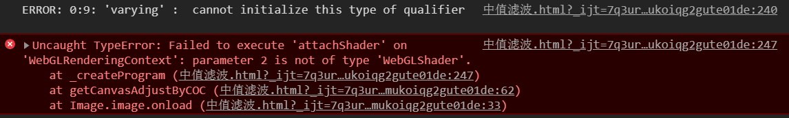
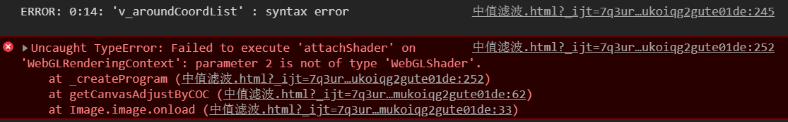
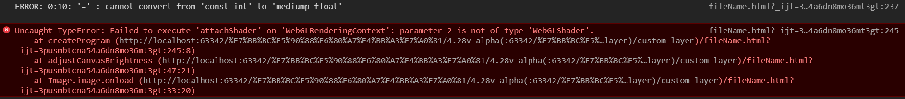
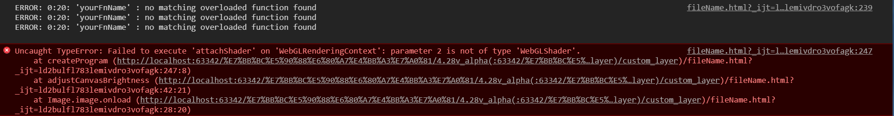

本笔记说的是web上的GLSL，不包含其他OpenGL的GLSL

手头关于这部分的资料是不足的，需要收集，最缺失的是API文档


### 裁剪空间

webGL在一个容器里会生成一个**裁剪空间**，这个**裁剪空间**所绘制的图像会被拉伸地展示在容器上

- 裁剪空间轴方向与平面坐标系相同
- 坐标值区间是[-1,1]


# 顶点着色器与片段着色器
- 两个着色器之间作用域应该不共享  

  这意味着片段着色器中要用顶点着色器中的变量的话仍然需要再声明一次  

- 着色器中使用变量都需要声明  

  如果是attribute、uniform、varying的话前面还需要加上相应的内容（`attribute`、`uniform`、`varying`）

### 顶点着色器

##### gl_PointSize

顶点着色器的可选输出

代表顶点显示的方块的尺寸

- 最小绘制区域  
  （当前是个人定义的一个概念）  
  - 不管`gl_PointSize`设多小，在canvas上绘制区域都至少会有1个像素  
    - 当绘制区域在最小值且绘制坐标不在像素正中间时  
      会绘制4个像素  
      绘制颜色会比赋值的要透明

（用ps魔棒测量时记得把“消除锯齿”去掉，不然会多选几个像素）

##### gl_Position

- `gl_Position`是顶点着色器一个必须的输出，代表一个顶点
- 值应该是四维向量，头两个是顶点的xy坐标 


### 片段着色器

- `gl_FragColor`就是片段着色器的最终输出（也就是屏幕上的色值）  
  r、g、b可以大于1，最终显示效果就是1。（是否可以小于0，以及a的情况未测试）

- 可以输出透明度颜色（不过“最初例子”两个重叠图形的透明部分不会叠加）

- 片断着色器没有默认精度，我们需要设置一个精度  

  `precision mediump float;`代表中等精度


# 变量

自己做了2个名词定义

- 三类变量  
  指：attribute、uniform、varying
- 非三类变量  
  非三类变量也非texture的变量


### attribute
中文名：属性（暂定）  

可在js与顶点着色器之间共享  
一个attribute估计是每个顶点执行不一样的，每个顶点从attribute里取一组数据（或者说每次的顶点着色器取其中一组）


### uniform
中文名：全局变量（暂定，webglfundamentals里这样叫）  

uniform就是一个定值，在各个地方都一样  
uniform属于一个着色器程序

- GLSL中uniform声明的变量需要全部添加到ShaderMaterial的uniforms配置项下  
- 着色器运行前就要从js中获取这些变量值  
- 两个着色器都可以用uniform


### varying
中文名：可变量（暂定）

- 顶点着色器确定片段着色器中varying值的计算方式
- 在着色器绘制面时，面中的每个“像素”将有不同的`gl_Position`，因此有`gl_Position`参与计算的varying在每个“像素”也有不同的值

> 对于每一个片段，每一个varying的值将是相邻顶点值的平滑插值。 —— three官网

### texture

> texture是一个数据序列，可以在着色程序运行中随意读取其中的数据。 大多数情况存放的是图像数据，但是texture仅仅是数据序列， 你也可以随意存放除了颜色数据以外的其它数据。 —— [webglfundamentals](https://webglfundamentals.org/webgl/lessons/zh_cn/webgl-fundamentals.html)

### const

`const int 变量名=值`  
等号后面不能是变量或者说运算出来的一个值

### main内与main外

```glsl
void main() {
    // 代码
}
```

- 只有在main中才能给已声明变量赋值，不然将会报错“syntax error”或“global variable initializers must be constant expressions”   

  并且着色器无法运行  

- “三类变量”的声明要放在main外，不然XXX  

- main外不能给“三类变量”赋值  
  下面列出报错情况

  - 声明时赋值  
    
  - 声明后赋值  
    

- “非三类变量”可以在任意位置赋值


### 向量
- 可以用`vec4( vec2(1,2) , 0, 1);`这种写法  

- 颜色值向量的每个分量值都是从0到1  
  
> WebGL中颜色值的范围是0到1 —— webglfundamentals.org
  
- 可以用数字与向量进行加减，这时数字就相当于每个分量都等于其数字值的向量
- 向量的分量是可以被改变的  
  测试环境：片段着色器`main`函数内`vec4 a = texture2D(u_image, v_texCoord);`的`a`向量

**取值**

- vec4.x, vec4.y, vec4.z, vec4.w 通过x，y，z，w可以分别取出4个值。
- vec4.xy, vec4.xx, vec4.xz, vec4.xyz 任意组合可以取出多种维度的向量。
- vec4.r, vec4.g, vec4.b, vec4.a 还可以通过r，g，b，a分别取出4个值，同上可以任意组合。
- vec4.s, vec4.t, vec4.p, vec4.q 还可以通过s，t，p，q分别取出4个值，同上可以任意组合。
- vec3和vec2也是类似，只是变量相对减少，比如vec3只有x，y，z，vec2只有x，y。


### 矩阵

声明  

- 接收webGL传来的变量  
  `uniform mat4 brightnessDeltaList;`

- glsl内新建一个矩阵  

  ```glsl
  mat4 变量名=mat4(1.0,2.0,3.0,4.0,
                  5.0,6.0,7.0,8.0,
                  9.0,10.0,11.0,12.0,
                  13.0,14.0,15.0,16.0);
  ```

  

### 用`[]`对向量或矩阵进行取值

<span style='opacity:.5'>这部分内容来自《WebGL编程指南（谢光磊 译）》第196页，且都已经过验证</span>

- 取出向量的一个分量  
  `向量[分量序号]`
- 取出矩阵的某一行  
  `矩阵[行的序号]`  
  结果是一个向量

序号必须是 常量索引值（constant index），下面列出部分定义：

- 整型字面量，不然无法运行，并且有如下白色提示：  
  `ERROR: 0:13: '[]' : integer expression required`
- 用`const`修饰的全局变量或局部变量，不包括函数参数


### 运算

- 只有同类型数据才能进行运算、比较等操作  

  不然报不存在两个数据之间的那个操作符

- 似乎无法从int类型数据的运算中得到浮点数  
  得到这个结论来源的例子如下：（片段着色器）  

  ```glsl
  precision mediump float;
  float oneOf16=1/16;
  ```

  这时的报错如下：  
  

##### 运算符

基本与js一致

##### 乘法顺序

- 矩阵与向量相乘，矩阵要放前面，不然平移矩阵不会生效
- 不同顺序的矩阵相乘会产生不同的结果

##### 矢量间运算

<span style='opacity:.5'>这部分内容来自《WebGL编程指南（谢光磊 译）》第198页</span>

结果的分量=左边向量的分量 运算符 右边向量的分量

这点在加减乘除上都是一致的

##### 矩阵+矩阵

结果的分量=2个矩阵分量的和

（找了很多资料都没说到这一点，不过自己已经测试验证）


### 数组

<span style='opacity:.5'>这部分内容来自《WebGL编程指南（谢光磊 译）》第201页</span>

声明：

```glsl
float 变量名[长度]; // 声明指定长度的、元素都是浮点数的数组
vec4 变量名[长度]; // 声明指定长度的、元素都是4维向量的数组
```

- 只支持一维数组

更多内容请查阅该扫描版pdf


### 函数

下方的`s`就是函数

```glsl
precision mediump float;

vec4 s(float r_param,float g_param,float b_param) {
    return vec4(r_param,g_param,b_param,1.0);
}

void main() {
    float r_variable=1.0;
    float g_variable=0.0;
    float b_variable=0.0;
    vec4 sss=s(r_variable,g_variable,b_variable);
    gl_FragColor = sss;
}
```

- 不能在`main`里声明函数  
  这时候的错误提示为`ERROR: 0:6: '{' : syntax error`（白色）
- 没有像js一样的函数提升  
  这就意味着如果你调用了一个“靠后”的函数的话GLSL就会认为你调用了未声明的函数
- 调用未声明的函数时的报错如下：  
  


# 其他

- 除了数组序号与分量值外，所有数字都要带小数点。  

  不然会报前一个运算符“wrong operand types”，而且整个着色器无法运行  
  
  （也有可能是因为声明为浮点数的值必须带小数点）  
  
- **普通声明**  
这是一个自己定义的概念：也就是attribute、uniform、varying以外的声明  
  普通声明在任何地方都可以  
甚至可以在main外进行带四则运算的赋值  
  可以在声明时不赋值，使用未赋值的变量程序也能正常运行

- 如果在该用浮点数的地方用了整数的话会有如下报错  
  


### 条件语句相关

???

### 注释

- 单行注释：`//`
- 块注释：`/**/`


# 疑问
- 着色器中找不到来源的的变量和函数、关键字都是什么
  - 这些变量包括但不限于uv、projectionMatrix、modelViewMatrix、position
    
    - projectionMatrix、modelViewMatrix、position估计都是three提供的 attribute 
    
      - **projectionMatrix**  
    
        投影矩阵
    
      - **modelViewMatrix**  
    
        视图矩阵与模型矩阵的乘积
    
      - **position**  
    
        模型点坐标（三维向量）（之前写是四维）  
      
        `position`可能只能在顶点着色器使用
      
      来源：[掘金博客](https://juejin.im/post/5b0ace63f265da0db479270a)
      
      `modelViewMatrix*vec4( position,1.)`的中心点位于canvas中央，单位和`position`没有区别
  - 这些函数包括但不限于perspectiveDepthToViewZ、viewZToOrthographicDepth
  
- 这些关键字包括但不限于#include
  
- `attribute`有什么`uniform`没有的功能

- 坐标系

