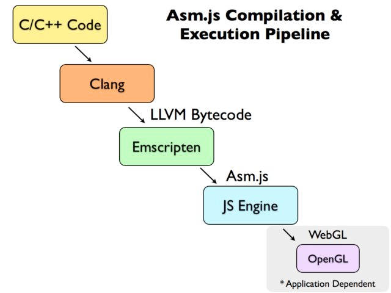

# 概念

### 代理

不代理的请求直接请求目标服务器，有代理的请求是：

1. 前端请求代理服务器
2. 代理服务器请求目标服务器
3. 代理服务器接收目标服务器返回数据后发给前端

代理服务器会被设置为和前端不跨域，以此解决跨域问题

### MVC与MVP

MVC中V（视图）需承担显示以外的功能
MVP中V（视图）无需承担显示以外的功能
两个模式中M与P、M与C分界都比较模糊，但存放数据的功能都是由M完成

### 向前兼容与向后兼容

向后兼容：新版程序能运行旧版程序的产物  
向前兼容：旧版程序能运行新版程序的产物

# 浏览器

### 跨域

跨域在network里也是报红
有的时候Status是(failed) net::ERR_FAILED有时候是(failed)
似乎有的时候跨域不报错？

### Cookie

【】  
跨域似乎还和cookie有关，似乎前端cookie是否携带要和后端保持一致,express的话似乎一定要设置是否携带cookie  
无锡项目中必须2边都设为false才行

**总体介绍**

> - 保存在浏览器所在硬盘上
> - 透过Cookie文件的文件名就能看出是哪个网站的
> - 是一段不超过4KB的文本数据
>
> —— [百度百科](https://baike.baidu.com/item/cookie/1119)

> 可以使用`Set-Cookie` [HTTP header](https://developer.mozilla.org/zh-CN/docs/Web/HTTP/Cookies)在服务器级别设置或修改Cookie，也可以使用`document.cookie`。 —— [MDN > 术语表 > Cookie](https://developer.mozilla.org/zh-CN/docs/Glossary/Cookie)

**http`Cookie`请求头部**

>其中含有先前由服务器通过 [`Set-Cookie`响应头部](https://developer.mozilla.org/zh-CN/docs/Web/HTTP/Headers/Set-Cookie) 投放并存储到客户端的 [HTTP cookies](https://developer.mozilla.org/en-US/docs/Web/HTTP/Cookies)。
>
>语法示例：`甲键名=键值; 乙键名=键值; 丙键名=键值`  
>注意：分隔键值对的是分号加空格，而不是分号
>
>—— [MDN《http`Cookie`请求头部》](https://developer.mozilla.org/zh-CN/docs/Web/HTTP/Headers/Cookie)

**http`Set-Cookie`响应头部**

>—— [MDN《http`Set-Cookie`响应头部》](https://developer.mozilla.org/zh-CN/docs/Web/HTTP/Headers/Set-Cookie)

### 页面请求得到html代码的处理方式

这里指的是直接在浏览器地址栏里输入地址，服务端响应了浏览器请求，并返回了html代码的情况

以下内容在chrome进行了测试

- 服务端响应头部的`Content-Type`未设置时  
  返回字符串会作为页面真正的html加入到页面内  
  这个插入是有一定智能程度的：
  - 当字符串内容最外层是`html`标签时  
    字符串会被作为整个页面的html被解析
  - 当字符串内容最外层是`head`标签时  
    字符串会被解析为`head`标签并替换原页面的`head`标签
  - 当字符串内容是（数量不定的）普通标签时  
    字符串会被解析为标签并插入页面的`body`标签内
- 服务端头部的`Content-Type`设置为`'text/plain'`时  
  返回内容会被插入`body`标签的`pre`标签内以文本方式显示

### 关于二进制流数据

- 二进制流数据可以被下载。下载后直接用原本接收二进制流的方法接收这个文件的效果和从服务端获取二进制流数据的效果是相同的

### 路径

> js里发起的请求如果写相对路径的话，相对的是html文件所在服务的地址 —— 为鑫（个人也在武汉cz上稍微进行了一些验证）

### 深度级别知识

- css的transform动画不用和js抢主线程

# 历史

### js赢得浏览器脚本语言市场份额的过程

applet、ActiveX、VBScript、NPAPI、native client...

**Google Native Client**

> Native Client是Google在浏览器领域推出的一个开源技术，它允许在浏览器内编译Web应用程序，并执行原生的编译好的代码。
>
> 可以直接在web上执行了原生的2D，3D图形渲染程序，播放音视频，响应鼠标键盘事件，多线程执行代码等等，而这一切，不需要浏览器安装任何插件。
>
> 一个Web程序，只需要开发一份代码，即可以在所有平台（包括Windows，linux，Mac等）运行。
>
> 支持直接执行C/C++/Java等代码。
>
> —— [博客](https://blog.csdn.net/dj0379/article/details/51917026)

【】了解web现状（比如浏览器政治现状、electron现状）

【】对未来web情况作出预测

# 其他终端设备情况

### app
『阿里巴巴淘系技术（媒体）』详细的知乎回答：https://www.zhihu.com/answer/1252582543

网上看起来阿里巴巴很注重跨端开发，也深入使用了web端开发APP的技术。同时也很热衷于使用flutter

##### web技术开发

『阿里巴巴淘系技术（媒体）』对于web开发的负面评价：浏览器本身的沙盒属性、与系统较低的结合度、以及在低端设备上较差的性能都降低了研发效率和用户体验，提高了业务的交付门槛。

##### flutter

『阿里巴巴淘系技术（媒体）』对flutter的负面评价：Flutter 目前的限制在于，动态性能力及前期的投入成本。
Flutter Web 方案的负面评价：虽然不存在审核限制，但受限于浏览器 DOM API 与 widgets 体系的差异性，目前仍旧存在较严重的性能瓶颈和渲染差异性。

##### 大型案例

2020年8月收集

**支付宝**

（以下内容来自[博客](https://www.sohu.com/a/341358883_100004247)）
技术方案：HTML5+内核优化  
> 目前支付宝采用的是阿里集团的 UC 自研内核，并针对支付宝的 HTML5 容器进行了深度优化和定制。

**美团**

安卓端是java写的

### 现有浏览器状况

**Chromium和Webkit的关系**

看[这里](https://zhidao.baidu.com/question/336031809.html)

# 非重点内容

### [emscripten](https://emscripten.org/)

> 一个可以将C/C++代码编译成『一种叫做 [asm.js](http://asmjs.org/) 的 JavaScript 变体』的编译器
>
> Emscripten 的底层是 LLVM 编译器，理论上任何可以生成 LLVM IR（Intermediate Representation）的语言，都可以编译生成 asm.js。 但是实际上，Emscripten 几乎只用于将 C / C++ 代码编译生成 asm.js。
>
> Emscripten关系图【】看到这
>
> 
>
> —— [阮一峰博客](http://www.ruanyifeng.com/blog/2017/09/asmjs_emscripten.html)

**LLVM**

Low Level Virtual Machine（底层虚拟机）

> 不过实际上跟虚拟机没有一点关系 —— [博客](https://www.codercto.com/a/41721.html)

> LLVM的项目是一个模块化和可重复使用的编译器和[工具技术](https://baike.baidu.com/item/工具技术)的集合 —— [百度百科](https://baike.baidu.com/item/LLVM#%E7%B3%BB%E7%BB%9F%E7%AE%80%E4%BB%8B)

**asm.js**

> 它的变量一律都是静态类型，并且取消垃圾回收机制。除了这两点，它与 JavaScript 并无差异。
>
> 一旦 JavaScript 引擎发现运行的是 asm.js，就知道这是经过优化的代码，可以跳过语法分析这一步，直接转成汇编语言。另外，浏览器还会调用 WebGL 通过 GPU 执行 asm.js，即 asm.js 的执行引擎与普通的 JavaScript 脚本不同。这些都是 asm.js 运行较快的原因。据称，asm.js 在浏览器里的运行速度，大约是原生代码的50%左右。
>
> 所有浏览器都支持 asm.js，不会有兼容性问题。
>
> 虽然 asm.js 可以手写，但是它从来就是编译器的目标语言，要通过编译产生。目前，生成 asm.js 的主要工具是 Emscripten。
>
> —— [阮一峰博客](http://www.ruanyifeng.com/blog/2017/09/asmjs_emscripten.html)

### WebAssembly 

> 也能将 C / C++ 转成 JS 引擎可以运行的代码。
>
> WebAssembly 和asm.js功能基本一致，就是转出来的代码不一样：asm.js 是文本，WebAssembly 是二进制字节码，因此运行速度更快、体积更小。
>
> —— [阮一峰博客](http://www.ruanyifeng.com/blog/2017/09/asmjs_emscripten.html)

# 未归类

### 注释

有2个地方可以参考：jsdoc、[closure编译器注释规范](https://github.com/google/closure-compiler/wiki/Annotating-JavaScript-for-the-Closure-Compiler)

### 用前端做应用

**更新**

虽然更新感觉很方便，不过要让用户注意缓存，不然实际上是没有更新的

### 移动端的web开发

[移动端的web开发](https://www.zhihu.com/question/20269059/answer/60767669)