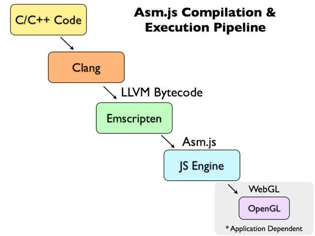

本笔记仅包含概念，不包含具体技术的使用

# 概念

### JavaScript

正式名称：ECMAScript

> $ECMAScript^®$ 是 Ecma International 的注册商标
>
> $JavaScript^{TM}$ 是Oracle的商标
>
> —— [TC39](https://www.ecma-international.org/technical-committees/tc39/)

归属协会：[Ecma International](https://www.ecma-international.org/)

协会下具体负责JS的组织：[TC39](https://www.ecma-international.org/technical-committees/tc39/)（第39号技术委员会）

**[TC53](https://www.ecma-international.org/technical-committees/tc53/)**

负责嵌入式系统的ECMAScript模块

### 代理

不代理的请求直接请求目标服务器，有代理的请求是：

1. 前端请求代理服务器
2. 代理服务器请求目标服务器
3. 代理服务器接收目标服务器返回数据后发给前端

代理服务器会被设置为和前端不跨域，以此解决跨域问题

### CSS in JS

CSS-in-JS是一种在js里写css的技术，有[很多库](https://github.com/MicheleBertoli/css-in-js)可以帮你做这个事，这些库大部分是react的

### 页面请求得到html代码的处理方式

这里指的是直接在浏览器地址栏里输入地址，服务端响应了浏览器请求，并返回了html代码的情况

以下内容在chrome进行了测试

- 服务端响应头部的`Content-Type`未设置时  
  返回字符串会作为页面真正的html加入到页面内  
  这个插入是有一定智能程度的：
  - 当字符串内容最外层是`html`标签时  
    字符串会被作为整个页面的html被解析
  - 当字符串内容最外层是`head`标签时  
    字符串会被解析为`head`标签并替换原页面的`head`标签
  - 当字符串内容是（数量不定的）普通标签时  
    字符串会被解析为标签并插入页面的`body`标签内
- 服务端头部的`Content-Type`设置为`'text/plain'`时  
  返回内容会被插入`body`标签的`pre`标签内以文本方式显示

### 关于二进制流数据

- 二进制流数据可以被下载。下载后直接用原本接收二进制流的方法接收这个文件的效果和从服务端获取二进制流数据的效果是相同的

### 路径

> js里发起的请求如果写相对路径的话，相对的是html文件所在服务的地址 —— 为鑫（个人也在武汉cz上稍微进行了一些验证）

### 深度级别知识

- css的transform动画不用和js抢主线程

### DPR

DPR (Device Pixel Ratio)

> window.devicePixelRatio 是设备上物理像素 (physical pixels) 和设备无关像素 (device-independent pixels (dips)) 的比例。公式表示就是window.devicePixelRatio = physical pixels / dips  
>
> 这个定义里的 dips 并不太好理解，现在我们尝试通过下面几点来搞明白：
>
> - 首先，dips 是一种度量单位
> - 然后，要知道浏览器并不是根据物理硬件的像素来工作的，而是根据 dips 宽度来工作。
> - 最后，还要知道 dips 是将像素值与实际距离联系起来的，不管屏幕的像素密度是多少，dips 为 1px，那么实际宽度就是 1px，也就是对应 CSS 中的 1px，而不是对应物理像素 1px。
>
> —— [知乎文章](https://zhuanlan.zhihu.com/p/26131956)

- 在 Chrome 浏览器控制台 console 中输入`window.devicePixelRatio`可以获取当前屏幕的 DPR

# 历史

### js赢得浏览器脚本语言市场份额的过程

applet、ActiveX、VBScript、NPAPI、native client...

**Google Native Client**

> Native Client是Google在浏览器领域推出的一个开源技术，它允许在浏览器内编译Web应用程序，并执行原生的编译好的代码。
>
> 可以直接在web上执行了原生的2D，3D图形渲染程序，播放音视频，响应鼠标键盘事件，多线程执行代码等等，而这一切，不需要浏览器安装任何插件。
>
> 一个Web程序，只需要开发一份代码，即可以在所有平台（包括Windows，linux，Mac等）运行。
>
> 支持直接执行C/C++/Java等代码。
>
> —— [博客](https://blog.csdn.net/dj0379/article/details/51917026)

【】对未来web情况作出预测

# 其他终端设备情况

### 现有浏览器状况

**Chromium和Webkit的关系**

看[这里](https://zhidao.baidu.com/question/336031809.html)

# 非重点内容

### [emscripten](https://emscripten.org/)

> 一个可以将C/C++代码编译成『一种叫做 [asm.js](http://asmjs.org/) 的 JavaScript 变体』的编译器
>
> Emscripten 的底层是 LLVM 编译器，理论上任何可以生成 LLVM IR（Intermediate Representation）的语言，都可以编译生成 asm.js。 但是实际上，Emscripten 几乎只用于将 C / C++ 代码编译生成 asm.js。
>
> Emscripten关系图【】看到这
>
> 
>
> —— [阮一峰博客](http://www.ruanyifeng.com/blog/2017/09/asmjs_emscripten.html)

**LLVM**

Low Level Virtual Machine（底层虚拟机）

> 不过实际上跟虚拟机没有一点关系 —— [博客](https://www.codercto.com/a/41721.html)

> LLVM的项目是一个模块化和可重复使用的编译器和[工具技术](https://baike.baidu.com/item/工具技术)的集合 —— [百度百科](https://baike.baidu.com/item/LLVM#%E7%B3%BB%E7%BB%9F%E7%AE%80%E4%BB%8B)

**asm.js**

> 它的变量一律都是静态类型，并且取消垃圾回收机制。除了这两点，它与 JavaScript 并无差异。
>
> 一旦 JavaScript 引擎发现运行的是 asm.js，就知道这是经过优化的代码，可以跳过语法分析这一步，直接转成汇编语言。另外，浏览器还会调用 WebGL 通过 GPU 执行 asm.js，即 asm.js 的执行引擎与普通的 JavaScript 脚本不同。这些都是 asm.js 运行较快的原因。据称，asm.js 在浏览器里的运行速度，大约是原生代码的50%左右。
>
> 所有浏览器都支持 asm.js，不会有兼容性问题。
>
> 虽然 asm.js 可以手写，但是它从来就是编译器的目标语言，要通过编译产生。目前，生成 asm.js 的主要工具是 Emscripten。
>
> —— [阮一峰博客](http://www.ruanyifeng.com/blog/2017/09/asmjs_emscripten.html)

### WebAssembly 

> 也能将 C / C++ 转成 JS 引擎可以运行的代码。
>
> WebAssembly 和asm.js功能基本一致，就是转出来的代码不一样：asm.js 是文本，WebAssembly 是二进制字节码，因此运行速度更快、体积更小。
>
> —— [阮一峰博客](http://www.ruanyifeng.com/blog/2017/09/asmjs_emscripten.html)

- [让你开始操作的博客](https://segmentfault.com/a/1190000008402872)
- 浏览器有内置一个`WebAssembly`对象
- unity要通过WebAssembly才能生成网页（静态页面）（静态页面就是说，不需要用特殊的姿势来使用）

# 未归类

### 优化

- 组织好代码避免内存泄漏  
  比如说及时清除定时器、尽量编写纯函数、尽量缩小变量的作用域

### 注释

有2个地方可以参考：jsdoc、[closure编译器注释规范](https://github.com/google/closure-compiler/wiki/Annotating-JavaScript-for-the-Closure-Compiler)

### 用前端做应用

**更新**

虽然更新感觉很方便，不过要让用户注意缓存，不然实际上是没有更新的

