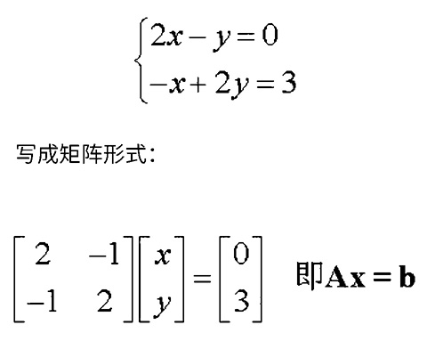

# 幂运算

$底数^{指数}=幂$  

结果可以称为“底数的指数次幂”或“底数的指数次方”  

- **正整数通用结果理解**  

  底数自乘指数次

- **将正整数通用结果理解推广到正实数**  

  将指数拆成两个数的乘积，一个数是分子为1的分数，而另一个是正整数  

  结果就是${\sqrt[分母]{底数}}^{正整数}$

# 线代

### 名词定义

- 标量  
  说法一：只有大小没有方向的物理量  
  说法二：在[坐标变换](https://baike.baidu.com/item/坐标变换/5261943)下保持不变的物理量
  
- 线性关系  
  如果可以用一个二元一次方程来表达两个变量之间关系的话，这两个变量之间的关系称为线性关系
  
- 线性方程  
  含有n个变量的一次方程  
  可以称为n元线性方程  
  
  > 在笛卡尔坐标系上任何一个一次方程的表示都是一条直线—— [百度百科“线性方程”词条](https://link.zhihu.com/?target=https%3A//baike.baidu.com/item/%E7%BA%BF%E6%80%A7%E6%96%B9%E7%A8%8B/6129663%3Ffr%3Daladdin)
  
  上一行不一定对，至少3元以上无法用几何来表示
  
  > 线性代数里那个线性，通常指齐次性和可加性。这是纯代数定义。
  >
  > 并不是说线性方程表达的就是某条几何直线。—— [知乎用户](https://www.zhihu.com/people/xu-kong-hui-guang-36)

# 向量

### 基础定义

向量：
在线代中和非线代中的定义有一些区别。
非线代中一般是有大小和方向的量，是具有几何意义的，在物理学和工程学中几何向量更常被称为矢量。

向量空间：
又称线性空间、矢量空间。
定义：三大条八小条，见https://baike.baidu.com/item/%E5%90%91%E9%87%8F%E7%A9%BA%E9%97%B4/5936597?fr=kg_general

向量相关的习惯表述：
xyz轴的单位向量一般称为ijk，二维平面坐标系中ij叫一组基底，三维空间坐标系中ikj叫一组基底。

行列式：
在2维空间中，两个2维向量构成的的行列式的值，等同于以两个向量为边组成的平行四边形面积大小。也就是说，在2维空间中，两个2维向量构成的的行列式的值，等同于两个2维向量的叉积。
三维空间中行列式的值应该是以三个向量为边组成的六面体的体积。

向量的模：
向量的大小，也就是向量的长度(或称模)。向量a的模记作|a|。

### 基础运算

##### 向量运算
- 加法：结果的分量是运算中每个向量相应分量的和
- 减法：类比加法
- 乘法：
  已知叫法有：点乘、叉乘、数乘、数量积、向量积、混合积、双重向量积

### 升级内容

# 卷积

### 定义

我们称`(f*g)(n)`为`f,g`的卷积  

- 其连续定义为：  
  $(f*g)(n)=\mathop{ \int }\nolimits_{{-∞}}^{{∞}}f{ \left( {τ} \right) }g{ \left( {n-τ} \right) } \text{d}τ
$
- 其离散的定义为：   
  $(f*g)(n)=\sum\limits_{τ=-∞}^∞f{ \left( {τ} \right) }g{ \left( {n-τ} \right) } 
$

### 例子

##### 离散卷积：求两枚骰子点数加起来为4的概率

f(n)、g(n)分别表示第一、二枚骰子投出n的概率  
那么这道题的答案是：f(1)g(3)+f(2)g(2)+f(3)g(1)  
写成标准形式就是$(f*g)(4)=\sum\limits_{m=1}^3f{ \left( {4-m} \right) }g{ \left( {m} \right) } 
$

