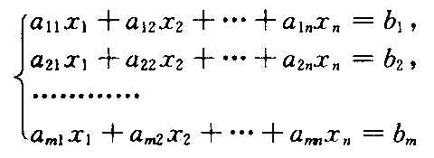
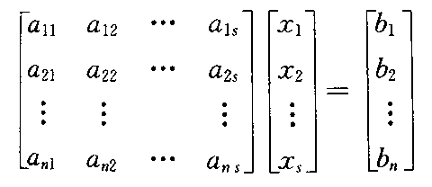
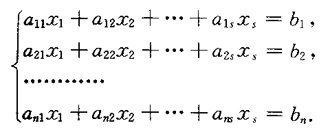

# 四则运算

**因数**

> “×”是[乘号](https://baike.baidu.com/item/乘号)，乘号前面和后面的数叫做[因数](https://baike.baidu.com/item/因数)，“=”是等于号，等于号后面的数叫做积。 —— [百度百科“乘法”词条](https://baike.baidu.com/item/%E4%B9%98%E6%B3%95#%E5%90%8D%E7%A7%B0)

> 因数是指整数a除以整数b(b≠0) 的商正好是整数而没有余数，我们就说b是a的因数。 —— [百度百科“因数”词条](https://baike.baidu.com/item/%E5%9B%A0%E6%95%B0)

# 幂运算

$底数^{指数}=幂$  

结果可以称为“底数的指数次幂”或“底数的指数次方”  

- **正整数通用结果理解**  

  底数自乘指数次

- **将正整数通用结果理解推广到正实数**  

  将指数拆成两个数的乘积，一个数是分子为1的分数，而另一个是正整数  

  结果就是${\sqrt[分母]{底数}}^{正整数}$

# 线代

### 名词定义

- 标量  
  说法一：只有大小没有方向的物理量  
  说法二：在[坐标变换](https://baike.baidu.com/item/坐标变换/5261943)下保持不变的物理量
  
- 线性关系  
  如果可以用一个二元一次方程来表达两个变量之间关系的话，这两个变量之间的关系称为线性关系
  
- 线性方程  
  含有n个变量的一次方程  
  可以称为n元线性方程  
  
  > 在笛卡尔坐标系上任何一个一次方程的表示都是一条直线—— [百度百科“线性方程”词条](https://link.zhihu.com/?target=https%3A//baike.baidu.com/item/%E7%BA%BF%E6%80%A7%E6%96%B9%E7%A8%8B/6129663%3Ffr%3Daladdin)
  
  上一行不一定对，至少3元以上无法用几何来表示
  
  > 线性代数里那个线性，通常指齐次性和可加从性。这是纯代数定义。
  >
  > 并不是说线性方程表达的就是某条几何直线。—— [知乎用户](https://www.zhihu.com/people/xu-kong-hui-guang-36)

- 矩阵  
  m行n列的矩阵可以称为：m × n 的矩阵  
  矩阵A可以写为：$A_{m×n}$  
  当m=n时可以写为：$A_m$
- 用矩阵与列向量表示线性方程组  
    
  像上图的线性方程组可以表示为`Ax=b`  
  其中A=$A_{m×n}$ x=$[x1,x2,...,xn]^T$  b=$[b1,b2,...,bn]^T$ 

# 矩阵

# 向量

### 基础定义

**向量**
线代向量的定义和几何向量的定义是有一定区别的  

- 线代中的向量

  > n个数组成的有序数组称为n元向量（或n维向量），记为[a1,a2,...,an]，或“竖着写” —— [《陈维新线代》](https://book.douban.com/subject/1239578/)（语言进行了精简）

  > 线代的向量不一定以数对表示 —— [百度百科](https://baike.baidu.com/item/%E5%90%91%E9%87%8F/1396519)（语言进行了精简）

- 线代以外的向量（几何向量）  
  有大小和方向的量。在物理学和工程学中几何向量更常被称为矢量。

**分量**

向量中的项叫做向量的分量

**维度**

> 向量中分量的个数就是这个向量的维度 —— [知乎视频](https://www.zhihu.com/zvideo/1247273664388894720)（是作者的意思但不是原话）

**行向量与列向量**

- [a1,a2,...,an]这种表达式称为行向量，“竖着写” 称为列向量
- 利用矩阵转置的记号（$^T$ ）可以把列向量记为$[a1,a2,...,an]^T$ 

关于行、列向量意义的思考

- 暂时的结论：  
  可能不用太纠结意义，因为就没有太多意义  
  尤其是列向量单独出现时很可能就是单纯数组的意思  
  目前感觉有意义的可能就是向量相乘的时候，前一个必须写成行向量，第二个必须写成列向量

- >  如果用矩阵的观点来看，行向量是只有一行的矩阵，而列向量是只有一列的矩阵 —— [《陈维新线代》](https://book.douban.com/subject/1239578/)

- 似乎普通数组向量就是列向量，依据如下  

  > 本书凡向量一般都指列向量 —— [《陈维新线代》](https://book.douban.com/subject/1239578/)（语言进行了精简）

**向量组**

就是一组向量  
[《陈维新线代》](https://book.douban.com/subject/1239578/)中没有这个定义，不过使用了这个名词

**向量空间**
又称线性空间、矢量空间。
定义：有三大条，其中一大条有八小条。详见：[百度百科](https://baike.baidu.com/item/%E5%90%91%E9%87%8F%E7%A9%BA%E9%97%B4#%E8%AF%A6%E7%BB%86%E5%AE%9A%E4%B9%89)

**向量相关的习惯表述**

- xyz轴的单位向量一般称为ijk，二维平面坐标系中ij叫一组基底，三维空间坐标系中ikj叫一组基底。

- >  本书一般用小写希腊字母αβγ等表示向量，而用带有下标的小写拉丁字母如$a_i$来表示向量的第i个分量 —— [《陈维新线代》](https://book.douban.com/subject/1239578/)

**行列式**
在2维空间中，两个2维向量构成的的行列式的值，等同于以两个向量为边组成的平行四边形面积大小。也就是说，在2维空间中，两个2维向量构成的的行列式的值，等同于两个2维向量的叉积。
三维空间中行列式的值应该是以三个向量为边组成的六面体的体积。

**向量的模**
向量的大小，也就是向量的长度(或称模)。向量a的模记作|a|。

### 基础运算

一些未知的运算：纯量乘法(亦称数量乘法)、点乘、叉乘、数量积、向量积、混合积、双重向量积

##### 向量与数的运算

- 数量乘积（简称数乘）  
  向量 乘 数 后得到的新向量的每一个分量都是：原向量每一个分量和数的积

##### 向量间的运算
- 加法：结果的分量是运算中每个向量相应分量的和

- 减法：类比加法

- 乘法：  

  > $[x1,x2,..xn] [y1,y2,..yn]^{-T}=x1*y1+x2*y2+..+xn*yn$ —— [知乎视频](https://www.zhihu.com/zvideo/1247273664388894720)、读大学时在[《陈维新线代》](https://book.douban.com/subject/1239578/)上写的笔记 上都是这样说的

  > 行向量一定要写在列向量前面 —— 读大学时在[《陈维新线代》](https://book.douban.com/subject/1239578/)上写的笔记

##### 向量与矩阵的运算

- 矩阵"乘"向量  
  [《陈维新线代》p110](https://book.douban.com/subject/1239578/)中没有说这是乘法，不过用了这种书写方式  
  书写：  
  该书写的结果为：

### 进阶定义

##### 向量与线性

- 线性组合  
  是一个向量对于一个向量组的关系  
  如果一个向量是向量组中各向量的数量积的和  
  则说这个向量是向量组的一个**线性组合**
- 线性表示  
  若一个向量是一个向量组的线性组合，那么可以说这个向量可经这个向量组**线性表示**

# 卷积

### 定义

我们称`(f*g)(n)`为`f,g`的卷积  

- 其连续定义为：  
  $(f*g)(n)=\mathop{ \int }\nolimits_{{-∞}}^{{∞}}f{ \left( {τ} \right) }g{ \left( {n-τ} \right) } \text{d}τ
$
- 其离散的定义为：   
  $(f*g)(n)=\sum\limits_{τ=-∞}^∞f{ \left( {τ} \right) }g{ \left( {n-τ} \right) } 
$

### 例子

##### 离散卷积：求两枚骰子点数加起来为4的概率

f(n)、g(n)分别表示第一、二枚骰子投出n的概率  
那么这道题的答案是：f(1)g(3)+f(2)g(2)+f(3)g(1)  
写成标准形式就是$(f*g)(4)=\sum\limits_{m=1}^3f{ \left( {4-m} \right) }g{ \left( {m} \right) } 
$

# 归一化

> - 归一化是一种无量纲处理手段，使物理系统数值的绝对值变成某种相对值关系。 
> - 例如对于一个采样频率为500hz的系统，400hz的归一化频率就为400/500=0.8，归一化频率范围在[0,1]之间。
>
> —— [百度百科](https://baike.baidu.com/item/%E5%BD%92%E4%B8%80%E5%8C%96/2215161?fr=aladdin)

稍微百度了下，没找到明确的说明

> 卷积计算时，界面上的9个整数要先做归一化，使它们的和为1。 —— 上海电力大学贾老师对“卷积计算”功能的要求